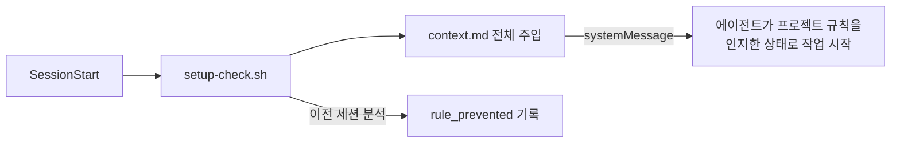
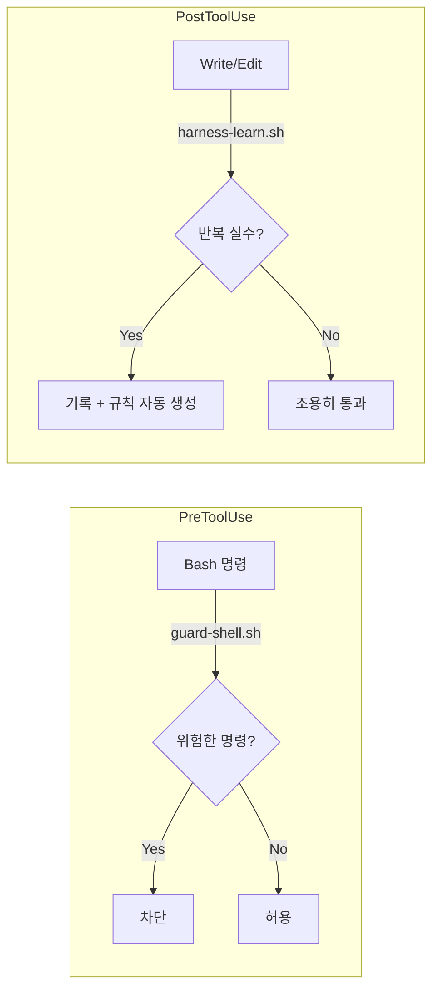
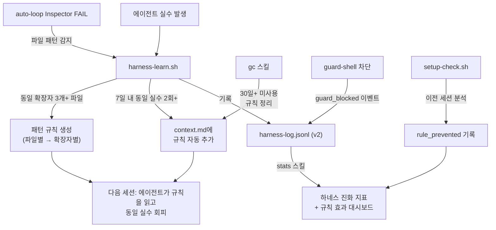
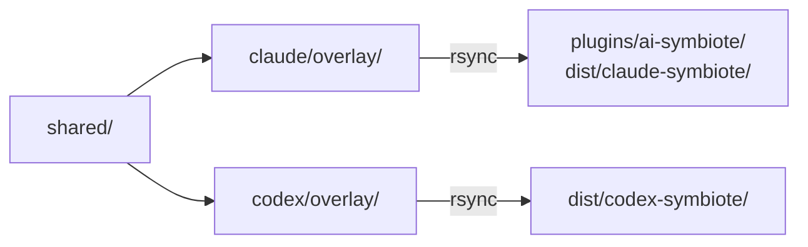

# ai-symbiote

> Author: JunyoungJung

마블의 **베놈(Venom)**을 기억하시나요? 심비오트(Symbiote)는 숙주에 달라붙어 하나가 되는 외계 생명체입니다. 숙주의 능력을 증폭시키고, 숙주의 경험을 통해 스스로도 진화합니다.

ai-symbiote는 이 관계를 코드 위에 구현합니다. AI 에이전트에 달라붙어 하나가 되고, 에이전트가 실수하면 하네스가 자동으로 강해지고, 개발자가 규칙을 다듬으면 에이전트가 더 정확해집니다. 베놈이 에디 브록과 함께 강해지듯, **ai-symbiote는 쓰면 쓸수록 개발자와 에이전트가 함께 강해지는 공생 시스템**입니다.

Claude Code와 Codex CLI에서 동일한 스킬, 훅, 태스크 매니저를 공유하는 AI 에이전트 오케스트레이션 플러그인입니다.

## Harness Engineering

AI 모델이 아무리 똑똑해도 혼자 두면 같은 실수를 반복합니다. 하네스(harness)는 이 문제를 구조적으로 해결합니다. 프롬프트로 "이렇게 하지 마"라고 부탁하는 대신, **실수 자체가 불가능한 환경을 설계**합니다.

ai-symbiote의 하네스는 세 가지 기둥으로 구성됩니다:

### 1. Context File (context.md)

에이전트가 매 세션 시작 시 가장 먼저 읽는 프로젝트 지침서입니다. `setup` 스킬이 프로젝트 스택, 코딩 컨벤션, 아키텍처를 자동 감지하여 생성하고, `evolve` 스킬이 프로젝트 변화에 맞춰 동기화합니다. 기술 스택별 **시드 규칙**(harness-seeds)이 초기 부트스트랩 시 로딩되어 알려진 에이전트 실수를 첫 세션부터 방지합니다.



### 2. Auto-Enforcement (Hooks)

규칙을 "부탁"이 아닌 "강제"로 적용합니다:

| Hook | Event | Action |
|------|-------|--------|
| `guard-shell.sh` | PreToolUse(Bash) | 위험 명령 차단 + 안전한 우회 경로 제시 + harness-log 기록 |
| `harness-learn.sh` | PostToolUse(Write\|Edit) | 에이전트 실수 감지 + auto-loop FAIL 연동 + 확장자 패턴 학습 → 자동 규칙 생성 |
| `comment-checker.sh` | PostToolUse(Write\|Edit) | 자명한 주석, 주석 처리된 코드 경고 |



핵심 원칙: **"성공은 조용히, 실패만 시끄럽게."** 테스트가 통과하면 아무 출력 없이 진행하고, 실패했을 때만 에이전트에게 알립니다. 통과한 4,000줄의 결과를 모두 보여주면 에이전트가 그걸 읽느라 정작 할 일을 잊어버리기 때문입니다.

### 3. Garbage Collection (gc skill)

규칙은 추가만 하면 비대해집니다. `gc` 스킬이 30일 이상 트리거되지 않은 규칙을 식별하고 정리를 제안합니다. 규칙별 **방지 횟수(rule_prevented)** 카운터로 데이터 기반 삭제 판단이 가능합니다. 코드 레벨 위생 검사는 별도 `lint` 스킬이 담당합니다 (gc = 규칙 정리, lint = 코드 정리).

### Self-Evolving Harness



시간이 지날수록 하네스는 프로젝트에 특화된 규칙을 축적합니다. auto-loop의 실패도 자동으로 학습하고, 파일 단위 규칙은 확장자 패턴으로 일반화됩니다. `stats --baseline`으로 반복률 기준선을 측정하고, `stats`로 하네스 진화 지표(규칙 수, 실수 빈도 추이, 재발률, 규칙 효과)를 확인할 수 있습니다.

## 설치

### Claude Code

```text
/plugin marketplace add Jimmy-Jung/ai-symbiote
/plugin install ai-symbiote@ai-symbiote
```

로컬 저장소 사용:

```text
/plugin marketplace add /path/to/ai-symbiote
/plugin install ai-symbiote@ai-symbiote
```

설치 없이 세션 한 번만 테스트:

```bash
claude --plugin-dir /path/to/ai-symbiote/plugins/ai-symbiote
```

### Codex CLI

```bash
git clone https://github.com/Jimmy-Jung/ai-symbiote.git ~/ai-symbiote-repo
cd ~/ai-symbiote-repo && bash platforms/codex/install.sh
```

`install.sh`가 빌드, `~/plugins/ai-symbiote/` 복사, marketplace 등록, `config.toml` 설정(`codex_hooks = true`)을 한 번에 처리합니다.

### 업데이트

```
Claude: /ai-symbiote:update
Codex:  $ai-symbiote:update
```

## 스킬 목록 (28개)

`/ai-symbiote:<name>` (Claude) 또는 `$ai-symbiote:<name>` (Codex)으로 호출합니다.

### 핵심 워크플로우

| 스킬 | 설명 |
|------|------|
| `synapse` | 사용자 의도를 분석하여 적절한 스킬과 팀을 자동 선택하는 오케스트레이터 |
| `auto-loop` | Analyze → Plan → Execute → Verify를 반복하여 작업을 자율 완료 (최대 10회) |
| `autopilot` | auto-loop의 병렬 극대화 모드. Builder를 최대한 동시 투입 |
| `setup` | 프로젝트 스택 감지, 연동 플러그인 자동 설치, 상태 디렉터리 초기화 |

### 계획 및 분석

| 스킬 | 설명 |
|------|------|
| `plan` | Scout 2명 + Architect 1명으로 구현 계획 수립 |
| `planning` | 요구사항 인터뷰, 영향도 평가, 계획 템플릿 방법론 |
| `analyze` | Scout 2~3명 + Architect 1명으로 대상 심층 분석 |
| `deep-search` | Grep, Glob, Agent(Explore) 병렬 3-Track 코드베이스 탐색 |

### 코드 품질

| 스킬 | 설명 |
|------|------|
| `review` | 현재 변경사항에 대해 코드 리뷰 실행 |
| `code-accuracy` | 심볼 존재 확인, import 검증, 환각 코드 방지 가드레일 |
| `verify-loop` | 자율 루프의 4-Level 완료 기준과 재시도 전략 |

### Git 및 협업

| 스킬 | 설명 |
|------|------|
| `git-commit` | git diff를 분석하여 Conventional Commits 형식으로 커밋 메시지 생성 |
| `pr` | 현재 브랜치의 변경사항을 분석하고 Pull Request 생성 |
| `messenger` | Slack, Discord, Telegram 연동으로 원격 모니터링 및 제어 ([상세](docs/MESSENGER.md)) |

### 태스크 관리

| 스킬 | 설명 |
|------|------|
| `tm-init` | Task Master 전역 task graph 초기화 |
| `tm-parse-prd` | `prd.json`을 읽어 작업별 `task.json` 초안 생성 |
| `tm-board` | task graph를 상태별로 요약 표시 |

### 유틸리티

| 스킬 | 설명 |
|------|------|
| `note` | Compaction 내성 메모장. 컨텍스트 윈도우 초과 시에도 정보 보존 |
| `evolve` | 프로젝트 변경을 감지하여 `manifest.json`과 `context.md` 동기화 |
| `update` | 저장소 pull + 플랫폼별 재설치를 자동 수행 |
| `clean` | 완료된 작업의 상태 폴더 정리 |
| `gc` | 하네스 자동 생성 규칙의 가비지 컬렉션. 미사용 규칙 정리, 규칙 효과 측정 |
| `lint` | 코드 위생 검사. 프로젝트 린터 자동 감지/실행 또는 기본 패턴 검사 |
| `skill-store` | 커뮤니티 스킬 카탈로그(1,060+개)에서 프로젝트에 맞는 스킬 추천/설치 |
| `stats` | 스킬/커맨드 사용 빈도 분석 + 하네스 진화 지표 + 규칙 효과 대시보드 |
| `contribute` | 플러그인의 버그/개선점 발견 시 GitHub 이슈 등록. 환경 정보 자동 수집 |

### 내부 스킬 (synapse가 자동 참조)

| 스킬 | 설명 |
|------|------|
| `roles` | Scout, Architect, Builder, Inspector, Researcher, Codex 6개 역할의 계약 정의 |
| `team-templates` | analysis, implementation, review, planning, research, dynamic 6개 팀 템플릿 |

## 아키텍처

```text
ai-symbiote/
├── shared/                    # 공용 원본 (여기만 편집)
│   ├── skills/                #   28개 스킬
│   ├── hooks/scripts/         #   6개 훅 스크립트
│   │   ├── setup-check.sh     #     세션 시작: 컨텍스트 주입 + rule_prevented 분석
│   │   ├── guard-shell.sh     #     위험 명령 차단 + 우회 경로 + 로깅
│   │   ├── usage-tracker.sh   #     스킬/도구 사용 추적
│   │   ├── harness-learn.sh   #     실수 감지 + auto-loop 연동 + 패턴 학습
│   │   ├── comment-checker.sh #     코드 주석 품질 검사
│   │   ├── messenger-notify.sh#     메신저 알림 전송
│   │   └── lib/common.sh      #     훅 공용 라이브러리
│   ├── harness-seeds/         #   스택별 초기 하네스 규칙 시드
│   ├── taskmaster/            #   PRD/task/state 스키마 및 템플릿
│   └── messenger-bridge/      #   Slack/Discord/Telegram 브릿지 (TypeScript)
├── platforms/
│   ├── claude/overlay/        #   .claude-plugin/plugin.json, hooks/hooks.json
│   └── codex/overlay/         #   .codex-plugin/plugin.json, hooks/hooks.json
├── plugins/ai-symbiote/       # Claude marketplace용 번들 (빌드 생성물)
├── dist/                      # 빌드 출력
├── scripts/                   # build-claude.sh, build-codex.sh, build-all.sh
└── docs/                      # ARCHITECTURE.md, MESSENGER.md
```

### 빌드 흐름



```bash
bash scripts/build-all.sh      # 양쪽 모두
bash scripts/build-claude.sh   # Claude만
bash scripts/build-codex.sh    # Codex만
```

## 플랫폼 차이

| 항목 | Claude Code | Codex CLI |
|------|-------------|-----------|
| 플러그인 경로 | `${CLAUDE_PLUGIN_ROOT}` | `~/plugins/ai-symbiote` |
| Hooks 이벤트 | SessionStart, PreToolUse, PostToolUse | SessionStart, PreToolUse |
| PostToolUse 매처 | Read\|Skill, Write\|Edit | Bash만 지원 |
| Hooks 활성화 | 기본 활성 | `config.toml`에 `codex_hooks = true` 필요 |
| 기본 모델 | — | gpt-5.4 |

Codex에서 PostToolUse의 Read\|Skill, Write\|Edit 매처가 지원되지 않으므로, usage-tracker, harness-learn, comment-checker, messenger-notify 훅은 Claude에서만 동작합니다.

## 상태 관리

모든 플랫폼은 `~/ai-symbiote/{slug}/`를 공용 상태 루트로 사용합니다.

slug는 **git 루트 디렉터리의 basename**을 소문자로 변환하여 생성합니다:

```
/home/user/projects/MyApp  →  myapp
/home/user/work/api-server →  api-server
```

```text
~/ai-symbiote/{slug}/
├── manifest.json       # 프로젝트 스택, 설정, 경로, 연동 플러그인 상태
├── context.md          # 동적 컨텍스트 (스택, 컨벤션, 하네스 규칙)
├── harness-log.jsonl   # 에이전트 실수 로그 (자동 관리)
├── state/              # 작업별 상태 (ralph-state.md, 결과 파일)
├── taskmaster/         # PRD, task graph
├── usage-data/         # 스킬/커맨드 사용 통계
└── messenger/          # 메신저 브릿지 설정, 커맨드, 승인 요청
```

### 연동 플러그인

setup 시 자동으로 설치/확인되는 외부 플러그인:

| 플러그인 | 용도 | 필수 여부 |
|----------|------|-----------|
| [snarktank/ralph](https://github.com/snarktank/ralph) | PRD 생성(`/prd`) 및 JSON 변환(`/ralph`) | 자동 설치 |
| [openai/codex-plugin-cc](https://github.com/openai/codex-plugin-cc) | Codex(GPT-5.4) 서브에이전트 연동 | 선택적 |

## 메신저 브릿지

Telegram, Slack, Discord를 통해 Claude/Codex CLI를 원격으로 사용할 수 있습니다. 자세한 설정 및 사용법은 [docs/MESSENGER.md](docs/MESSENGER.md)를 참조하세요.

- **AI 챗봇**: Telegram에서 질문하면 Claude/Codex가 직접 답변 (세션 유지)
- **세션 연동**: 맥 터미널의 Claude Code 세션을 Telegram에서 이어감
- **실시간 모니터링**: macOS 알림 + 봇 로그로 CLI 실행 과정 확인
- **보안**: 사용자 인증 (allowedUserIds) + CLI 권한 제한 (permissionLevel)
- **루프 제어**: auto-loop/autopilot 세션의 원격 모니터링, 중지, 재개

## 유지보수 원칙

- **공용 변경**: `shared/`만 수정 → `build-all.sh`로 양쪽 번들 갱신
- **플랫폼 차이**: `platforms/<name>/overlay/`만 수정
- **빌드 생성물**: `plugins/ai-symbiote/`와 `dist/`는 직접 편집 금지
- **상세 구조**: [docs/ARCHITECTURE.md](docs/ARCHITECTURE.md) 참조
