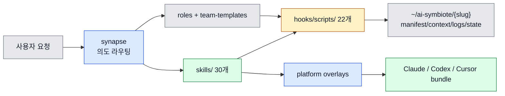
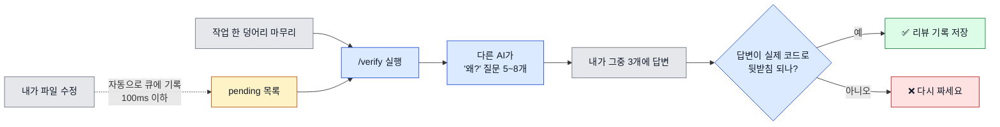

# ai-symbiote

> Author: JunyoungJung

마블의 베놈을 떠올리면 가장 먼저 보이는 것은 "기생"이 아니라 "공생"에 가깝습니다.  
심비오트는 숙주에 달라붙어 하나가 되고, 숙주의 능력을 증폭시키며, 숙주의 경험을 통해 스스로도 진화합니다.

`ai-symbiote`는 그 관계를 AI 코딩 에이전트 위에 옮긴 플러그인입니다.  
에이전트에 스킬과 훅, 상태 관리, 학습 로그를 붙여서 한 번의 작업 결과가 다음 세션의 실행 품질을 바꾸게 만듭니다.

Claude Code, Codex CLI, Cursor에서 같은 스킬과 하네스를 공유하면서, 에이전트가 반복 실수한 내용을 상태 파일과 훅, 로그에 축적해 다음 세션의 규칙으로 바꿉니다. 개발자가 규칙을 다듬을수록 에이전트는 더 정확해지고, 에이전트가 더 많이 일할수록 하네스는 더 프로젝트에 맞게 진화합니다. 베놈이 에디 브록과 함께 강해지듯, `ai-symbiote`는 개발자와 에이전트가 함께 강해지는 공생 시스템을 목표로 합니다.

## ai-symbiote가 푸는 문제

AI 코딩 에이전트는 기본적으로 세 가지 약점을 가집니다.

1. 세션이 바뀌면 프로젝트 맥락을 잊기 쉽습니다.
2. 같은 실수를 다른 파일에서 반복하기 쉽습니다.
3. 플랫폼마다 설정과 훅 구조가 달라 운영 방식이 쉽게 분열됩니다.

`ai-symbiote`는 이 문제를 다음 조합으로 풀었습니다.

- `shared/` 공용 코어: 스킬, 훅, 시드 규칙, 메신저 브릿지, 태스크마스터를 한 군데서 관리
- `platforms/*/overlay/` 오버레이: Claude, Codex, Cursor 차이만 얇게 분리
- `~/ai-symbiote/{slug}/` 상태 루트: 저장소 바깥에서 프로젝트별 컨텍스트와 로그를 공용 관리
- 하네스 학습 루프: 훅이 반복 실수를 기록하고, 통계와 GC 스킬이 규칙을 다듬음

## 왜 이렇게 설계했나

| 설계 선택 | 이유 | 얻는 효과 |
|------|------|------|
| `shared/` + 플랫폼 오버레이 분리 | 플랫폼별 차이는 적고, 공용 로직이 훨씬 많음 | 기능을 한 번 만들고 세 플랫폼에 재사용 |
| 상태를 저장소 밖 `~/ai-symbiote/{slug}`에 저장 | 브랜치/워크트리와 무관하게 같은 프로젝트 맥락을 유지해야 함 | 세션이 바뀌어도 컨텍스트, 통계, 보안 로그, 메신저 상태 지속 |
| 프롬프트만이 아니라 훅으로 강제 | "주의하세요"만으로는 반복 실수를 못 막음 | 위험 명령 차단, 읽지 않고 수정하는 행동 방지, 보안 검사 자동화 |
| 로그를 남기고 `stats`/`gc`로 되돌아봄 | 규칙은 쌓기만 하면 비대해짐 | 실제로 예방한 규칙만 남기고 쓸모없는 규칙 정리 |
| `synapse` 중심 라우팅 | 모든 요청을 사용자가 매번 적절한 스킬로 직접 연결하기 어려움 | 사용자 의도를 보고 분석/계획/구현/리뷰 팀을 자동 선택 |

## Overview

<!-- AI-SYMBIOTE:START readme:overview -->
`ai-symbiote`의 실제 소스 오브 트루스는 `shared/`와 `platforms/*/overlay/`입니다. 빌드 스크립트가 이 둘을 합쳐 Claude/Codex/Cursor 번들을 만들고, 설치 스크립트가 각 런타임의 플러그인 경로와 설정으로 배포합니다. 런타임에서는 `synapse`가 요청을 해석해 적절한 스킬과 팀을 고르고, 훅이 세션 시작부터 종료까지 실행을 감시하며, 상태 디렉터리가 프로젝트 기억을 유지합니다.



- 공용 스킬: `shared/skills/` 33개 (v0.11에서 `/verify` 추가, v0.12에서 `/security mode` 서브커맨드 추가)
- 훅/유틸 스크립트: `shared/hooks/scripts/` + `lib/common.sh` 포함 24개 (v0.11 `verify-queue.sh` + v0.12 `lib/security-mode.sh` 추가)
- 시드 규칙: `shared/harness-seeds/` 5개
- 테스트 스크립트: `tests/` 34개 (v0.11 verify-queue/setup-check-verify + v0.12 security-mode/security-mode-integration 추가)
- 현재 버전: `0.12.0`
<!-- AI-SYMBIOTE:END readme:overview -->

## 빠른 이해를 위한 핵심 개념

### 1. `synapse`: 요청을 해석하는 팀 리더

사용자가 "분석해줘", "고쳐줘", "리뷰해줘", "외부 문서 찾아줘"처럼 자연어로 말하면 `synapse`가 이를 `analysis`, `implementation`, `review`, `planning`, `research`, `dynamic` 흐름으로 분류합니다. 특정 키워드는 `setup`, `messenger`, `security`, `skill-store` 같은 직접 실행 스킬로 우회합니다.

### 2. 하네스: AI가 실수하기 어려운 실행 환경

하네스는 세 가지 축으로 동작합니다.

- 컨텍스트: `manifest.json`, `context.md`, 하네스 시드 규칙
- 훅: 세션 시작, 읽기/쓰기, 쉘 실행, 종료 시점의 자동 검사와 관찰
- 로그: `harness-log.jsonl`, `security-log.jsonl`, `usage-data/`를 통한 회고와 진화

### 3. 상태 루트: 프로젝트를 기억하는 외부 메모리

각 저장소는 git 루트 basename 기반 slug를 갖고, 모든 플랫폼이 같은 상태 폴더를 공유합니다.

```text
~/ai-symbiote/{slug}/
├── manifest.json
├── context.md
├── harness-log.jsonl
├── security-baseline.json
├── security-log.jsonl
├── state/
├── taskmaster/
├── usage-data/
└── messenger/
```

이 구조 덕분에 Claude에서 시작한 컨텍스트를 Codex나 Cursor에서도 같은 프로젝트 단위로 재사용할 수 있습니다.

### 4. 코드 리뷰를 코드가 아니라 Q&A로 (v0.11+, `/verify`)

**겪는 문제**: AI가 짠 코드는 읽히긴 하는데 **"왜 이렇게 짰지?"가 설명이 안 됩니다**. 테스트는 통과하고 동작도 맞는데 리뷰에서 막힙니다. 6개월 뒤 본인이 봐도 의도를 재구성하기 어렵습니다.

**이 기능이 하는 일**: 편집 직후에 **다른 AI**를 불러서 "이 코드 왜 이렇게 짰어?" 질문을 만들게 합니다. 내(AI)가 답변하고, 답변이 말이 되는지 또 다른 AI가 판정합니다. 답변 못 하면 다시 짜야 합니다.

리뷰의 대상이 **코드가 아니라 Q&A 대화록**이 됩니다. `.ai-symbiote/qa/<날짜>/<sha>.md`에 저장되어 PR에 링크로 붙습니다.



**세 가지 설계 포인트** (왜 이렇게?):

1. **다른 AI로 검증**. 나(Claude) 혼자 자기 검토하면 같은 맹점을 공유해서 놓칩니다. 벤더가 다른 AI(예: Codex)는 학습 분포가 달라 내가 못 본 걸 봅니다. 판정도 또 다른 AI가 합니다
2. **편집 흐름 방해 없음**. 편집 직후엔 100ms 안에 큐에만 기록하고 끝. 실제 검증은 내가 `/verify`를 부를 때 30초쯤 돌아갑니다. **작업 한 덩어리가 끝난 시점**에 부르는 게 디자인 의도입니다
3. **질문 랜덤 선택**. 5~8개 질문 중 3개만 무작위로 뽑아서 답변하게 합니다. 저자가 "예상 질문에 답변 미리 준비해두기" 같은 꼼수를 못 쓰게 하는 안전장치

**사용**:

```text
/ai-symbiote:verify              # 지금까지 편집 전부 검증
/ai-symbiote:verify --dry-run    # 큐에 뭐가 쌓였는지만 확인 (비용 0)
/ai-symbiote:verify --file foo.ts # 특정 파일만
```

한 번 검증에 **약 30초, $0.10** 정도 듭니다. 실제 이슈 발견 효율은 이슈당 $0.02 선.

더 자세히: [docs/09-검증-레이어-동작원리.md](docs/09-검증-레이어-동작원리.md) (그림 12개 + FAQ)로 처음 보는 사람도 이해할 수 있게 설명되어 있습니다.

### 5. AI가 할 수 있는 일의 범위를 프로젝트별로 조절 (v0.12+, `/security mode`)

**겪는 문제**: `ai-symbiote`는 기본적으로 AI가 위험한 명령을 못 치게 막고(guard-shell), 위험한 코드 쓰기를 감시하고(security-guard), 편집 기록을 남기는 hook들을 켭니다. 근데 **어떤 프로젝트에선 이게 방해**가 됩니다 — 빠른 실험, 스파이크, 이미 다른 도구로 검증하는 경우.

**이 기능이 하는 일**: 프로젝트별로 **어떤 제한을 켤지** 고르게 해줍니다. 4가지 프리셋:

| 모드 | 어떤 느낌 | 언제 |
|------|-----------|------|
| `minimal` | AI가 뭐든 할 수 있음 (안전장치 전부 off) | 실험, 스파이크, "빨리 시도만" |
| `balanced` (기본) | 모든 안전장치 on | 프로덕션 작업의 기본 |
| `strict` | balanced와 같음 (미래에 더 엄격해질 예약) | 고위험 작업용 여유 |
| `custom` | 5개 기능을 하나씩 on/off | "shell은 제한하되 편집 감시는 끄고 싶어" |

게이트 대상 5개: `guardShell` (위험 shell 차단), `securityGuard` (쓰기 후 보안 스캔), `harnessLearn` (실수 학습), `commentChecker` (주석 품질), `verifyQueue` (위 #4 기능).

**사용**:

```text
/ai-symbiote:security mode                          # 지금 어떤 상태인지
/ai-symbiote:security mode minimal                  # 전부 끄기
/ai-symbiote:security mode balanced                 # 기본 복원
/ai-symbiote:security mode custom \
  --hooks '{"guardShell":false,"verifyQueue":true}' # 선택적으로
```

변경은 **다음 편집부터 즉시 반영**. Claude Code 재시작 필요 없습니다.

**왜 안전한가** (자기 자신을 우회할 수 없도록):

- AI가 `manifest.json`을 직접 편집해서 "너 스스로 보안 끄렴"은 차단됩니다. `config-protection.sh`가 Write/Edit 도구 경로를 막습니다
- `/security mode` 서브커맨드는 Python 직접 호출이라 그 차단을 합법적으로 우회해 사용자 의도대로 저장합니다
- 사용자가 터미널에서 직접 `manifest.json`을 수정하고 싶으면 `SYMBIOTE_ALLOW_CONFIG_EDIT=1`로 override 가능

이 부분 보안 설계는 실제 adversarial review (Claude + Codex 교차 확인)에서 발견된 4가지 우회 경로를 막은 결과물입니다. 자세한 건 [CHANGELOG.md](CHANGELOG.md#0120---2026-04-21)의 Fixed 섹션 참고.

## 설치

### 프롬프트로 자동 설치

이미 Claude Code, Codex CLI, Cursor 중 하나를 쓰고 있다면 아래 프롬프트를 그대로 붙여 넣어 에이전트가 클론부터 빌드·설치·검증까지 처리하게 할 수 있습니다. 예시의 `~/ai-symbiote`는 사용자 홈 디렉터리(`$HOME`) 아래 경로이며, 다른 위치에 두고 싶으면 원하는 절대 경로로 바꿔 쓰면 됩니다.

#### Claude Code

```text
ai-symbiote 플러그인을 설치해줘.

1. https://github.com/JunyoungJung/ai-symbiote 를 ~/ai-symbiote에 클론
2. `bash scripts/build-all.sh` 실행해서 번들 빌드
3. `bash platforms/claude/install.sh` 실행
4. 설치된 절대 경로를 알려주고, 내가 `/plugin marketplace add <절대 경로>`와
   `/plugin install ai-symbiote@ai-symbiote`를 이어서 실행할 수 있게 안내
5. `python3 scripts/version_sync.py --check`로 버전 싱크 검증까지 수행
```

#### Codex CLI

```text
ai-symbiote 플러그인을 Codex CLI에 설치해줘.

1. https://github.com/JunyoungJung/ai-symbiote 를 ~/ai-symbiote에 클론
2. 저장소 루트로 이동 후 `bash platforms/codex/install.sh` 실행
3. `~/.codex/config.toml`에 플러그인 활성화와 `codex_hooks = true`가 반영됐는지 확인
4. `$ai-symbiote:setup` 실행 준비가 됐는지 알려줘
```

#### Cursor

```text
ai-symbiote 플러그인을 Cursor에 설치해줘.

1. https://github.com/JunyoungJung/ai-symbiote 를 ~/ai-symbiote에 클론
2. `bash platforms/cursor/install.sh` 실행
3. `~/.cursor/plugins/local/ai-symbiote` 경로에 번들이 놓였는지 확인
4. Cursor 재시작 또는 `Developer: Reload Window`가 필요함을 안내
```

세 플랫폼을 한 번에 설치하려면 위 프롬프트들을 합쳐 "Claude/Codex/Cursor 모두 설치해줘"처럼 요청해도 됩니다. 에이전트가 `bash scripts/build-all.sh`와 세 `install.sh`를 순차 실행합니다.

> 자동 설치 중 에이전트가 시스템 경로 쓰기, `config.toml` 수정, 심볼릭 링크 생성 등을 요청할 수 있습니다. 필요한 권한만 승인하세요.

### Claude Code

가장 간단한 경로는 로컬 저장소를 marketplace로 등록하는 방식입니다.

```bash
bash platforms/claude/install.sh
```

설치 스크립트 실행 후 Claude 안에서:

```text
/plugin marketplace add ~/ai-symbiote
/plugin install ai-symbiote@ai-symbiote
```

`~/ai-symbiote`는 사용자 홈 디렉터리(`$HOME`) 아래에 클론한 저장소 경로 예시입니다. 다른 위치에 클론했다면 해당 절대 경로로 바꿔 주세요. 현재 경로는 저장소 루트에서 `pwd`로 확인할 수 있습니다.

한 번만 테스트하려면:

```bash
claude --plugin-dir ~/ai-symbiote/plugins/ai-symbiote
```

### Codex CLI

```bash
bash platforms/codex/install.sh
```

이 스크립트는 아래를 한 번에 처리합니다.

- `scripts/build-codex.sh` 실행
- `~/plugins/ai-symbiote`에 번들 동기화
- `~/.agents/plugins/marketplace.json` 등록
- `~/.codex/config.toml`에 플러그인 활성화와 `codex_hooks = true` 설정
- Codex 캐시 경로까지 동기화

### Cursor

```bash
bash platforms/cursor/install.sh
```

이 스크립트는 `dist/cursor-symbiote/`를 다시 빌드한 뒤 `~/.cursor/plugins/local/ai-symbiote`에 설치합니다. 설치 후에는 Cursor 재시작 또는 `Developer: Reload Window`가 필요합니다.

## Quick Start

<!-- AI-SYMBIOTE:START readme:quick-start -->
처음 써볼 때는 "설치 → 상태 초기화 → 분석/계획 → 구현/리뷰" 순서를 밟는 것이 가장 빠릅니다.

### 1. 저장소와 번들 검증

```bash
python3 scripts/version_sync.py --check
bash scripts/build-all.sh
```

### 2. 플랫폼별 설치

```bash
bash platforms/claude/install.sh
bash platforms/codex/install.sh
bash platforms/cursor/install.sh
```

### 3. 프로젝트 상태 초기화

- Claude: `/ai-symbiote:setup`
- Codex: `$ai-symbiote:setup`

`setup`은 바로 파일을 만들지 않고 먼저 plan 모드로 시작합니다. 현재 저장소를 분석한 뒤 다음 항목을 보여줍니다.

1. 상태 디렉터리 준비
2. 플랫폼 연동 확인
3. 프로젝트 스택 감지
4. 추천 스킬/CLI/MCP 후보 제시
5. `manifest.json`, `context.md` 기본값 생성 또는 보정

### 4. 바로 써볼 만한 첫 명령

- 구조 파악: `/ai-symbiote:analyze 인증 흐름 분석`
- 계획 수립: `/ai-symbiote:plan 로그인 화면 리팩토링 계획`
- 자동 실행: `/ai-symbiote:auto 다크모드 버그 수정`
- 리뷰: `/ai-symbiote:review`
- 문서 갱신: `/ai-symbiote:dev-docs`
- 보안 상태: `/ai-symbiote:security status`
- PRD 기반 루프: `/ai-symbiote:prd`, `/ai-symbiote:ralph`

### 5. 최소 검증

```bash
bash tests/test-dev-docs-skill.sh
bash tests/test-dev-docs-updater.sh
bash tests/test-setup-check-summary.sh
```
<!-- AI-SYMBIOTE:END readme:quick-start -->

## 실전 사용법

### 시나리오 1. 코드를 이해하고 싶다

```text
/ai-symbiote:analyze 이 프로젝트의 인증 구조를 설명해줘
/ai-symbiote:deep-search token refresh 흐름을 찾아줘
```

- `analyze`: 구조와 의존성 중심의 깊은 설명
- `deep-search`: Grep, Glob, Explorer를 병렬로 써서 빠르게 근거 수집

### 시나리오 2. 구현 전에 계획을 고정하고 싶다

```text
/ai-symbiote:plan 결제 실패 복구 UX를 어떻게 구현할지 정리해줘
```

- 복잡한 변경을 바로 코딩하지 않고 단계별 계획으로 정리
- 이후 사용자가 승인하면 `implementation` 흐름으로 이어가기 좋음

### 시나리오 3. 끝까지 자동으로 처리하고 싶다

```text
/ai-symbiote:auto 캐시 무효화 버그를 수정하고 검증까지 끝내줘
/ai-symbiote:auto 성능 병목을 찾아서 병렬로 최대한 처리해줘 --mode parallel-max
```

- `autonomous`: 최대 10회 반복, 안정 우선
- `parallel-max`: Builder 병렬 극대화, 속도 우선

### 시나리오 4. 변경 내용을 점검하고 싶다

```text
/ai-symbiote:review
/ai-symbiote:security scan
/ai-symbiote:lint
```

- `review`: 현재 변경사항 코드 리뷰
- `security`: 보안 baseline, 최근 경고/차단 이벤트, 추가 도구 추천
- `lint`: 프로젝트 린터 또는 기본 위생 검사

### 시나리오 5. 저장소 운영 자체를 자동화하고 싶다

```text
/ai-symbiote:dev-docs
/ai-symbiote:stats
/ai-symbiote:gc
/ai-symbiote:update
```

- 문서 생성/갱신
- 사용량과 하네스 진화 추적
- 오래된 규칙 정리
- 플러그인 업데이트

### 시나리오 6. AI 편집의 "왜"를 나중이 아니라 write-time에 증명시키고 싶다

```text
# 한 논리 단위(기능 한 덩어리, 리팩터 한 회) 편집 후
/ai-symbiote:verify                          # pending 편집 전부 검증 (배치 캡 10)
/ai-symbiote:verify --sha abc123             # 특정 커밋만
/ai-symbiote:verify --dry-run                # 큐 내용만 표시
```

- Codex가 3-role cold-read reviewer로 질문 생성, 저자 Claude가 답변
- V2b judge가 답변의 verifiability 검사 → `.ai-symbiote/qa/<date>/<sha>.md` 아티팩트
- 이 아티팩트가 PR 리뷰의 **주된 대상**이 됨 (코드는 구현 증거)

### 시나리오 7. AI의 행동을 어디까지 허용할지 프로젝트별로 조정하고 싶다

```text
/ai-symbiote:security mode                              # 현재 상태 확인
/ai-symbiote:security mode minimal                      # 모든 AI-restriction hook 끄기 (최대 자율)
/ai-symbiote:security mode balanced                     # 기본값 (모든 hook ON)
/ai-symbiote:security mode custom \
  --hooks '{"guardShell":false,"verifyQueue":true}'     # 개별 토글
```

- `minimal`: 속도 우선, 실험/스파이크 작업에 적합
- `balanced`: 프로덕션 작업 기본값
- `custom`: hook별 정확한 제어
- 변경은 다음 hook fire 시 즉시 적용 (Claude Code 재시작 불필요)

## 기능 전체 맵

### 오케스트레이션과 자율 실행

| 스킬 | 역할 | 언제 쓰나 |
|------|------|------|
| `synapse` | 사용자 의도 라우팅과 팀 선택 | 대부분의 자연어 요청 진입점 |
| `auto` | 자율 실행 루프 | "끝까지 해줘", "자동으로 처리해줘" |
| `verify-loop` | 자율 루프 완료 기준과 재시도 규칙 | `auto` 품질 기준 설명/확장 |
| `roles` | Scout, Architect, Builder, Inspector, Researcher, Codex 역할 계약 | 팀 구성 원리 확인 |
| `team-templates` | analysis/implementation/review/planning/research/dynamic 템플릿 | 어떤 팀이 어떻게 짜이는지 확인 |

### 프로젝트 부트스트랩과 상태 진화

| 스킬 | 역할 | 언제 쓰나 |
|------|------|------|
| `setup` | 상태 디렉터리, 컨텍스트, 추천 도구 초기화 | 프로젝트 첫 연결 |
| `evolve` | 프로젝트 변화 반영, `manifest.json`/`context.md` 동기화 | 스택이나 구조가 바뀌었을 때 |
| `note` | compaction 내성 메모 | 중요한 결정이나 진행상황 고정 |
| `clean` | 완료된 작업 상태 폴더 정리 | 오래된 task 상태 청소 |
| `stats` | 사용량, 하네스 진화, 보안 텔레메트리 보고 | 회고/운영 지표 확인 |
| `gc` | 오래된 규칙과 로그 정리 | 하네스 비대화 방지 |
| `instinct-status` | 학습된 instinct와 confidence 표시 | 하네스가 무엇을 배웠는지 확인 |
| `context-budget` | 토큰 사용량 감사 | 컨텍스트 과적재 진단 |

### 분석, 계획, 구현, 검증

| 스킬 | 역할 | 언제 쓰나 |
|------|------|------|
| `analyze` | 대상 심층 분석 | 구조와 동작을 설명받고 싶을 때 |
| `deep-search` | 다중 전략 코드 탐색 | 특정 패턴이나 의존성 위치를 찾을 때 |
| `plan` | 구현 계획 수립 | 설계와 단계 정의가 먼저 필요할 때 |
| `code-accuracy` | 심볼/라이브러리/API 정확성 검증 | 환각 코드 방지 |
| `review` | 코드 리뷰 | 현재 diff 품질과 리스크 점검 |
| `lint` | 코드 위생 검사 | 린트/기본 냄새 검사 |
| `git-commit` | 커밋 메시지 생성 | Conventional Commits 작성 |
| `pr` | PR 생성 지원 | 변경사항을 올릴 때 |

### 생태계, 보안, 운영

| 스킬 | 역할 | 언제 쓰나 |
|------|------|------|
| `security` | 보안 baseline, 상태 확인, 도구 추천, AI-restriction hook mode 관리 (`/security mode`) | 보안 점검, hook 토글 제어 |
| `verify` | Write-time Verification Layer — 큐잉된 편집에 대해 cold-read reviewer + LLM judge 실행 | 편집 후 "왜?" 재구성 검증 |
| `dev-docs` | README와 번호형 문서 생성/갱신 | 문서 최신화 |
| `skill-store` | 커뮤니티 스킬 추천/설치 | 새 워크플로우 확장 |
| `cli-store` | CLI 도구 추천/설치 | MCP보다 가벼운 툴 우선 확장 |
| `mcp-store` | MCP 서버 추천/설치 | 외부 서비스/툴 연동 확장 |
| `taskmaster` | PRD와 task graph 관리 | 요구사항을 작업 단위로 전개 |
| `messenger` | Slack/Discord/Telegram 브리지 | 원격 모니터링과 승인/지시 |
| `update` | 플러그인 업데이트 | 새 버전 반영 |
| `contribute` | 저장소 이슈 생성 | 개선 아이디어나 버그 신고 |

## 훅 파이프라인

훅은 "프롬프트로만 부탁하지 않는다"는 설계를 실제로 구현하는 부분입니다.

아래 흐름은 Claude/Codex 기준으로 읽는 것이 가장 정확합니다. Cursor는 현재 `Edit` 보다 `Write` 중심 매처를 사용합니다.

```mermaid
flowchart TD
    A["SessionStart"] --> B["setup-check.sh"]
    B --> C["context / manifest / seed 주입"]
    D["UserPromptSubmit"] --> E["intent-router.sh + usage-tracker.sh"]
    F["PreToolUse(Bash)"] --> G["guard-shell.sh"]
    H["PreToolUse(Write|Edit)"] --> I["pre-edit-write-dispatcher.sh"]
    I --> I1["config-protection.sh"]
    I --> I2["gateguard-gate.sh"]
    J["PreToolUse(*)"] --> K["mcp-health-check.sh"]
    L["PostToolUse(Read|Write|Edit, platform-specific)"] --> M["gateguard-tracker.sh"]
    L2["PostToolUse(Read|Skill)"] --> M2["usage-tracker.sh"]
    N["PostToolUse(Write|Edit, platform-specific)"] --> O["harness-learn.sh"]
    N --> P["security-guard.sh"]
    N --> Q["comment-checker.sh"]
    N --> R["messenger-notify.sh"]
    N --> R2["suggest-compact.sh"]
    S["PostToolUseFailure"] --> T["mcp-health-failure.sh"]
    U["Stop"] --> V["cost-tracker.sh"]
    U --> W["instinct-observer.sh"]
    U --> X["next-action.sh"]

    style A fill:#e5e7eb,stroke:#6b7280,color:#111827
    style B fill:#dbeafe,stroke:#1d4ed8,color:#111827
    style C fill:#fef3c7,stroke:#b45309,color:#111827
    style D fill:#e5e7eb,stroke:#6b7280,color:#111827
    style E fill:#dbeafe,stroke:#1d4ed8,color:#111827
    style F fill:#e5e7eb,stroke:#6b7280,color:#111827
    style G fill:#fee2e2,stroke:#b91c1c,color:#111827
    style H fill:#e5e7eb,stroke:#6b7280,color:#111827
    style I fill:#dbeafe,stroke:#1d4ed8,color:#111827
    style I1 fill:#fee2e2,stroke:#b91c1c,color:#111827
    style I2 fill:#fee2e2,stroke:#b91c1c,color:#111827
    style J fill:#e5e7eb,stroke:#6b7280,color:#111827
    style K fill:#fee2e2,stroke:#b91c1c,color:#111827
    style L fill:#e5e7eb,stroke:#6b7280,color:#111827
    style M fill:#dbeafe,stroke:#1d4ed8,color:#111827
    style L2 fill:#e5e7eb,stroke:#6b7280,color:#111827
    style M2 fill:#dbeafe,stroke:#1d4ed8,color:#111827
    style N fill:#e5e7eb,stroke:#6b7280,color:#111827
    style O fill:#fef3c7,stroke:#b45309,color:#111827
    style P fill:#fee2e2,stroke:#b91c1c,color:#111827
    style Q fill:#fef3c7,stroke:#b45309,color:#111827
    style R fill:#dbeafe,stroke:#1d4ed8,color:#111827
    style R2 fill:#dbeafe,stroke:#1d4ed8,color:#111827
    style S fill:#e5e7eb,stroke:#6b7280,color:#111827
    style T fill:#fee2e2,stroke:#b91c1c,color:#111827
    style U fill:#e5e7eb,stroke:#6b7280,color:#111827
    style V fill:#dbeafe,stroke:#1d4ed8,color:#111827
    style W fill:#dbeafe,stroke:#1d4ed8,color:#111827
    style X fill:#dcfce7,stroke:#15803d,color:#111827
```



### 훅/유틸 스크립트 전체 목록

| 스크립트 | 역할 |
|------|------|
| `setup-check.sh` | 세션 시작 시 상태 확인, fingerprint/요약 주입 |
| `pre-compact.sh` | compaction 직전 핵심 컨텍스트 재주입 |
| `intent-router.sh` | 사용자 프롬프트를 읽고 스킬 힌트 주입 |
| `guard-shell.sh` | 위험 쉘 명령과 보안 패턴 차단 |
| `pre-edit-write-dispatcher.sh` | 쓰기 전 차단 검사(config/gateguard)를 순서대로 통합 |
| `config-protection.sh` | 민감한 설정 파일 수정 가드 |
| `gateguard-gate.sh` | 읽지 않은 파일을 바로 수정하려는 흐름 차단 |
| `suggest-compact.sh` | 쓰기 작업이 누적됐을 때 다음 단계 전 compact 제안 |
| `mcp-health-check.sh` | 장애 난 MCP 서버 호출 차단 |
| `build-watcher.sh` | 쉘 기반 빌드/테스트 실패를 분류하고 기록 |
| `gateguard-tracker.sh` | 읽은 파일과 성공한 쓰기 대상 추적, Cursor는 현재 `Write` 중심 |
| `usage-tracker.sh` | 스킬/명령 사용량 기록 |
| `harness-learn.sh` | 반복 실수 패턴을 학습 후보로 기록 |
| `security-guard.sh` | 쓰기 후 보안 검사 |
| `comment-checker.sh` | 자명한 주석, 죽은 코드성 주석 감시 |
| `messenger-notify.sh` | 원격 브리지 알림 생성 |
| `mcp-health-success.sh` | MCP 성공 시 상태 회복 반영 |
| `mcp-health-failure.sh` | MCP 실패 이벤트 기록 |
| `cost-tracker.sh` | 세션 비용/메트릭 수집 |
| `instinct-observer.sh` | 세션 종료 시 학습 패턴 관찰 |
| `next-action.sh` | 다음 추천 액션 제시 |
| `feedback-logger.sh` | 사용자 거부/피드백 기록 유틸리티 |
| `lib/common.sh` | 훅 공통 함수와 안전한 stdin 처리 |

## 플랫폼별 차이

| 항목 | Claude Code | Codex CLI | Cursor |
|------|-------------|-----------|--------|
| 플러그인 진입 | marketplace 설치 또는 `--plugin-dir` | `platforms/codex/install.sh` | `platforms/cursor/install.sh` |
| 훅 이벤트 | `SessionStart`, `PreToolUse`, `PostToolUse`, `PostToolUseFailure`, `Stop`, `UserPromptSubmit`, `PreCompact` | `SessionStart`, `PreToolUse`, `PostToolUse` | `sessionStart`, `preToolUse`, `postToolUse`, `postToolUseFailure`, `stop`, `userPromptSubmit`, `preCompact` |
| 읽기 추적 기반 GateGuard | `Read` + `Write|Edit` 추적 | 미지원 | `Read` + `Write` 추적 |
| MCP health failure/success 추적 | 지원 | 미지원 | 지원 |
| 쓰기 후 학습/보안/주석 검사 | `Write|Edit` | 제한적 | `Write` 중심 |
| 설치 후 추가 작업 | Claude 안에서 `/plugin install` | `config.toml` 자동 수정 | Cursor 재시작 또는 Reload |

Codex는 현재 플랫폼 훅 제약 때문에 `PostToolUse(Read)`와 `PostToolUseFailure`가 없습니다. 그래서 읽기 추적 기반 `gateguard`와 MCP failure 추적이 빠지고, 대신 `guard-shell.sh`, `pre-edit-write-dispatcher.sh`, `build-watcher.sh` 중심으로 동작합니다.

## 상태와 로그

### `manifest.json`

프로젝트 스택, 보안 설정, auto loop 기본값, 설치된 추천 도구 상태 같은 구조화 설정을 담습니다. 사람보다 스크립트와 훅이 읽기 좋은 파일입니다.

### `context.md`

에이전트가 실제로 읽는 프로젝트 지침서입니다. 스택 요약, 코딩 컨벤션, 하네스 규칙, 보안 요약이 들어갑니다.

### `harness-log.jsonl`

실수, rule creation, rule prevention, guard block 같은 이벤트를 누적합니다. `stats`와 `gc`가 이 파일을 근거로 진화 상태를 계산합니다.

### `security-baseline.json` / `security-log.jsonl`

현재 보안 점수와 최근 보안 이벤트를 추적합니다. `/ai-symbiote:security scan`이 baseline을 갱신하고, 쓰기 후 `security-guard.sh`가 경고/차단 이벤트를 남깁니다.

### `usage-data/`

사용한 스킬과 명령을 `{count}|{timestamp}` 형식으로 저장합니다. 자주 쓰는 워크플로우와 거의 안 쓰는 기능을 정량적으로 볼 수 있습니다.

## 메신저 브릿지

`shared/messenger-bridge/`는 TypeScript 기반의 별도 서브시스템입니다. Telegram, Slack, Discord를 통해 로컬 AI 세션을 원격으로 다루게 해 줍니다.

핵심 기능은 다음과 같습니다.

- 메신저에서 Claude/Codex 백엔드에 질의
- 진행 중인 auto loop 상태 확인, 정지, 재개, 지시 주입
- 승인 요청과 결과 회신
- macOS 알림과 브리지 로그를 통한 실시간 모니터링

자세한 설정은 [docs/08-메신저-브릿지.md](docs/08-메신저-브릿지.md)를 보면 됩니다.

## 저장소 구조

```text
ai-symbiote/
├── shared/                    # 공용 원본: 여기만 수정하는 것이 원칙
│   ├── skills/                # 30개 스킬
│   ├── hooks/scripts/         # 22개 훅/유틸 스크립트
│   ├── harness-seeds/         # generic, security, nextjs, python, swift
│   ├── lib/                   # intent 힌트, skill chain, service pattern
│   ├── taskmaster/            # PRD/task/state schema + template
│   └── messenger-bridge/      # 메신저 브리지 소스
├── platforms/
│   ├── claude/overlay/
│   ├── codex/overlay/
│   └── cursor/overlay/
├── scripts/                   # build-all + platform build + version sync
├── tests/                     # shell 기반 계약/회귀 테스트
├── docs/                      # 00~08 번호형 문서
├── plugins/ai-symbiote/       # Claude marketplace용 빌드 산출물
└── dist/                      # Codex/Cursor 포함 플랫폼별 산출물
```

### 수정 원칙

- 공용 기능은 `shared/`에서 수정
- 플랫폼 차이는 `platforms/<name>/overlay/`에서만 수정
- `plugins/`와 `dist/`는 빌드 산출물로 보고 직접 수정하지 않음
- 수정 후 `bash scripts/build-all.sh`로 번들 재생성

## 개발자 문서

<!-- AI-SYMBIOTE:START readme:docs-map -->
README는 전체 그림과 빠른 진입을 담당하고, 상세 설계와 운영 규칙은 번호형 문서에 분리되어 있습니다.

| 순서 | 문서 | 목적 |
|------|------|------|
| 00 | [docs/00-시작하기.md](docs/00-시작하기.md) | 첫날 온보딩과 최소 실행 경로 |
| 01 | [docs/01-프로젝트-개요.md](docs/01-프로젝트-개요.md) | 제품 목적과 저장소 지도 |
| 02 | [docs/02-아키텍처.md](docs/02-아키텍처.md) | 서브시스템, 경계, 플랫폼 차이 |
| 03 | [docs/03-빌드-및-실행.md](docs/03-빌드-및-실행.md) | 빌드, 설치, 업데이트 |
| 04 | [docs/04-주요-기능.md](docs/04-주요-기능.md) | 하네스와 오케스트레이션 기능 |
| 05 | [docs/05-코딩-컨벤션.md](docs/05-코딩-컨벤션.md) | 수정 규칙과 생성물 경계 |
| 06 | [docs/06-문제해결-가이드.md](docs/06-문제해결-가이드.md) | 장애 진단과 복구 |
| 07 | [docs/07-운영-흐름-및-배포.md](docs/07-운영-흐름-및-배포.md) | 운영 흐름, 배포, 상태 전이 |
| 08 | [docs/08-메신저-브릿지.md](docs/08-메신저-브릿지.md) | 원격 운영과 승인 흐름 |
| 09 | [docs/09-검증-레이어-동작원리.md](docs/09-검증-레이어-동작원리.md) | Write-time Verification Layer 동작원리 (mermaid 12개) |

`dev-docs` 스킬은 위 문서들의 AI 소유 마커 블록만 갱신합니다. README를 사람이 더 풍부하게 다듬고 싶다면 마커 바깥 수동 섹션을 유지하는 방식이 가장 안전합니다.
<!-- AI-SYMBIOTE:END readme:docs-map -->

## 자주 쓰는 명령

```bash
python3 scripts/version_sync.py --check
bash scripts/build-all.sh
bash platforms/claude/install.sh
bash platforms/codex/install.sh
bash platforms/cursor/install.sh
bash tests/test-dev-docs-skill.sh
bash tests/test-dev-docs-updater.sh
```

```text
/ai-symbiote:setup
/ai-symbiote:analyze <질문>
/ai-symbiote:plan <작업>
/ai-symbiote:auto <작업>
/ai-symbiote:review
/ai-symbiote:verify                     # Write-time Verification Layer
/ai-symbiote:security status
/ai-symbiote:security mode [preset]     # AI-restriction hook mode
/ai-symbiote:dev-docs
/ai-symbiote:stats
```
