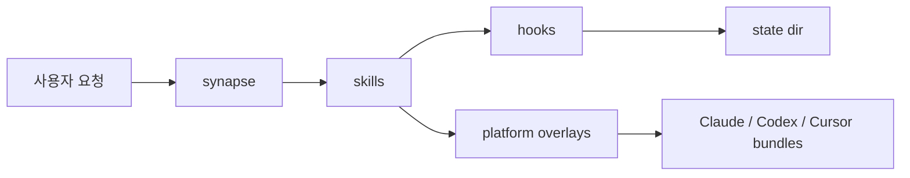

# 01. 프로젝트 개요

이 문서는 프로젝트를 처음 보는 개발자가 제품 목적과 저장소 구성을 빠르게 이해하도록 돕습니다.

## 한눈에 보기

<!-- AI-SYMBIOTE:START overview:project-summary -->
`ai-symbiote`는 Claude Code, Codex CLI, Cursor에서 같은 공용 코어를 공유하는 AI 에이전트 오케스트레이션 플러그인입니다. 핵심은 에이전트가 반복 실수하지 않도록 상태 파일, 훅, 스킬, 로그를 하나의 하네스로 묶는 데 있습니다. 신규 개발자는 이 프로젝트를 "AI 에이전트 실행 환경 + 자동 학습 가드레일"로 이해하면 가장 빠릅니다.

<!-- AI-SYMBIOTE:END overview:project-summary -->

## 저장소 지도

<!-- AI-SYMBIOTE:START overview:repo-map -->
| 경로 | 역할 |
|------|------|
| `shared/` | 공용 스킬, 훅, 시드, 태스크마스터, 메신저 브리지 |
| `platforms/` | Claude/Codex/Cursor 차이만 담는 오버레이 |
| `scripts/` | 빌드/버전 동기화 진입점 |
| `tests/` | 셸 기반 계약/회귀 테스트 |
| `plugins/`, `dist/` | 빌드 결과물 |
| `docs/` | 번호형 개발자 문서 세트 |

- 공용 스킬 수: 28
- 시드 규칙 수: 5
- 플랫폼 오버레이: Claude=yes, Codex=yes, Cursor=yes
<!-- AI-SYMBIOTE:END overview:repo-map -->

## 추천 읽기 순서

<!-- AI-SYMBIOTE:START overview:docs-journey -->
프로젝트를 빠르게 이해하려면 아래 문서 순서를 유지하는 편이 좋습니다.

1. `00-시작하기` — 당장 무엇을 실행해야 하는지
2. `01-프로젝트-개요` — 왜 이런 구조인지
3. `02-아키텍처` — 어디에 무엇이 있는지
4. `04-주요-기능` — 실제로 무엇을 해주는지
5. `07-운영-흐름-및-배포` — 변경이 어떻게 배포까지 이어지는지
<!-- AI-SYMBIOTE:END overview:docs-journey -->
