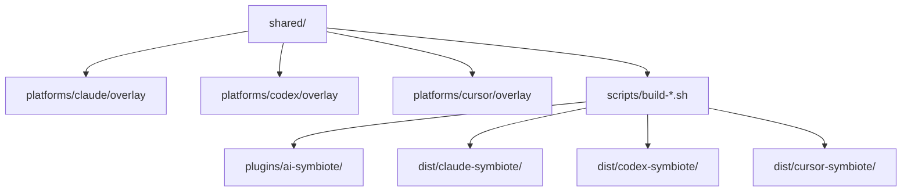
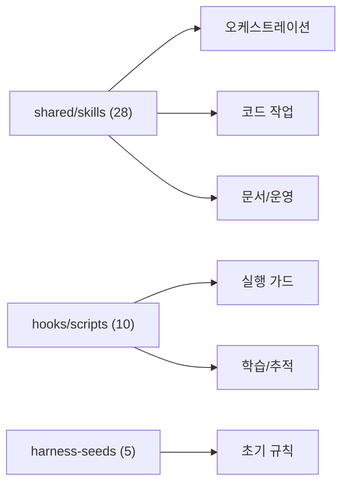

# 02. 아키텍처

이 문서는 공용 코어, 플랫폼 오버레이, 상태 구조를 설명합니다.

## 시스템 개요

<!-- AI-SYMBIOTE:START architecture:system-overview -->
이 저장소의 실제 원본은 `shared/`와 `platforms/*/overlay/`입니다. 빌드 스크립트가 이 둘을 합쳐 Claude/Codex/Cursor 번들을 만들고, 테스트가 그 산출물이 소스와 맞는지 확인합니다.

<!-- AI-SYMBIOTE:END architecture:system-overview -->

## 핵심 서브시스템

<!-- AI-SYMBIOTE:START architecture:subsystems -->

| 서브시스템 | 설명 |
|-----------|------|
| `shared/skills/` | 스킬 정의와 보조 스크립트 |
| `shared/hooks/scripts/` | guard, setup, 학습, 추적, 보안 스크립트 |
| `shared/harness-seeds/` | 스택별 초기 규칙 |
| `shared/taskmaster/` | PRD/task 스키마 |
| `shared/messenger-bridge/` | Telegram/Slack/Discord 브리지 |
<!-- AI-SYMBIOTE:END architecture:subsystems -->

## 플랫폼 차이

<!-- AI-SYMBIOTE:START architecture:platform-differences -->
| 항목 | Claude | Codex | Cursor |
|------|--------|-------|--------|
| manifest 경로 | `.claude-plugin/plugin.json` | `.codex-plugin/plugin.json` | `.cursor-plugin/plugin.json` |
| hooks 이벤트명 | PascalCase (`PreToolUse`) | PascalCase (`PreToolUse`) | lower camelCase (`sessionStart`, `preToolUse`, `postToolUse`) |
| hooks 매처 | `Bash`, `Read\|Skill`, `Write\|Edit` | `Bash`만 | `Shell`, `Read`, `Write` |
| 설치 스크립트 | `platforms/claude/install.sh` | `platforms/codex/install.sh` | `platforms/cursor/install.sh` |

현재 버전 동기화 기준 줄:
- 현재 버전: `0.10.0`
<!-- AI-SYMBIOTE:END architecture:platform-differences -->
