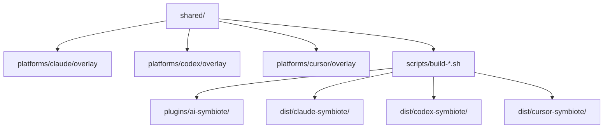
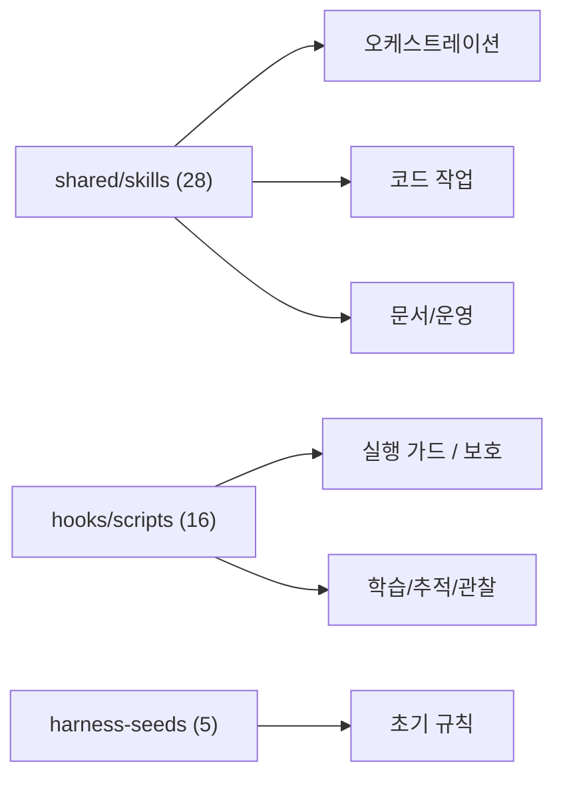
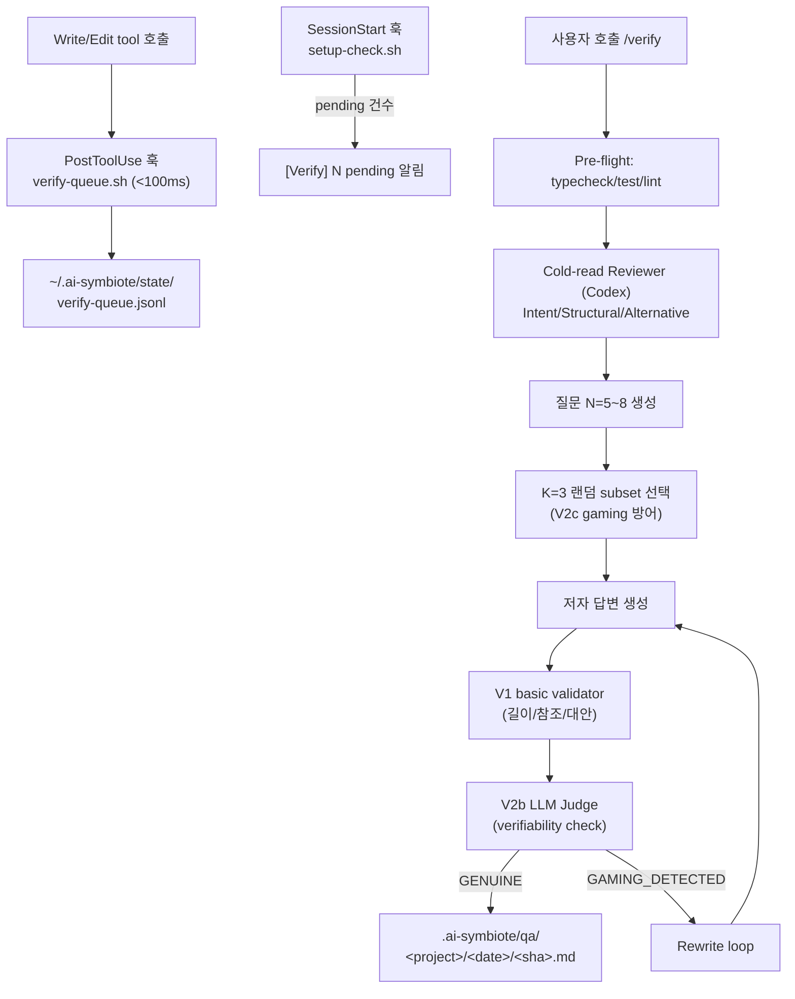

# 02. 아키텍처

이 문서는 공용 코어, 플랫폼 오버레이, 상태 구조를 설명합니다.

## 시스템 개요

<!-- AI-SYMBIOTE:START architecture:system-overview -->
이 저장소의 실제 원본은 `shared/`와 `platforms/*/overlay/`입니다. 빌드 스크립트가 이 둘을 합쳐 Claude/Codex/Cursor 번들을 만들고, 테스트가 그 산출물이 소스와 맞는지 확인합니다.

<!-- AI-SYMBIOTE:END architecture:system-overview -->

## 핵심 서브시스템

<!-- AI-SYMBIOTE:START architecture:subsystems -->

| 서브시스템 | 설명 |
|-----------|------|
| `shared/skills/` | 스킬 정의와 보조 스크립트 |
| `shared/hooks/scripts/` | guard, setup, 학습, 추적, 보안, dispatcher, compaction, instinct 스크립트 |
| `shared/harness-seeds/` | 스택별 초기 규칙 |
| `shared/taskmaster/` | PRD/task 스키마 |
| `shared/messenger-bridge/` | Telegram/Slack/Discord 브리지 |
<!-- AI-SYMBIOTE:END architecture:subsystems -->

## 플랫폼 차이

<!-- AI-SYMBIOTE:START architecture:platform-differences -->
| 항목 | Claude | Codex | Cursor |
|------|--------|-------|--------|
| manifest 경로 | `.claude-plugin/plugin.json` | `.codex-plugin/plugin.json` | `.cursor-plugin/plugin.json` |
| hooks 이벤트명 | PascalCase (`PreToolUse`) | PascalCase (`PreToolUse`) | lower camelCase (`sessionStart`, `preToolUse`, `postToolUse`) |
| hooks 매처 | `Bash`, `Read\|Skill`, `Write\|Edit`, `*` | `Bash`, `Write\|Edit` | `Shell`, `Read`, `Write` |
| PreCompact | ✅ | ✗ (미지원) | ✅ |
| PostToolUseFailure | ✅ | ✗ (미지원) | ✅ |
| GateGuard | ✅ (tracker + gate) | ✗ (Read tracker 없음) | ✅ |
| MCP Health | ✅ (check + failure + success) | ✗ (failure 미지원) | ✅ |
| 설치 스크립트 | `platforms/claude/install.sh` | `platforms/codex/install.sh` | `platforms/cursor/install.sh` |

현재 버전 동기화 기준 줄:
- 현재 버전: `0.11.0`
<!-- AI-SYMBIOTE:END architecture:platform-differences -->

## Write-time Verification Layer (Option D)

AI가 작성한 코드의 opacity(이유 불투명)를 행동적으로 측정·제거하는 파이프라인입니다. Post-hoc PR 리뷰 도구와 달리 write-time에 Q&A를 강제하고 이를 1급 리뷰 아티팩트로 만듭니다. 설계 배경은 `jimmy-main-design-20260420-225015.md` 참조.

### 데이터 흐름

### 큐와 훅의 책임 분리

`hooks.json`의 `timeout: 10s` 제약 때문에 Judge 호출(~30s)을 훅 안에 넣을 수 없습니다. 이를 Option D로 우회합니다:

| 단계 | 담당 | 응답 예산 | 위치 |
|------|------|-----------|------|
| Queue append | `verify-queue.sh` (PostToolUse Write\|Edit) | <100ms | `shared/hooks/scripts/verify-queue.sh` |
| Pending 알림 | `setup-check.sh` (SessionStart) | <1s | `shared/hooks/scripts/setup-check.sh` |
| Reviewer + Judge | `/verify` 스킬 (사용자 명시적 호출) | ~60s × N | `shared/skills/verify/SKILL.md` |

### Queue 스키마 (v2, since 2026-04-21)

| 필드 | 목적 | 비고 |
|------|------|------|
| `ts` | 편집 발생 시각 (UTC ISO) | |
| `project` | `basename(repo_root)` | 사람이 읽을 UI 용도. 동명 레포는 구분 못 함 |
| `repo_root` | git 작업 트리 절대경로 | **동명 레포 격리의 진짜 키**. filter는 이걸 우선 |
| `branch` | 현재 브랜치명 | |
| `base_sha` | 편집 **직전** HEAD | `/verify` 의 diff 수집 계약 기준점 |
| `sha` | legacy v1 호환용, `base_sha`와 동일 | 다음 메이저에서 제거 예정 |
| `file` | 수정된 파일 절대경로 | |
| `trigger` | `write` \| `edit` (소문자) | |

**`base_sha` 계약이 중요합니다.** `base_sha`는 편집 직전 HEAD이므로 `git show <base_sha>`로 읽으면 이전 커밋 내용이 나옵니다(버그). 올바른 diff 수집:

- `HEAD == base_sha` (편집 후 아직 커밋 안 함) → `git diff <base_sha> -- <file>` (+ `--cached`)
- `HEAD != base_sha` (편집 후 커밋이 누적됨) → `git diff <base_sha>..HEAD -- <file>`
- `base_sha == "uncommitted"` (초기 repo) → 현재 작업 트리 전체를 diff로 취급

Schema v1 entry(= `repo_root`·`base_sha` 필드 없음, `sha`만 존재)는 `/verify`가 `sha`를 `base_sha`로 간주하고, `setup-check.sh`는 `project + branch`로 fallback 매칭합니다.

### Validator 계층

Stage 0 실측(2026-04-20)에서 V1만으로는 gaming 3/3 통과. V2b LLM judge가 실 차단선입니다.

| 계층 | 목적 | 항목 | 필수 여부 |
|------|------|------|-----------|
| V1a | 답변 길이 | ≥ 50자 | 필수 |
| V1b | 코드 참조 | `file.ext:line` 또는 backtick 식별자 | 필수 |
| V1c | 부재 키워드 | "모르겠음\|don't know\|그냥" 부재 | 필수 |
| V1d | 대안 언급 | "대신\|instead\|could have\|rejected\|considered" | 필수 |
| V2a | PR 본문 seeding 탐지 | 본문-답변 bigram overlap > 40% | 플래그 |
| V2b | LLM Judge verifiability | 저자와 다른 벤더의 judge | **필수 방어선** |
| V2c | 질문 랜덤화 | reviewer N=5 생성 → 저자 K=3 무작위 | 필수 |

### 플랫폼 지원

- **Claude**: hook queue + `/verify` skill 둘 다 지원 (초기 지원 플랫폼)
- **Codex**: Write\|Edit PostToolUse 훅 부재로 자동 큐잉 불가. `/verify --sha <sha>` 또는 `--file <path>` 수동 호출만 지원 (v0.10.x 기준 제한). `build-codex.sh`가 `shared/skills/verify/SKILL.md`를 `dist/codex-symbiote/`로 복사하므로 스킬 자체는 노출됨
- **Cursor**: 후속 릴리즈(v0.11+)에서 별도 검토 예정. 현재 배포에는 통합되지 않음

### Artifact 영속성

PR 본문은 squash-sensitive하고 mutable하므로 검증 transcript는 git-tracked 경로에 저장합니다:

- 경로: `.ai-symbiote/qa/<project>/<YYYY-MM-DD>/<sha-or-timestamp>.md`
- PR 본문에는 이 파일 경로를 링크로 참조
- `gc` 스킬 확장으로 오래된 entry / artifact 정리 예정
