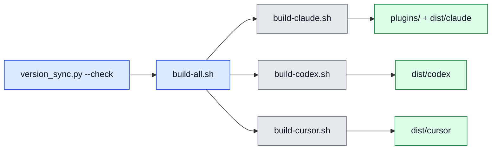

# 03. 빌드 및 실행

이 문서는 필요한 도구와 빌드, 설치, 업데이트 경로를 정리합니다.

## 필요한 도구

<!-- AI-SYMBIOTE:START build:toolchain -->
| 도구 | 실제 사용 위치 |
|------|----------------|
| `bash` | build/test/hook 스크립트 전체 |
| `rsync` | 번들 복사 |
| `python3` | `scripts/version_sync.py`, 설치 보조 |
| `git` | slug 계산, 설치/업데이트, CI 검증 |
| `jq` | hook JSON 파싱 |
| `grep`, `sed`, `awk`, `find` | 텍스트 처리와 테스트 |
| `node`, `npm`, `tsc` | 메신저 브리지 개발/실행 |
<!-- AI-SYMBIOTE:END build:toolchain -->

## 빌드 흐름

<!-- AI-SYMBIOTE:START build:build-run-flow -->

1. `python3 scripts/version_sync.py --check`
2. `bash scripts/build-all.sh`
3. 필요하면 `bash scripts/build-claude.sh`, `bash scripts/build-codex.sh`, `bash scripts/build-cursor.sh`
4. 필요하면 플랫폼별 설치 스크립트 실행
<!-- AI-SYMBIOTE:END build:build-run-flow -->

## 설치와 업데이트

<!-- AI-SYMBIOTE:START build:install-update-path -->
| 목적 | 명령 |
|------|------|
| Claude 로컬 설치 | `bash platforms/claude/install.sh` |
| Codex 로컬 설치 | `bash platforms/codex/install.sh` |
| Cursor 로컬 설치 | `bash platforms/cursor/install.sh` |
| 공용 번들 갱신 | `bash scripts/build-all.sh` |
| 사용자 업데이트 | Claude는 `/ai-symbiote:update`, Codex는 `$ai-symbiote:update`, Cursor는 설치 스크립트 재실행 |

- Claude overlay 존재: yes
- Codex overlay 존재: yes
- Cursor overlay 존재: yes
<!-- AI-SYMBIOTE:END build:install-update-path -->
