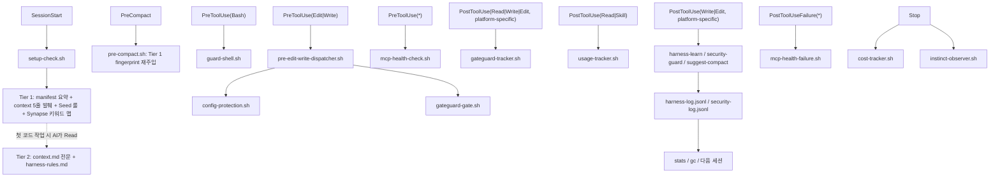

# 04. 주요 기능

이 문서는 이 프로젝트가 실제로 제공하는 핵심 기능을 설명합니다.

## 하네스 핵심 축

<!-- AI-SYMBIOTE:START features:harness-pillars -->
핵심 기능은 하네스입니다. 프로젝트 컨텍스트를 3-Tier Lazy Context 방식으로 세션 시작에 주입하고, 위험한 명령을 막고, 실패 패턴을 로그로 남기고, 반복 오류를 규칙으로 학습합니다.

아래 다이어그램은 Claude 기준으로 읽는 것이 가장 정확합니다. Cursor는 현재 `Write` 중심 훅 매처를 사용합니다.

### 훅 파이프라인 요약

| 이벤트 | 훅 | 역할 |
|--------|-----|------|
| SessionStart | setup-check.sh | Tier 1 fingerprint + Seed 룰 + instinct cleanup |
| PreCompact | pre-compact.sh | compaction 시 fingerprint 재주입 |
| UserPromptSubmit | intent-router.sh | 자연어 의도 분류 → 스킬 추천 힌트 주입 |
| PreToolUse(Bash) | guard-shell.sh | 위험 명령 차단 |
| PreToolUse(Edit\|Write) | pre-edit-write-dispatcher.sh | Config Protection → GateGuard 차단 검사 |
| PreToolUse(*) | mcp-health-check.sh | 장애 MCP 서버 차단 |
| PostToolUse(Read\|Write\|Edit, platform-specific) | gateguard-tracker.sh | 읽은 파일과 성공한 쓰기 대상 추적, Cursor는 현재 `Write` 중심 |
| PostToolUse(Read\|Skill) | usage-tracker.sh | 스킬/명령 사용량 기록 |
| PostToolUse(Write\|Edit, platform-specific) | harness-learn / security-guard / suggest-compact | 패턴 학습 + 보안 검사 + compact 제안, Cursor는 현재 `Write` 중심 |
| PostToolUseFailure(*) | mcp-health-failure.sh | MCP 실패 기록 |
| Stop | cost-tracker.sh + instinct-observer.sh + next-action.sh | 세션 메트릭 + 관찰 기록 + 다음 스킬 추천 |

> **안정성**: 모든 훅은 `common.sh`의 `read_stdin_safe`를 사용해 stdin을 2초 timeout으로 읽습니다. harness가 stdin을 닫지 않아도 훅이 hang되지 않도록 보장합니다.
<!-- AI-SYMBIOTE:END features:harness-pillars -->

## 오케스트레이션

<!-- AI-SYMBIOTE:START features:orchestration -->
`synapse`는 사용자 요청을 직접 스킬로 보낼지, 팀 템플릿으로 조합할지 판단합니다. `team-templates`와 `roles`는 analysis, implementation, review, planning, research, dynamic 흐름을 지원합니다.

| 축 | 역할 |
|----|------|
| `synapse` | 의도 라우팅 |
| `team-templates` | 팀 구성 템플릿 |
| `roles` | Scout, Architect, Builder, Inspector, Researcher, Codex 계약 |
| `auto` | 자율 실행 루프 |
<!-- AI-SYMBIOTE:END features:orchestration -->

## 먼저 알아둘 스킬

<!-- AI-SYMBIOTE:START features:key-skills -->
처음 보는 개발자가 먼저 알면 좋은 스킬:

- `setup` — 상태 디렉터리와 컨텍스트 초기화
- `dev-docs` — 번호형 문서 세트 갱신
- `review` — 현재 변경사항 코드 리뷰
- `analyze` / `plan` — 구조 파악과 구현 계획
- `security` — 보안 baseline과 상태 확인
- `stats` / `gc` — 하네스가 어떻게 진화했는지 확인
- `context-budget` — 토큰 소비 감사 및 최적화 권장
- `instinct-status` — 학습된 패턴과 confidence 점수 확인
<!-- AI-SYMBIOTE:END features:key-skills -->
