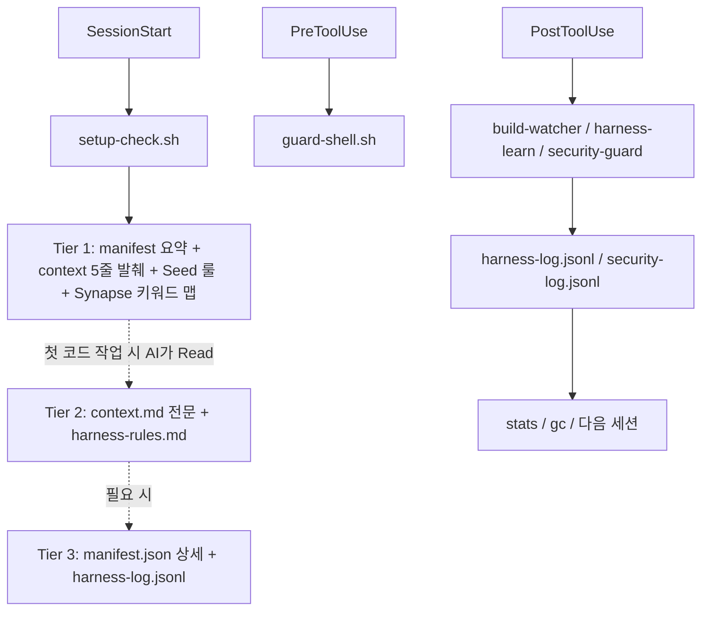

# 04. 주요 기능

이 문서는 이 프로젝트가 실제로 제공하는 핵심 기능을 설명합니다.

## 하네스 핵심 축

<!-- AI-SYMBIOTE:START features:harness-pillars -->
핵심 기능은 하네스입니다. 프로젝트 컨텍스트를 3-Tier Lazy Context 방식으로 세션 시작에 주입하고, 위험한 명령을 막고, 실패 패턴을 로그로 남기고, 반복 오류를 규칙으로 학습합니다.

<!-- AI-SYMBIOTE:END features:harness-pillars -->

## 오케스트레이션

<!-- AI-SYMBIOTE:START features:orchestration -->
`synapse`는 사용자 요청을 직접 스킬로 보낼지, 팀 템플릿으로 조합할지 판단합니다. `team-templates`와 `roles`는 analysis, implementation, review, planning, research, dynamic 흐름을 지원합니다.

| 축 | 역할 |
|----|------|
| `synapse` | 의도 라우팅 |
| `team-templates` | 팀 구성 템플릿 |
| `roles` | Scout, Architect, Builder, Inspector, Researcher, Codex 계약 |
| `auto` | 자율 실행 루프 |
<!-- AI-SYMBIOTE:END features:orchestration -->

## 먼저 알아둘 스킬

<!-- AI-SYMBIOTE:START features:key-skills -->
처음 보는 개발자가 먼저 알면 좋은 스킬:

- `setup` — 상태 디렉터리와 컨텍스트 초기화
- `dev-docs` — 번호형 문서 세트 갱신
- `review` — 현재 변경사항 코드 리뷰
- `analyze` / `plan` — 구조 파악과 구현 계획
- `security` — 보안 baseline과 상태 확인
- `stats` / `gc` — 하네스가 어떻게 진화했는지 확인
<!-- AI-SYMBIOTE:END features:key-skills -->

