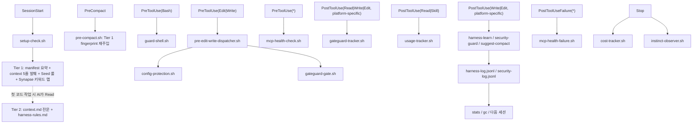

# 04. 주요 기능

이 문서는 이 프로젝트가 실제로 제공하는 핵심 기능을 설명합니다.

## 하네스 핵심 축

<!-- AI-SYMBIOTE:START features:harness-pillars -->
핵심 기능은 하네스입니다. 프로젝트 컨텍스트를 3-Tier Lazy Context 방식으로 세션 시작에 주입하고, 위험한 명령을 막고, 실패 패턴을 로그로 남기고, 반복 오류를 규칙으로 학습합니다.

아래 다이어그램은 Claude 기준으로 읽는 것이 가장 정확합니다. Cursor는 현재 `Write` 중심 훅 매처를 사용합니다.



### 훅 파이프라인 요약

| 이벤트 | 훅 | 역할 |
|--------|-----|------|
| SessionStart | setup-check.sh | Tier 1 fingerprint + Seed 룰 + instinct cleanup |
| PreCompact | pre-compact.sh | compaction 시 fingerprint 재주입 |
| UserPromptSubmit | intent-router.sh | 자연어 의도 분류 → 스킬 추천 힌트 주입 |
| PreToolUse(Bash) | guard-shell.sh | 위험 명령 차단 |
| PreToolUse(Edit\|Write) | pre-edit-write-dispatcher.sh | Config Protection → GateGuard 차단 검사 |
| PreToolUse(*) | mcp-health-check.sh | 장애 MCP 서버 차단 |
| PostToolUse(Read\|Write\|Edit, platform-specific) | gateguard-tracker.sh | 읽은 파일과 성공한 쓰기 대상 추적, Cursor는 현재 `Write` 중심 |
| PostToolUse(Read\|Skill) | usage-tracker.sh | 스킬/명령 사용량 기록 |
| PostToolUse(Write\|Edit, platform-specific) | harness-learn / security-guard / suggest-compact | 패턴 학습 + 보안 검사 + compact 제안, Cursor는 현재 `Write` 중심 |
| PostToolUseFailure(*) | mcp-health-failure.sh | MCP 실패 기록 |
| Stop | cost-tracker.sh + instinct-observer.sh + next-action.sh | 세션 메트릭 + 관찰 기록 + 다음 스킬 추천 |

> **안정성**: 모든 훅은 `common.sh`의 `read_stdin_safe`를 사용해 stdin을 2초 timeout으로 읽습니다. harness가 stdin을 닫지 않아도 훅이 hang되지 않도록 보장합니다.
<!-- AI-SYMBIOTE:END features:harness-pillars -->


## 오케스트레이션

<!-- AI-SYMBIOTE:START features:orchestration -->
`synapse`는 사용자 요청을 직접 스킬로 보낼지, 팀 템플릿으로 조합할지 판단합니다. `team-templates`와 `roles`는 analysis, implementation, review, planning, research, dynamic 흐름을 지원합니다.

| 축 | 역할 |
|----|------|
| `synapse` | 의도 라우팅 |
| `team-templates` | 팀 구성 템플릿 |
| `roles` | Scout, Architect, Builder, Inspector, Researcher, Codex 계약 |
| `auto` | 자율 실행 루프 |
<!-- AI-SYMBIOTE:END features:orchestration -->


## 먼저 알아둘 스킬

<!-- AI-SYMBIOTE:START features:key-skills -->
처음 보는 개발자가 먼저 알면 좋은 스킬:

- `setup` — 상태 디렉터리와 컨텍스트 초기화
- `dev-docs` — 번호형 문서 세트 갱신
- `review` — 현재 변경사항 코드 리뷰
- `analyze` / `plan` — 구조 파악과 구현 계획
- `verify` (v0.11+) — Write-time Verification Layer (편집 후 cold-read reviewer + judge)
- `security` — 보안 baseline, 상태 확인, AI-restriction hook mode (`/security mode`)
- `stats` / `gc` — 하네스가 어떻게 진화했는지 확인
- `context-budget` — 토큰 소비 감사 및 최적화 권장
- `instinct-status` — 학습된 패턴과 confidence 점수 확인
<!-- AI-SYMBIOTE:END features:key-skills -->


## Write-time Verification Layer (v0.11+)

AI 편집의 opacity 문제(동작은 맞지만 왜 그렇게 짰는지 재구성 불가)를 편집 직후에 드러내는 파이프라인입니다. 시간 축이 post-hoc PR 리뷰와 다릅니다.

- **PostToolUse 훅** `verify-queue.sh`가 편집 이벤트를 `~/.ai-symbiote/state/verify-queue.jsonl`에 `<100ms`로 append
- **`/verify` 스킬** (사용자 명시 호출) — 큐에서 pending entry 꺼내 cold-read reviewer(Codex) + V1 basic + V2b LLM judge + V2c 질문 랜덤화 순으로 실행
- **Artifact** — `.ai-symbiote/qa/<project>/<date>/<sha>.md`에 Q&A 트랜스크립트 저장. 코드가 아니라 이 아티팩트가 리뷰의 주된 대상

자세한 동작 원리는 [09-검증-레이어-동작원리.md](09-검증-레이어-동작원리.md)에 mermaid 12개 + FAQ로 설명되어 있습니다. 형식 명세는 [02-아키텍처.md](02-아키텍처.md) "Write-time Verification Layer" 섹션을 참고하세요.


## AI-Restriction Hook Modes (v0.12+)

AI의 동작을 제한하는 5개 hook을 사용자가 직접 켜고 끌 수 있습니다. `manifest.json`의 `security.mode` + `security.hooks.*`가 source of truth.

### 게이트 대상

| Hook | 역할 | Event |
|------|------|-------|
| `guardShell` | 위험 shell 명령 차단 | PreToolUse Bash |
| `securityGuard` | 쓰기 후 보안 anti-pattern 스캔 | PostToolUse Write\|Edit |
| `harnessLearn` | 반복 실수 학습 후보 기록 | PostToolUse Write\|Edit |
| `commentChecker` | 자명 주석 감시 | PostToolUse Write\|Edit |
| `verifyQueue` | Write-time Verification 큐잉 | PostToolUse Write\|Edit |

### Preset 모드

| Mode | 동작 | 용도 |
|------|------|------|
| `minimal` | 전부 off | 실험/스파이크, 최대 자율 |
| `balanced` (기본) | 전부 on | 프로덕션 기본 |
| `strict` | balanced + 향후 강화 hook | 고위험 변경 |
| `custom` | `security.hooks.*` 개별 토글 | 프로젝트별 세부 제어 |

### 운영 명령

```text
/ai-symbiote:security mode                                      # 현재 상태 확인
/ai-symbiote:security mode balanced                             # preset 전환
/ai-symbiote:security mode custom --hooks '{"guardShell":false,"verifyQueue":true}'
```

### 런타임 Gate + 보안 특성

`shared/hooks/scripts/lib/security-mode.sh`의 `is_hook_enabled "<name>"`가 매 hook 상단에서 호출되며, 결과는 `~/ai-symbiote/{slug}/state/security-mode.cache`에 캐시됩니다 (hot path <5ms). `/security mode`로 변경 시 즉시 무효화, **Claude Code 재시작 불필요**.

- **Kill-switch 보호** — `config-protection.sh`가 AI의 Write/Edit 도구로부터 `manifest.json`을 보호. `/security mode` 서브커맨드는 Python 직접 호출이라 정당히 통과
- **Cache symlink 거부** — `state/security-mode.cache`가 symlink이면 refuse
- **Helper load fail-open** — `source lib/security-mode.sh` 실패 시 hook이 silent disable되지 않고 정상 실행 (`_SEC_MODE_LIB_LOADED` sentinel)
- **`SYMBIOTE_SECURITY_FORCE` double-gate** — `SYMBIOTE_TESTING=1` 없으면 무시
