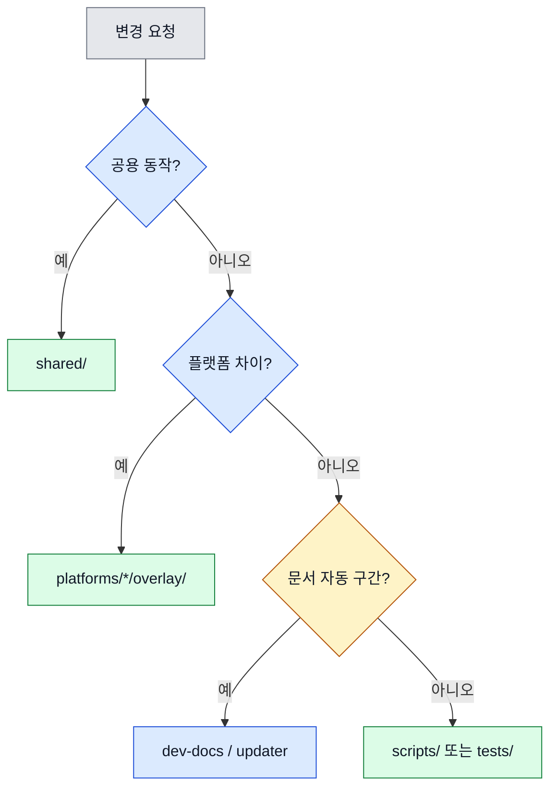

# 05. 코딩 컨벤션

이 문서는 어디를 수정해야 하는지와 생성물 경계를 설명합니다.

## 어디를 수정할까?

<!-- AI-SYMBIOTE:START conventions:decision-tree -->

<!-- AI-SYMBIOTE:END conventions:decision-tree -->

## 편집 규칙

<!-- AI-SYMBIOTE:START conventions:editing-rules -->
- 공용 동작은 `shared/`에서 수정한다.
- 플랫폼 차이는 `platforms/*/overlay/`에 둔다.
- `plugins/`와 `dist/`는 직접 수정하지 않는다.
- 문서 마커 내부는 `dev-docs`가 관리한다.
- 새 스킬은 `shared/skills/<name>/SKILL.md` 구조를 따른다.
<!-- AI-SYMBIOTE:END conventions:editing-rules -->

## 생성물 경계

<!-- AI-SYMBIOTE:START conventions:generated-boundaries -->
| 구역 | 직접 수정 |
|------|-----------|
| `shared/` | O |
| `platforms/*/overlay/` | O |
| `scripts/`, `tests/` | O |
| `plugins/`, `dist/` | X |
| docs 마커 블록 내부 | X |
| docs 마커 바깥 | O |
<!-- AI-SYMBIOTE:END conventions:generated-boundaries -->
