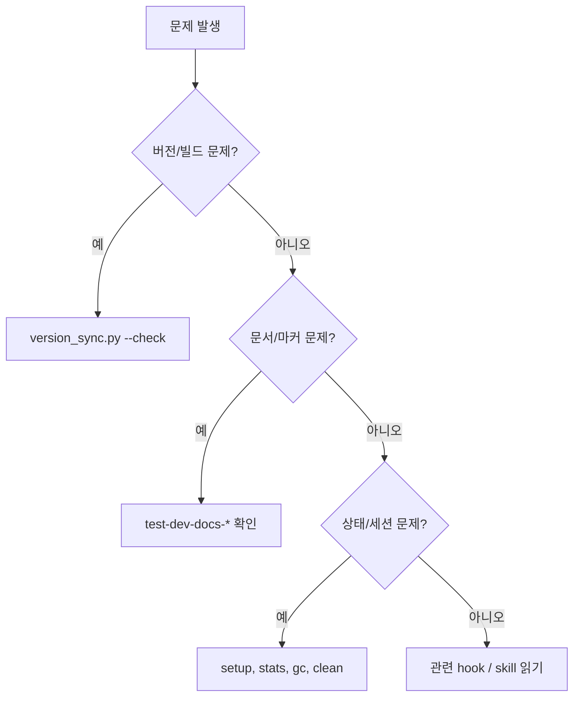

# 06. 문제해결 가이드

이 문서는 신규 개발자가 자주 마주치는 문제와 복구 경로를 정리합니다.

## 빠른 진단

<!-- AI-SYMBIOTE:START troubleshooting:quick-diagnosis -->

<!-- AI-SYMBIOTE:END troubleshooting:quick-diagnosis -->

## 자주 만나는 문제

<!-- AI-SYMBIOTE:START troubleshooting:common-failures -->
| 증상 | 먼저 볼 곳 |
|------|-------------|
| `version sync mismatch` | `VERSION`, `scripts/version_sync.py`, `02-아키텍처.md` |
| 빌드 후 diff 남음 | `scripts/build-all.sh`, `platforms/*/overlay/`, `plugins/`, `dist/` |
| `manifest.json not found` | `setup` 스킬, `shared/hooks/scripts/setup-check.sh` |
| Codex에서 일부 훅이 안 뜸 | `platforms/codex/overlay/hooks/hooks.json`와 플랫폼 제한 |
| 반복 규칙이 너무 많음 | `gc`, `stats`, `harness-log.jsonl` |
<!-- AI-SYMBIOTE:END troubleshooting:common-failures -->

## 복구 순서

<!-- AI-SYMBIOTE:START troubleshooting:recovery-commands -->
자주 쓰는 복구 순서:

1. `python3 scripts/version_sync.py --check`
2. `bash scripts/build-all.sh`
3. `bash tests/test-dev-docs-skill.sh && bash tests/test-dev-docs-updater.sh`
4. 상태 문제가 의심되면 `setup`, `stats`, `gc`, `clean` 순으로 확인
5. 그래도 모호하면 해당 스킬의 `SKILL.md`와 관련 hook 스크립트 header를 먼저 읽기
<!-- AI-SYMBIOTE:END troubleshooting:recovery-commands -->

