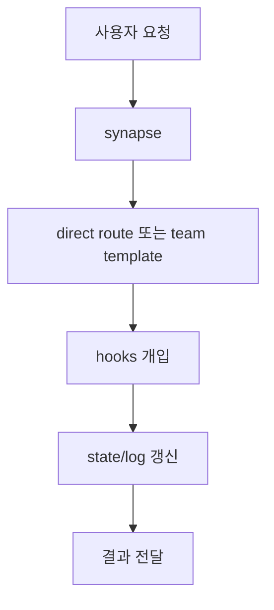
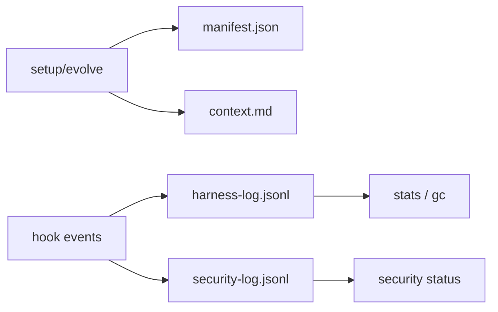
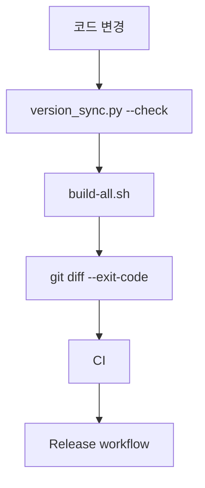

# 07. 운영 흐름 및 배포

이 문서는 요청 처리, 상태 흐름, CI/Release 파이프라인을 요약합니다.

## 요청 처리 흐름

<!-- AI-SYMBIOTE:START operations:request-flow -->

<!-- AI-SYMBIOTE:END operations:request-flow -->

## 상태와 로그 흐름

<!-- AI-SYMBIOTE:START operations:data-flow -->

<!-- AI-SYMBIOTE:END operations:data-flow -->

## CI와 릴리즈

<!-- AI-SYMBIOTE:START operations:ci-release-flow -->

| 단계 | 근거 파일 |
|------|-----------|
| CI 검증 | `.github/workflows/ci.yml` |
| Release 발행 | `.github/workflows/release.yml` |
<!-- AI-SYMBIOTE:END operations:ci-release-flow -->

