# 09. Write-time Verification Layer 동작원리

이 문서는 Write-time Verification Layer가 **왜 필요하고**, **어떻게 작동하고**, **어떤 공격을 막는지**를 그림 위주로 설명합니다. 형식 명세는 `docs/02-아키텍처.md`를 보세요. 이 문서는 "처음 보는 사람도 이해할 수 있게" 씁니다.

## TL;DR

> AI가 쓴 코드는 동작은 맞는데 **왜 그렇게 썼는지**를 알 수 없어서 리뷰가 불가능합니다. 이 레이어는 AI가 **자기가 쓴 코드를 스스로 심문하게** 만들어서, 답변 못 하면 rewrite 하게 강제합니다. 결과는 코드가 아니라 **Q&A 트랜스크립트**가 리뷰 대상이 됩니다.

## 왜 이게 필요한가

사람 코드와 AI 코드의 차이를 바둑에 빗대면 이렇습니다.

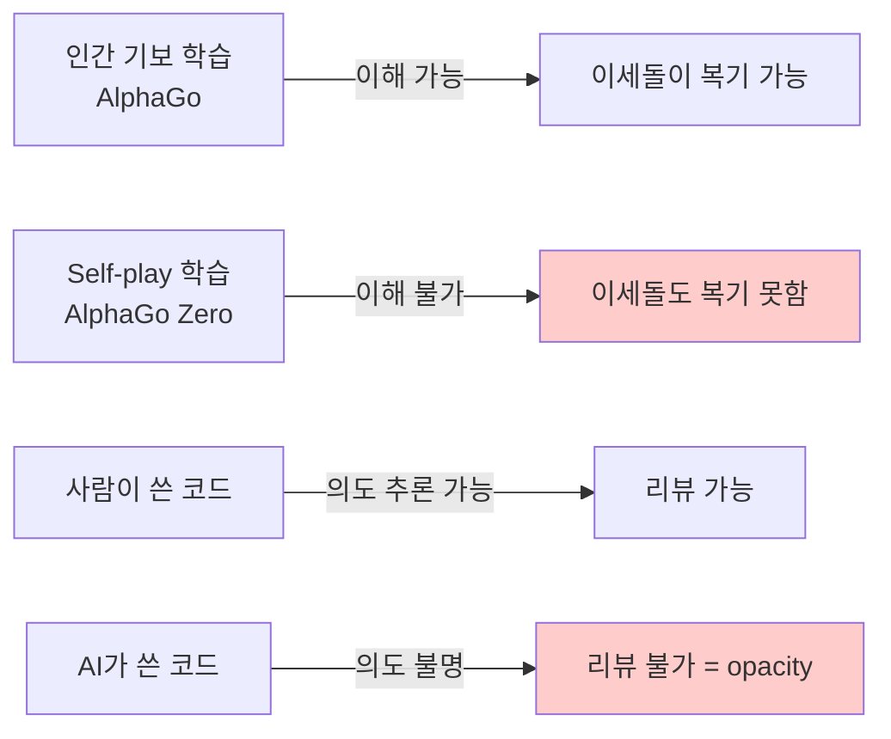

각 줄의 코드는 읽히지만, **왜 이렇게 설계했는지**를 재구성할 수 없습니다. 리뷰어가 "이 함수 왜 필요해?"라고 물어도 원 저자(AI)는 이미 사라졌고, 인간 리뷰어는 추측밖에 못 합니다.

**상용 AI 코드 리뷰 도구**(CodeRabbit, Greptile, cubic, qodo 등)는 PR **제출 후** 리뷰입니다. 이미 투명성을 잃은 코드를 뒤늦게 긁는 셈이죠. 이 레이어는 **write-time**, 즉 AI가 파일을 저장하는 순간에 개입해서 "왜 그렇게 썼는지 증명해봐"를 강제합니다.

## 전체 구조 (높은 수준)

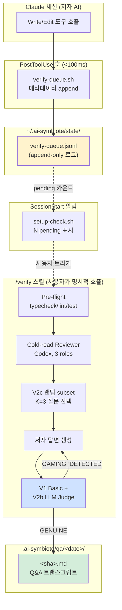

핵심은 **시간 분리**입니다. 훅은 <100ms로 큐잉만 하고 바로 끝납니다. 실제 검증(~30초 × N)은 사용자가 `/verify`를 호출할 때 몰아서 합니다. Claude Code hook의 `timeout: 10s` 제약을 우회하는 핵심 설계 결정이고, 이를 **Option D**라고 부릅니다.

## 한 번의 동작을 순서대로 (sequence diagram)

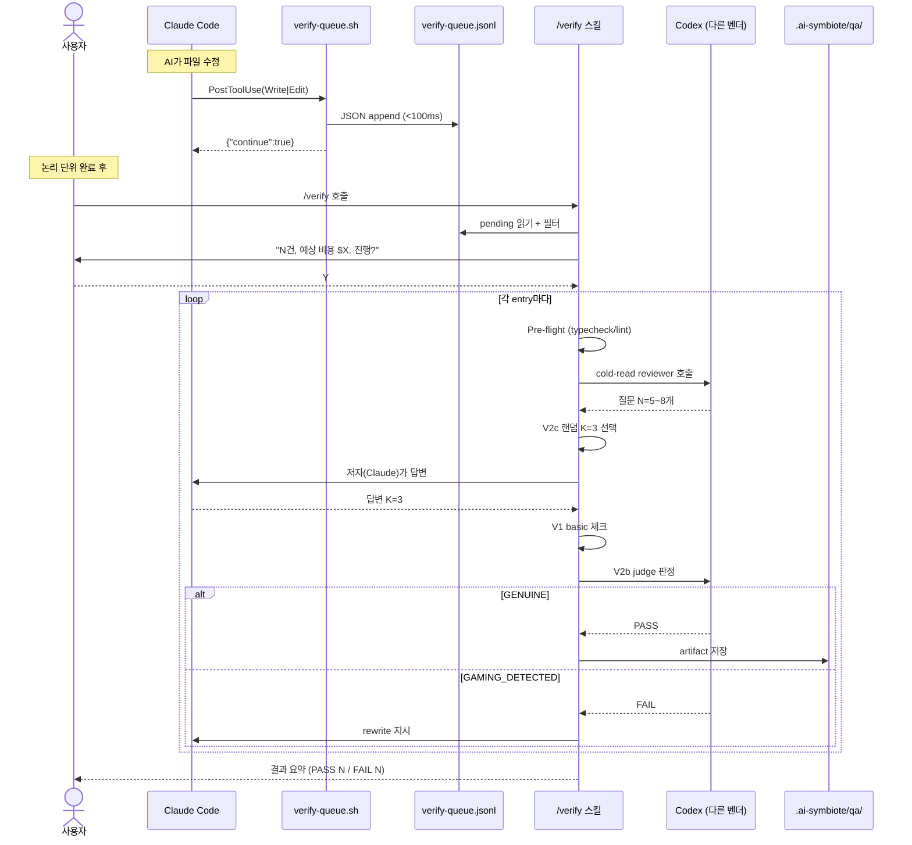

### 왜 Codex를 reviewer와 judge로 쓰나?

**AI끼리의 담합(collusion)을 막기 위해서**입니다.

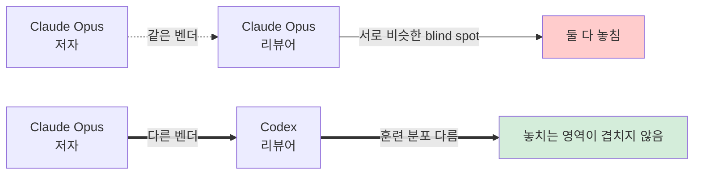

arxiv 2602.16741 연구 결과: "LLM 코드 리뷰어는 훈련 분포가 다를수록 blind spot 공유가 적다." 이 레이어는 이 원칙을 **config override 불가능한 하드 룰**로 고정했습니다. Claude 저자의 코드는 반드시 Codex가 리뷰하고 판정합니다.

## Validator 2층 구조

V1과 V2는 역할이 다릅니다.

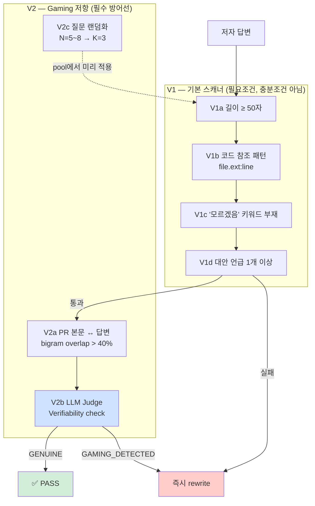

### V1만으로는 왜 부족한가

2026-04-20 Stage 0 실측에서 **V1만으로 3/3 gaming case 전부 통과**했습니다. 어떻게 뚫렸는지 예시:

**공격 시나리오**: 저자가 opaque한 코드를 쓰고, PR 본문에 그럴듯한 커버 스토리를 미리 심습니다. 질문이 오면 PR 본문의 표현을 paraphrase해서 답변.

| 답변 | V1a 길이 | V1b 코드 참조 | V1c 키워드 | V1d 대안 | V1 판정 |
|------|---------|-------------|----------|---------|--------|
| "`cache.ts:42`의 LRU를 대신 쓸 수도 있었지만, 우리 워크로드는 read-heavy라 write amortization이 더 중요해서 TinyLFU로 했습니다" | ≥50 ✓ | ✓ | ✓ | ✓ | **PASS** |

그런데 실제로 코드에 TinyLFU 같은 건 없고 그냥 평범한 Map이라면? V1은 못 잡습니다. **V2b judge**가 "그 주장을 뒷받침하는 artifact(벤치마크 파일, 주석, 참조 데이터)가 코드에 실재하는가?"를 구조적으로 검사해야 잡힙니다.

### V2c 질문 랜덤화가 필요한 이유

V2b judge만 있어도 seeding 공격의 **사전 준비 비용**이 낮습니다. 저자가 예상 질문 전부에 답변을 미리 준비할 수 있기 때문입니다.

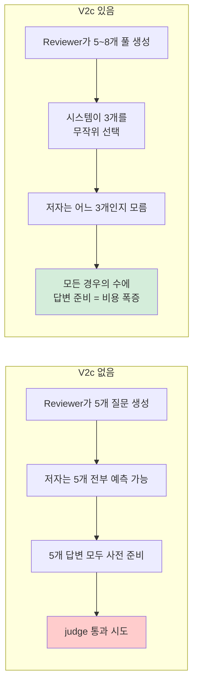

## 배치 캡: 비용 폭주 방지

`verify-queue.jsonl`이 하루에 100건 쌓일 수도 있습니다. Codex judge 1회가 ~$0.15라면 100건 = $15. 실수로 Y 한 번 누르면 터집니다.

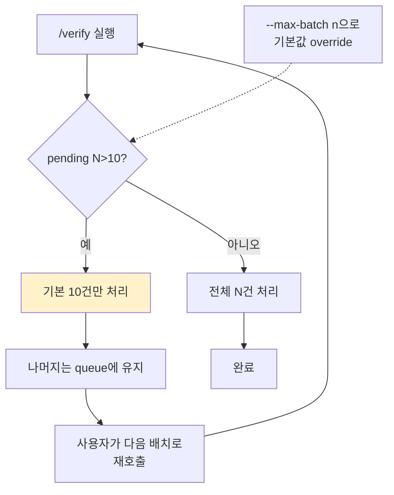

## Pre-flight: reviewer에게 힌트 주기

기계검증(typecheck/lint/test)은 AI-generated 코드의 전형적 opacity 패턴을 값싸게 잡습니다. 이걸 reviewer 질문 생성 **전에** 미리 돌려서 결과를 프롬프트에 주입합니다.

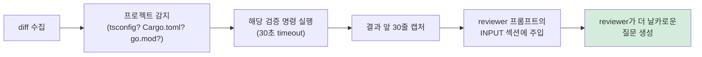

예시: lint가 `src/foo.ts:42 unused import`를 뱉으면, reviewer가 자동으로 "foo.ts:42의 unused import는 의도한 것인가, 아니면 이전 설계의 잔재인가?"를 묻게 됩니다. 이건 저자가 답변에서 진짜 이유를 드러내게 강제하는 좋은 프롬프트가 됩니다.

**Hard gate는 아닙니다**. 기계검증이 실패해도 Q&A는 계속 진행합니다. 목적은 reviewer에게 opacity 힌트를 주는 것이지 차단이 아닙니다.

## Artifact: 리뷰의 주체가 바뀐다

결과는 `.ai-symbiote/qa/<project>/<date>/<sha>.md`에 저장됩니다. 이 파일이 **인간 리뷰어의 실제 리뷰 대상**입니다.

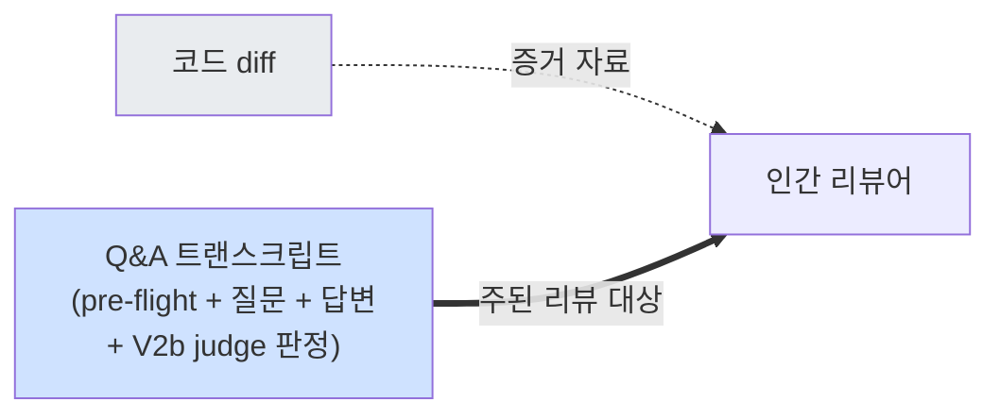

왜 PR 본문이 아니라 git-tracked 파일에 저장할까요?

- **PR 본문**: squash 가능, 덮어쓰기 가능 → 변조 위험
- **commit trailer**: 불변이지만 긴 transcript에 부적합
- **별도 저장소 (선택됨)**: git에 커밋되어 영속, PR 본문에 경로를 링크로 참조

## 플랫폼별 지원

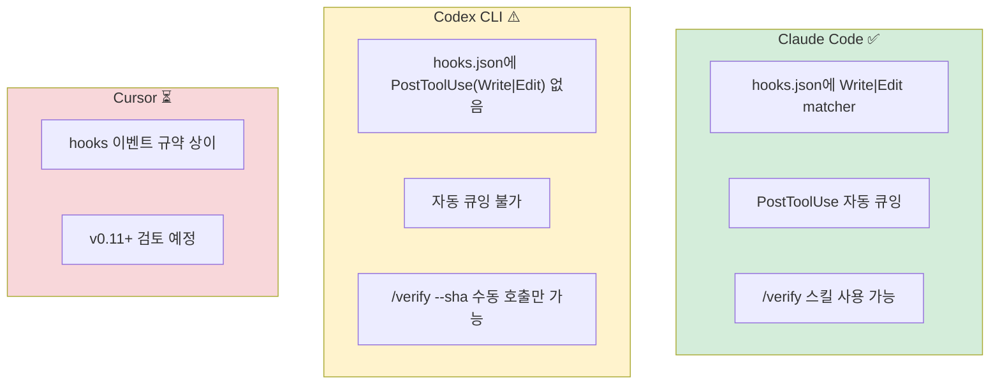

Codex 유저는 훅이 없는 대신 `/verify --sha <sha>` 또는 `--file <path>`로 수동 호출합니다. `build-codex.sh`가 `shared/skills/verify/SKILL.md`를 `dist/codex-symbiote/`로 복사하므로 스킬 자체는 노출됩니다.

## 상태 머신: entry 한 건의 일생

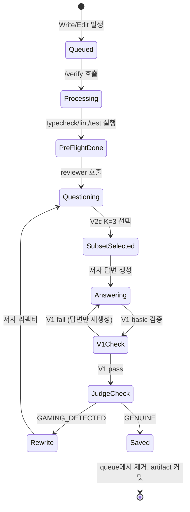

## 사용자가 실제로 보는 것

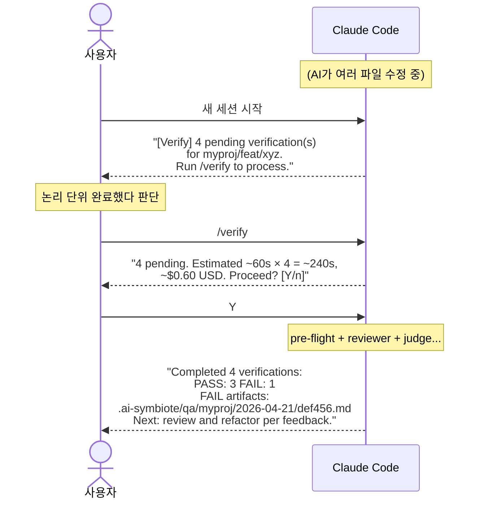

## FAQ

**Q. 왜 자동으로 실행 안 하고 사용자가 `/verify`를 호출해야 하나요?**
A. 훅의 `timeout: 10s` 제약 때문에 judge(~30s)를 훅 안에 못 넣습니다. 또한 edit 하나하나마다 돌리면 흐름을 방해합니다. **논리 단위가 완성된 시점**에 몰아서 하는 게 맞습니다.

**Q. "모르겠음"이라고 답하면 어떻게 되나요?**
A. V1c가 키워드를 잡아서 즉시 rewrite를 트리거합니다. 단 이건 **옳은 반응**입니다. 답변 못 하는 코드는 opacity 확정이고, 그럼 리팩터해서 명확하게 만들어야 합니다. "모르겠음"이 rewrite 시그널이 되는 건 설계의 핵심 메커니즘입니다.

**Q. pre-flight 기계검증이 느린 프로젝트면 어쩌죠?**
A. 각 명령마다 30초 timeout입니다. 초과하면 `(pre-flight: timeout)`으로 기록하고 Q&A는 계속 진행합니다. pre-flight는 hard gate가 아닙니다.

**Q. V2c의 K=3이 너무 적어서 중요한 질문을 놓치면요?**
A. Reviewer의 3개 role(Intent/Structural/Alternative)은 pool N=5~8에서 **각각의 관점**을 대표합니다. K=3을 뽑을 때 role balance를 최대한 유지합니다. 전체를 답변하려면 `--all-questions` 플래그가 있지만 artifact에 `v2c_bypassed: true`가 각인되어 production 검증으로 인정되지 않습니다.

**Q. queue가 계속 쌓이면 어떻게 관리하나요?**
A. PASS 처리된 entry는 자동 삭제됩니다. FAIL이나 사용자가 `/verify`를 안 부르는 경우에만 누적됩니다. 향후 `gc` 스킬 확장으로 30일 이상 된 entry 정리 예정입니다.

**Q. 편집 후 커밋을 이미 했는데 `/verify`를 돌리면 뭘 보나요?**
A. 큐에 저장된 `base_sha`(편집 직전 HEAD)를 기준으로 diff를 수집합니다. 편집 후 새 커밋이 여러 개 있으면 `git diff <base_sha>..HEAD -- <file>`로 누적 변경을 한 번에 봅니다. `git show <base_sha>`처럼 이전 커밋을 보는 식의 실수는 Codex adversarial review(Finding 1)에서 잡혀 수정됐습니다.

**Q. `~/work/app`과 `~/tmp/app` 둘 다 쓰면 queue가 섞이나요?**
A. 섞이지 않습니다. v2 schema가 `repo_root` 절대경로 필드를 따로 저장해서 `/verify`와 SessionStart 알림 둘 다 `repo_root`를 1차 필터로 씁니다. `project`(basename)은 사람이 읽을 용도로만 남아 있습니다.

## 관련 파일

| 역할 | 위치 |
|------|------|
| 훅 스크립트 | `shared/hooks/scripts/verify-queue.sh` |
| SessionStart 알림 | `shared/hooks/scripts/setup-check.sh` (365-383줄) |
| 스킬 정의 | `shared/skills/verify/SKILL.md` |
| 훅 등록 | `platforms/claude/overlay/hooks/hooks.json` (PostToolUse Write\|Edit) |
| 형식 명세 | `docs/02-아키텍처.md` ("Write-time Verification Layer" 섹션) |
| 설계 문서 | `~/.gstack/projects/Jimmy-Jung-ai-symbiote/jimmy-main-design-20260420-225015.md` |
| 훅 단위 테스트 | `tests/test-verify-queue.sh` (22 케이스) |
| 알림 테스트 | `tests/test-setup-check-verify.sh` (9 케이스) |
