# 09. 작성 시점 검증 레이어 동작원리

이 문서는 Write-time Verification Layer, 즉 **AI가 파일을 쓰는 순간에 검증 기록을 남기는 구조**가 왜 필요하고, 어떻게 작동하고, 어떤 우회 시도를 막는지 그림 위주로 설명합니다. 형식 명세는 `docs/02-아키텍처.md`를 보세요. 이 문서는 "처음 보는 사람도 이해할 수 있게" 씁니다.

## 핵심 요약

> AI가 쓴 코드는 동작은 맞는데 **왜 그렇게 썼는지**를 알 수 없어서 리뷰가 어려울 때가 많습니다. 이 레이어는 AI가 **자기가 쓴 코드를 스스로 설명하게** 만들고, 설명하지 못하면 다시 고치게 합니다. 결과적으로 리뷰 대상은 코드만이 아니라 **질문과 답변 기록**까지 포함됩니다.

## 용어 먼저 보기

문서에서 반복되는 용어를 먼저 정리하면 읽기 쉽습니다.

| 용어 | 쉬운 뜻 |
|------|---------|
| 작성 시점 검증 | AI가 파일을 저장한 직후, 나중에 검증할 수 있도록 수정 정보를 남기는 방식 |
| 훅(hook) | 특정 행동이 일어났을 때 자동으로 실행되는 작은 스크립트 |
| PostToolUse | AI가 `Write`나 `Edit` 같은 도구를 사용한 뒤 실행되는 훅 시점 |
| 큐(queue) | 나중에 처리할 일을 한 줄씩 쌓아두는 목록 |
| entry | 큐에 저장된 검증 대상 한 건 |
| diff | 파일에서 실제로 바뀐 부분 |
| reviewer | 코드를 보고 "왜 이렇게 썼나?"를 질문하는 검토자 역할 |
| judge | 답변이 코드 근거와 맞는지 판정하는 심판 역할 |
| cold-read | 이전 대화 맥락 없이 코드 변경만 보고 검토하는 방식 |
| artifact | 검증 결과로 남기는 파일. 여기서는 질문·답변·판정 기록 |
| transcript | 질문과 답변을 순서대로 남긴 기록 |
| gaming | 검증을 실제로 통과할 만큼 이해한 것이 아니라, 그럴듯한 말로 속이는 행위 |
| seeding | 예상 질문과 답변을 미리 심어두는 우회 방식 |
| bounded | 비용이 끝없이 늘지 않도록 횟수나 범위를 제한했다는 뜻 |
| evidence packet | 심판에게 넘기는 증거 묶음. diff, 검사 결과, 질문, 현재 답변만 포함 |
| hard gate | 실패하면 즉시 막는 강한 차단 조건 |

## 왜 이게 필요한가

사람 코드와 AI 코드의 차이를 바둑에 빗대면 이렇습니다.

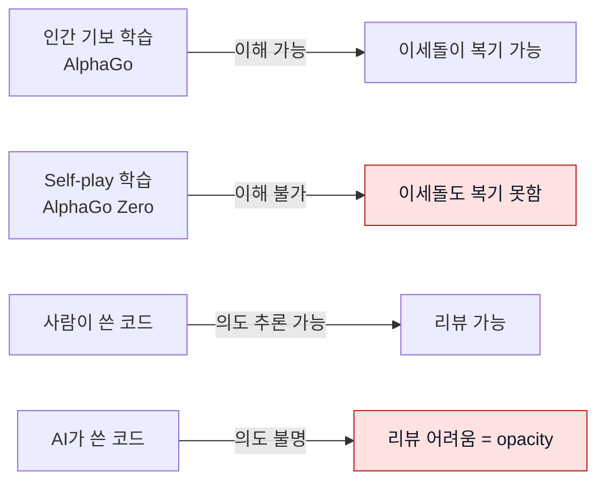

각 줄의 코드는 읽히지만, **왜 이렇게 설계했는지**를 재구성하기 어렵습니다. 리뷰어가 "이 함수 왜 필요해?"라고 물어도 원 저자(AI)는 이미 사라졌고, 인간 리뷰어는 추측밖에 못 합니다.

**상용 AI 코드 리뷰 도구**(CodeRabbit, Greptile, cubic, qodo 등)는 PR **제출 후** 리뷰입니다. 이미 설명 가능성을 잃은 코드를 뒤늦게 훑는 셈이죠. 이 레이어는 **작성 시점(write-time)**, 즉 AI가 파일을 저장하는 순간에 개입해서 "왜 그렇게 썼는지 설명해봐"를 강제합니다.

## 전체 구조 (높은 수준)

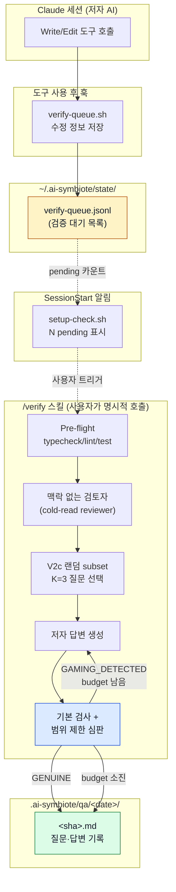

핵심은 **시간 분리 + 비용 상한**입니다. 훅은 <100ms로 검증 대기 목록에 저장만 하고 바로 끝납니다. 실제 검증은 사용자가 `/verify`를 호출할 때 몰아서 하되, 기본 `--max-rewrites 2`로 검증 대상 한 건당 최대 3라운드까지만 돕니다. Claude Code 훅의 `timeout: 10s` 제약을 피하기 위한 핵심 설계 결정이고, 이를 내부 설계 문서에서는 **Option D**라고 부릅니다.

## 한 번의 동작을 순서대로 (sequence diagram)

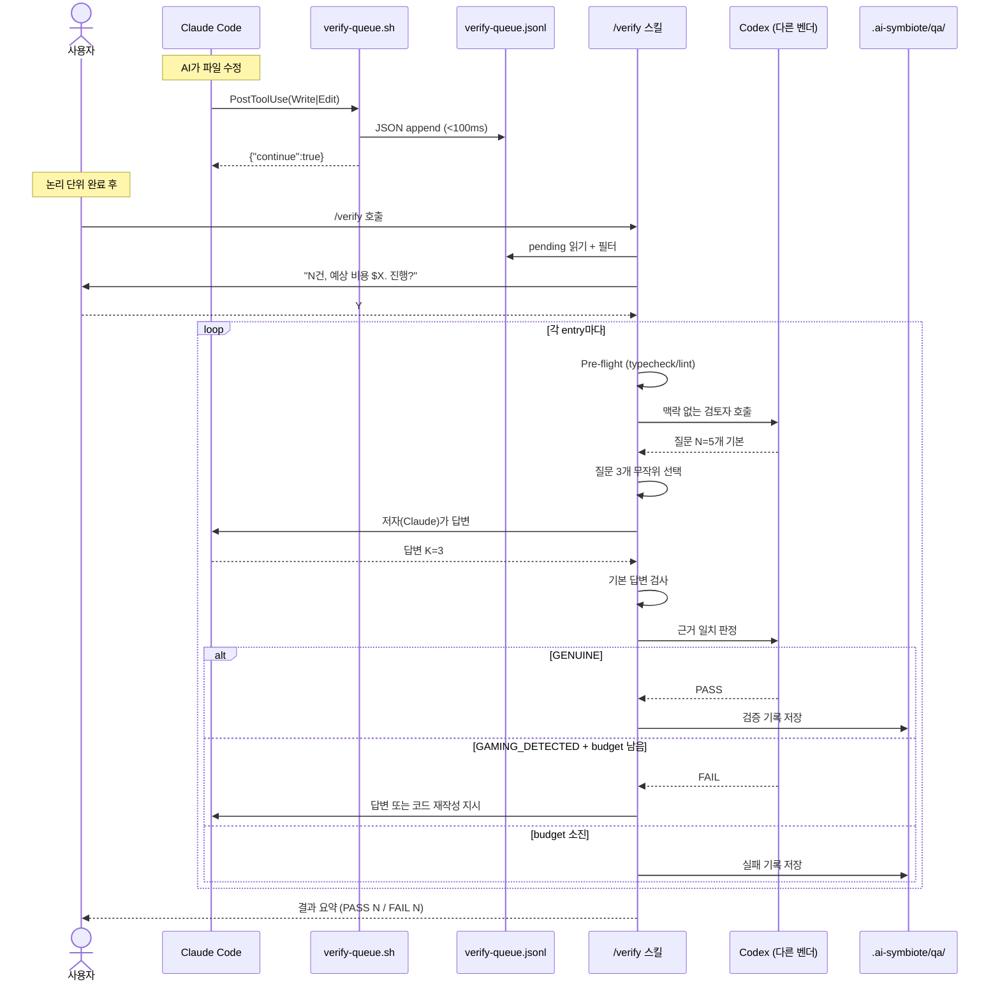

### 왜 Codex를 검토자와 심판으로 쓰나?

**같은 종류의 AI가 같은 실수를 반복해서 놓치는 문제를 줄이기 위해서**입니다. 여기서는 이를 collusion, 즉 AI끼리의 담합 위험이라고 부릅니다.

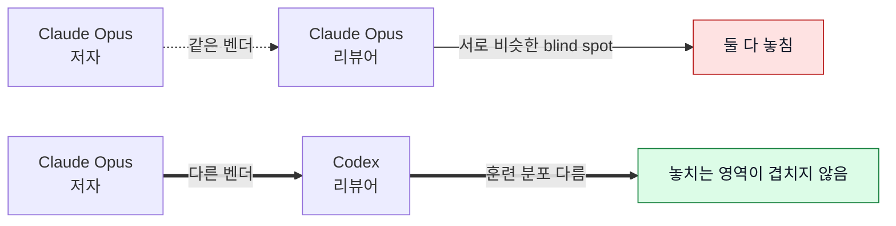

arxiv 2602.16741 연구 결과: "LLM 코드 리뷰어는 훈련 분포가 다를수록 blind spot 공유가 적다." 쉽게 말하면, 서로 다른 계열의 모델을 쓰면 같은 약점을 공유할 가능성이 줄어든다는 뜻입니다. 이 레이어는 이 원칙을 사용자가 설정으로 우회할 수 없는 규칙으로 고정했습니다. Claude가 쓴 코드는 반드시 Codex가 검토하고 판정합니다.

## 검증기 2층 구조

V1과 V2는 역할이 다릅니다.

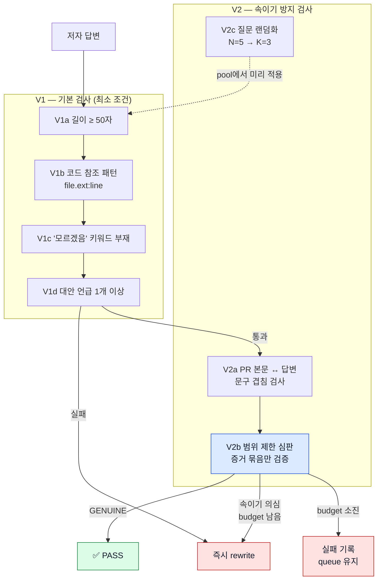

### 기본 검사만으로는 왜 부족한가

2026-04-20 Stage 0 실측에서 **기본 검사만으로는 3개의 속이기 사례가 모두 통과**했습니다. 어떻게 뚫렸는지 예시:

**우회 시나리오**: 저자가 설명하기 어려운 코드를 쓰고, PR 본문에 그럴듯한 설명을 미리 심습니다. 질문이 오면 PR 본문의 표현을 살짝 바꿔 답변합니다.

| 답변 | V1a 길이 | V1b 코드 참조 | V1c 키워드 | V1d 대안 | V1 판정 |
|------|---------|-------------|----------|---------|--------|
| "`cache.ts:42`의 LRU를 대신 쓸 수도 있었지만, 우리 워크로드는 read-heavy라 write amortization이 더 중요해서 TinyLFU로 했습니다" | ≥50 ✓ | ✓ | ✓ | ✓ | **PASS** |

그런데 실제로 코드에 TinyLFU 같은 건 없고 그냥 평범한 Map이라면? 기본 검사는 못 잡습니다. **근거 일치 판정(V2b judge)** 이 "그 주장을 뒷받침하는 기록이나 파일이 실제로 있는가?"를 검사해야 잡힙니다.

### 질문을 무작위로 고르는 이유

근거 일치 판정만 있어도 예상 질문과 답변을 미리 준비하는 우회를 막기 어렵습니다. 이를 seeding 공격이라고 부릅니다.

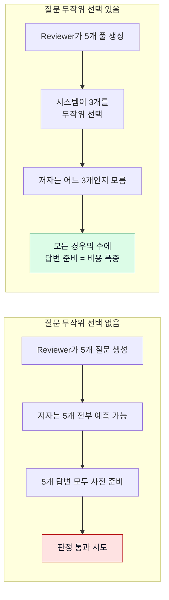

## 비용 상한: 배치와 rewrite 둘 다 제한

`verify-queue.jsonl`이 하루에 100건 쌓일 수도 있습니다. 게다가 심판이 "속이기 의심" 판정을 반복하면 한 건이 여러 라운드를 소비합니다. 그래서 `/verify`는 한 번에 처리할 건수와 재작성 라운드를 모두 제한합니다.

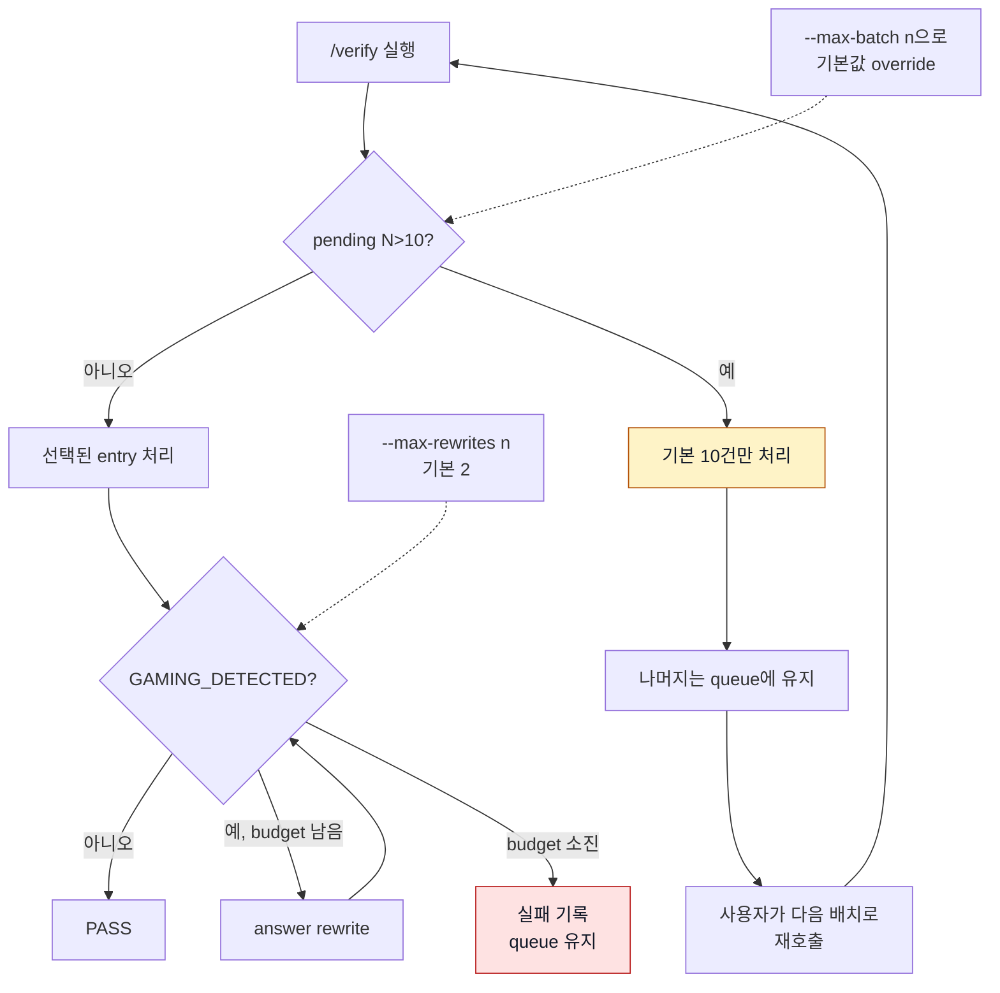

기본값:

| 옵션 | 기본값 | 역할 |
|------|--------|------|
| `--max-batch` | `10` | 한 번에 처리할 entry 수 |
| `--max-rewrites` | `2` | 첫 시도 이후 허용할 rewrite 라운드 수 |
| `--pool-size` | `5` | 검토자 질문 풀 크기 |
| `--judge-strictness` | `standard` | 사실 주장만 엄격 검증 |
| `--judge-repo-scan` | off | 심판의 추가 저장소 탐색 비활성화 |

## 사전 기계 검사: 검토자에게 힌트 주기

기계검증(typecheck/lint/test)은 AI가 만든 코드에서 흔히 보이는 설명 부족 신호를 값싸게 잡습니다. 이걸 검토자 질문 생성 **전에** 미리 돌려서 결과를 프롬프트에 넣습니다.

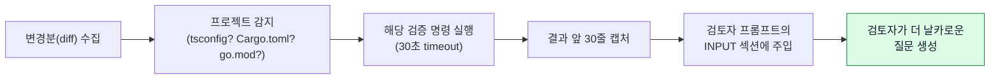

예시: lint가 `src/foo.ts:42 unused import`를 뱉으면, 검토자가 자동으로 "foo.ts:42의 unused import는 의도한 것인가, 아니면 이전 설계의 잔재인가?"를 묻게 됩니다. 이건 저자가 답변에서 진짜 이유를 드러내게 강제하는 좋은 프롬프트가 됩니다.

**강한 차단 조건(hard gate)은 아닙니다**. 기계검증이 실패해도 Q&A는 계속 진행합니다. 목적은 검토자에게 설명 부족 힌트를 주는 것이지 차단이 아닙니다.

## 검증 기록: 리뷰의 주체가 바뀐다

결과는 `.ai-symbiote/qa/<project>/<date>/<sha>.md`에 저장됩니다. 이 파일이 **인간 리뷰어의 실제 리뷰 대상**입니다.

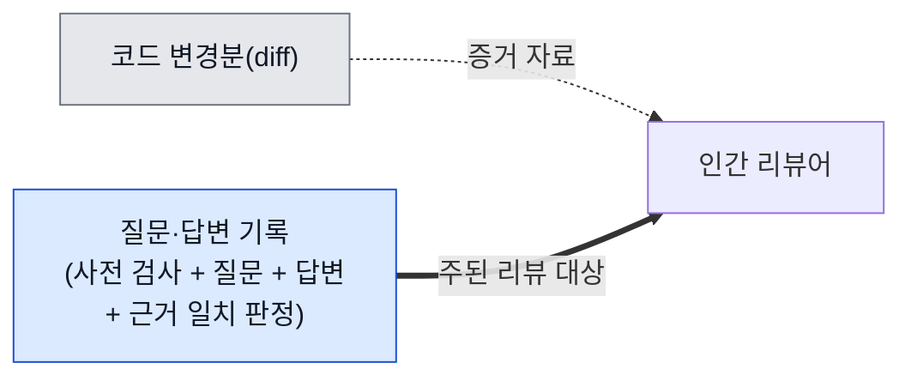

왜 PR 본문이 아니라 git-tracked 파일에 저장할까요?

- **PR 본문**: squash 가능, 덮어쓰기 가능 → 변조 위험
- **commit trailer**: 커밋 메시지 끝에 붙이는 짧은 메타데이터. 긴 질문·답변 기록에는 부적합
- **별도 저장소 (선택됨)**: git에 커밋되어 영속, PR 본문에 경로를 링크로 참조

## 플랫폼별 지원

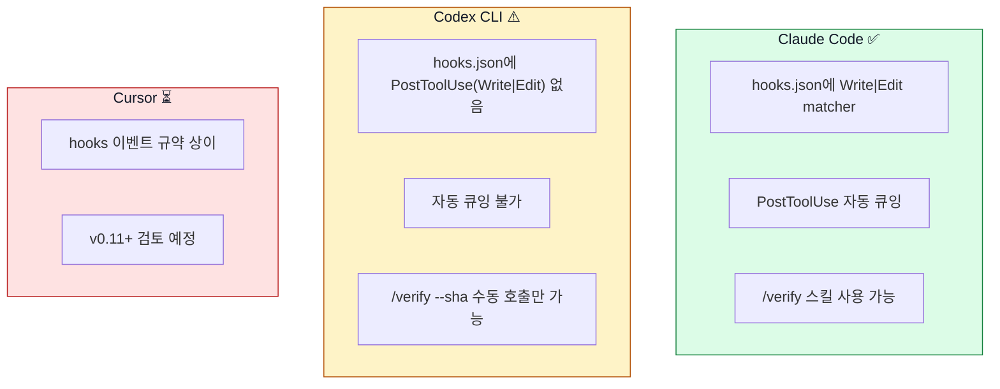

Codex 유저는 훅이 없는 대신 `/verify --sha <sha>` 또는 `--file <path>`로 수동 호출합니다. `build-codex.sh`가 `shared/skills/verify/SKILL.md`를 `dist/codex-symbiote/`로 복사하므로 스킬 자체는 노출됩니다.

## 상태 머신: entry 한 건의 일생

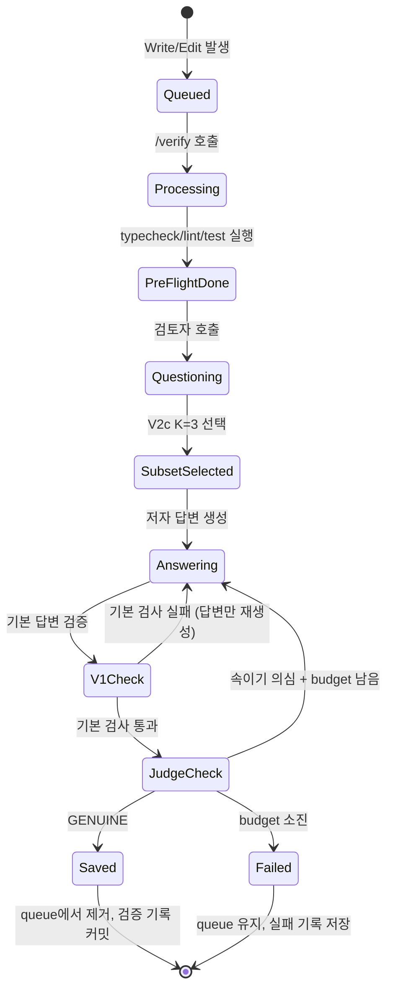

## 사용자가 실제로 보는 것

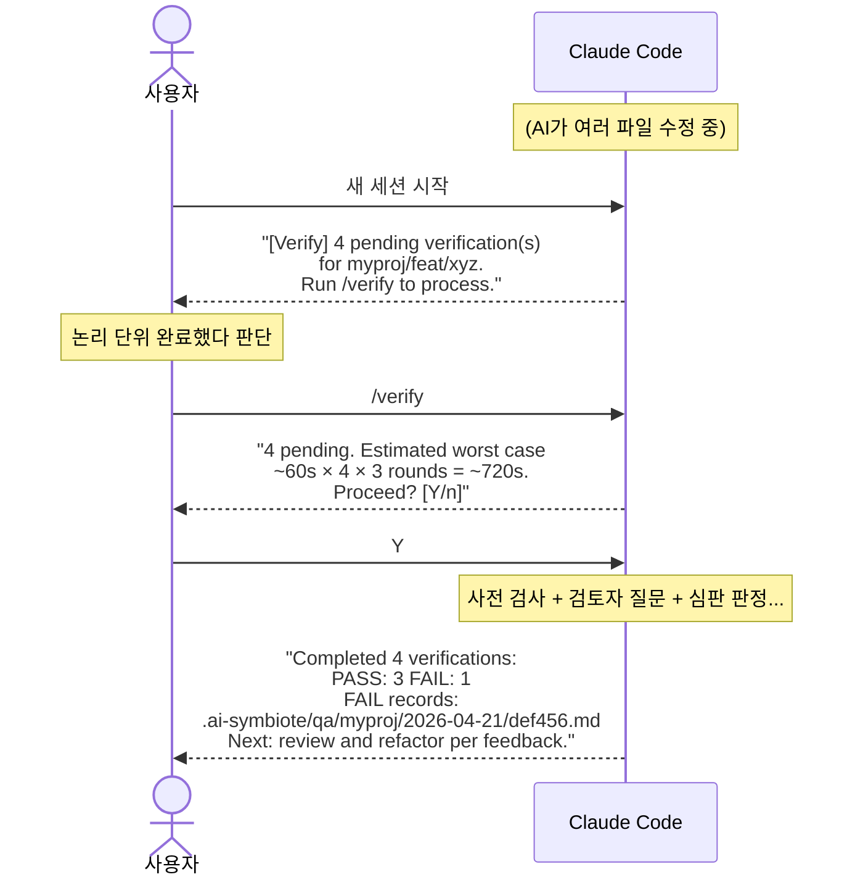

## FAQ

**Q. 왜 자동으로 실행 안 하고 사용자가 `/verify`를 호출해야 하나요?**
A. 훅의 `timeout: 10s` 제약 때문에 심판 판정(~30s)을 훅 안에 못 넣습니다. 또한 파일 수정 하나하나마다 돌리면 작업 흐름을 방해합니다. **논리 단위가 완성된 시점**에 몰아서 하는 게 맞습니다.

**Q. "모르겠음"이라고 답하면 어떻게 되나요?**
A. 기본 검사가 이 답변을 잡아서 즉시 다시 쓰게 합니다. 단 이건 **옳은 반응**입니다. 설명하지 못하는 코드는 의도가 불명확한 코드이므로, 답변이나 코드를 더 명확하게 고쳐야 합니다. "모르겠음"이 재작성 신호가 되는 건 설계의 핵심 메커니즘입니다.

**Q. 사전 기계 검사가 느린 프로젝트면 어쩌죠?**
A. 각 명령마다 30초 timeout입니다. 초과하면 `(pre-flight: timeout)`으로 기록하고 Q&A는 계속 진행합니다. 사전 기계 검사는 강한 차단 조건이 아닙니다.

**Q. V2c의 K=3이 너무 적어서 중요한 질문을 놓치면요?**
A. 검토자의 3개 관점(Intent/Structural/Alternative)은 기본 질문 풀 N=5에서 서로 다른 관점을 대표합니다. K=3을 뽑을 때 관점 균형을 최대한 유지합니다. 전체를 답변하려면 `--all-questions` 플래그가 있지만 검증 기록에 `v2c_bypassed: true`가 남아 실제 운영 검증으로 인정되지 않습니다.

**Q. 심판이 계속 `GAMING_DETECTED`를 내면 비용이 계속 늘어나나요?**
A. 아닙니다. 기본 `--max-rewrites 2`라서 첫 시도 포함 최대 3라운드까지만 돕니다. 소진되면 `budget_exhausted: true`가 들어간 실패 기록을 남기고 큐 항목은 유지합니다.

**Q. 심판이 저장소를 추가로 읽으면서 토큰을 많이 쓰는 건 막나요?**
A. 기본값에서는 심판이 변경분, 사전 검사 결과, 질문, 현재 답변으로 구성된 증거 묶음만 봅니다. 추가 저장소 탐색은 `--judge-repo-scan`을 명시했을 때만 허용하고 검증 기록에 `repo_scan: true`로 남깁니다.

**Q. queue가 계속 쌓이면 어떻게 관리하나요?**
A. PASS 처리된 entry는 자동 삭제됩니다. FAIL이나 사용자가 `/verify`를 안 부르는 경우에만 누적됩니다. 향후 `gc` 스킬 확장으로 30일 이상 된 entry 정리 예정입니다.

**Q. 편집 후 커밋을 이미 했는데 `/verify`를 돌리면 뭘 보나요?**
A. 큐에 저장된 `base_sha`(편집 직전 HEAD)를 기준으로 diff를 수집합니다. 편집 후 새 커밋이 여러 개 있으면 `git diff <base_sha>..HEAD -- <file>`로 누적 변경을 한 번에 봅니다. `git show <base_sha>`처럼 이전 커밋을 보는 식의 실수는 Codex adversarial review(Finding 1)에서 잡혀 수정됐습니다.

**Q. `~/work/app`과 `~/tmp/app` 둘 다 쓰면 queue가 섞이나요?**
A. 섞이지 않습니다. v2 schema가 `repo_root` 절대경로 필드를 따로 저장해서 `/verify`와 SessionStart 알림 둘 다 `repo_root`를 1차 필터로 씁니다. `project`(basename)은 사람이 읽을 용도로만 남아 있습니다.

## 관련 파일

| 역할 | 위치 |
|------|------|
| 훅 스크립트 | `shared/hooks/scripts/verify-queue.sh` |
| SessionStart 알림 | `shared/hooks/scripts/setup-check.sh` (365-383줄) |
| 스킬 정의 | `shared/skills/verify/SKILL.md` |
| 훅 등록 | `platforms/claude/overlay/hooks/hooks.json` (PostToolUse Write\|Edit) |
| 형식 명세 | `docs/02-아키텍처.md` ("Write-time Verification Layer" 섹션) |
| 설계 문서 | `~/.gstack/projects/Jimmy-Jung-ai-symbiote/jimmy-main-design-20260420-225015.md` |
| 훅 단위 테스트 | `tests/test-verify-queue.sh` (22 케이스) |
| 알림 테스트 | `tests/test-setup-check-verify.sh` (9 케이스) |
