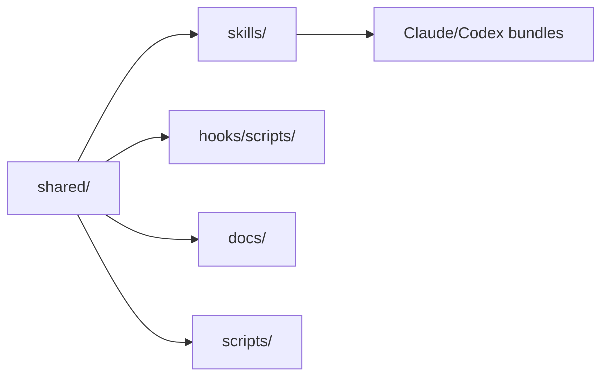
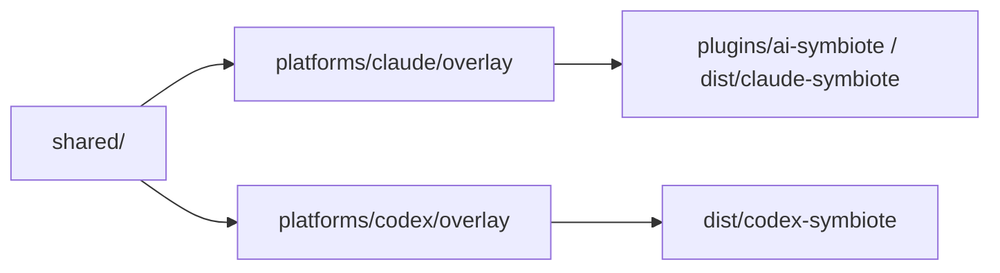

# Architecture

`ai-symbiote`는 공용 코어와 플랫폼 오버레이를 분리한 구조를 사용합니다.

## Core

<!-- AI-SYMBIOTE:START architecture:subsystems -->
`shared/`는 플랫폼에 독립적인 자산을 담습니다.

- `skills/` — 27개 스킬 정의
- `hooks/scripts/` — 6개 훅 스크립트
- `docs/` — 6개 상세 문서
- `scripts/` — 3개 빌드 스크립트

이 디렉터리의 내용은 Claude 번들과 Codex 번들 모두에 공통으로 들어갑니다.

<!-- AI-SYMBIOTE:END architecture:subsystems -->

## Platform Overlay

플랫폼 차이는 `platforms/<name>/overlay/`에서 관리합니다.

- Claude: `.claude-plugin/plugin.json`, `hooks/hooks.json` (SessionStart, PreToolUse, PostToolUse)
- Codex: `.codex-plugin/plugin.json`, `hooks/hooks.json` (SessionStart, PreToolUse만 지원)

### Hooks 이벤트 매핑

| 이벤트 | 매처 | 스크립트 | Claude | Codex | 비고 |
|--------|------|----------|--------|-------|------|
| SessionStart | — | setup-check.sh | O | O | context.md 전체 주입 + rule_prevented 분석 |
| PreToolUse | Bash | guard-shell.sh | O | O | 차단 시 우회 경로 제시 + harness-log 기록 |
| PostToolUse | Read\|Skill | usage-tracker.sh | O | X | |
| PostToolUse | Write\|Edit | harness-learn.sh | O | X | auto-loop FAIL 연동 + 확장자 패턴 학습 |
| PostToolUse | Write\|Edit | comment-checker.sh | O | X | |
| PostToolUse | Write\|Edit | messenger-notify.sh | O | X | |

Codex CLI는 PostToolUse에서 Bash 매처만 지원하므로 Read, Write, Edit, Skill 매처 훅은 Claude 전용입니다.

### Harness Log Schema

`harness-log.jsonl`은 두 가지 스키마 버전을 사용합니다:

- **v1** (`"v"` 필드 없음): `tool_error`, `repeated_error`, `churn`, `rule_created`
- **v2** (`"v":2`): `loop_verify_fail`, `guard_blocked`, `pattern_*`, `rule_prevented`, `seed_loaded`

파서(gc, stats)는 알 수 없는 이벤트 타입을 gracefully skip합니다.

### Harness Seed Templates

`shared/harness-seeds/`에 스택별 초기 규칙 시드가 있습니다:

| 파일 | 대상 | 접두사 |
|------|------|--------|
| `generic.md` | 모든 프로젝트 | `[Seed #S1]` |
| `swift.md` | Swift/iOS | `[Seed #S1]` |
| `nextjs.md` | Next.js/React | `[Seed #S1]` |
| `python.md` | Python | `[Seed #S1]` |

`setup` 스킬이 감지된 스택에 맞는 시드를 context.md에 로딩합니다. `[Seed #SN]` 접두사는 자동 생성 규칙 `[Harness #N]`과 분리되어 gc에서 독립적으로 관리됩니다.

### Scope Verification (Auto-Freeze)

auto-loop에서 Architect가 `## Affected Files` 섹션을 작성하면, Inspector가 Builder의 실제 변경과 비교하여 범위 밖 변경을 scope violation으로 보고합니다. `manifest.json`의 `autoFreeze: false`로 비활성화 가능합니다.

## Build Flow

<!-- AI-SYMBIOTE:START architecture:build-flow -->
1. `shared/` 자산을 빌드 대상으로 복사
2. `platforms/<name>/overlay/`를 같은 위치에 덮어쓰기
3. 결과 번들을 설치 스크립트에서 사용

플랫폼 지원:
- Claude overlay: yes
- Codex overlay: yes

빌드 스크립트:
- `scripts/build-all.sh`
- `scripts/build-claude.sh`
- `scripts/build-codex.sh`
<!-- AI-SYMBIOTE:END architecture:build-flow -->

## State Strategy

모든 플랫폼은 `~/ai-symbiote/{slug}`를 공용 상태 루트로 사용합니다.

- 새 설치는 항상 `~/ai-symbiote/{slug}`를 기본값으로 사용
- 기존 `~/symbiote/{slug}`, `~/claude_symbiote/{slug}`, `~/codex_symbiote/{slug}`는 호환성 경로로만 유지

## Packaging Strategy

- 제품 이름: `ai-symbiote`
- Claude 플러그인 식별자: `ai-symbiote`
- Codex 플러그인 식별자: `ai-symbiote`
- 현재 버전: `0.7.0`

즉 저장소는 하나지만, 사용자에게 노출되는 플러그인 이름은 양쪽 모두 `ai-symbiote`로 통일됩니다.
