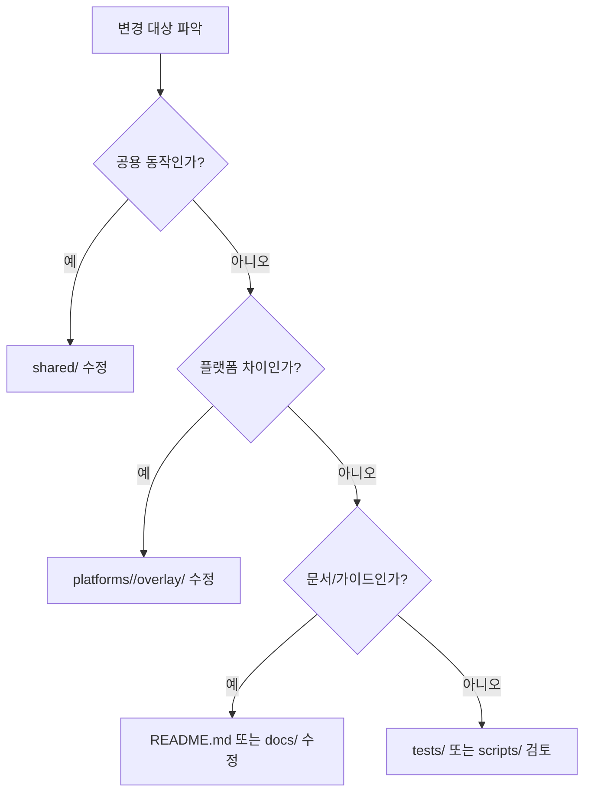

# Conventions

이 문서는 `ai-symbiote`를 수정할 때 지켜야 하는 저장소 규칙을 모아 둡니다.

## 어디를 수정할까?

<!-- AI-SYMBIOTE:START conventions:decision-tree -->

<!-- AI-SYMBIOTE:END conventions:decision-tree -->

## 편집 규칙

<!-- AI-SYMBIOTE:START conventions:editing-rules -->
- 공용 동작 변경은 `shared/`를 먼저 본다.
- `plugins/ai-symbiote/`와 `dist/`는 빌드 산출물이다. 직접 수정하지 않는다.
- 플랫폼 차이는 `platforms/<name>/overlay/`에 둔다.
- 새 스킬은 `shared/skills/<name>/SKILL.md`에 추가하고 빌드로 반영한다.
<!-- AI-SYMBIOTE:END conventions:editing-rules -->

## 네이밍과 배치

<!-- AI-SYMBIOTE:START conventions:naming-layout -->
- 스킬은 `shared/skills/<name>/SKILL.md` 구조를 따른다.
- 테스트는 `tests/test-*.sh` 패턴을 우선 사용한다.
- 빌드 스크립트는 `scripts/build-*.sh`에 둔다.
- 상세 문서는 `docs/` 아래에 두고 README는 허브 역할을 유지한다.
<!-- AI-SYMBIOTE:END conventions:naming-layout -->

## 생성물 경계

<!-- AI-SYMBIOTE:START conventions:generated-boundaries -->
`shared/`는 사람이 수정하는 원본이다. `plugins/ai-symbiote/`와 `dist/`는 빌드로 재생성되므로 수동 수정은 다음 빌드에서 사라진다.
<!-- AI-SYMBIOTE:END conventions:generated-boundaries -->
