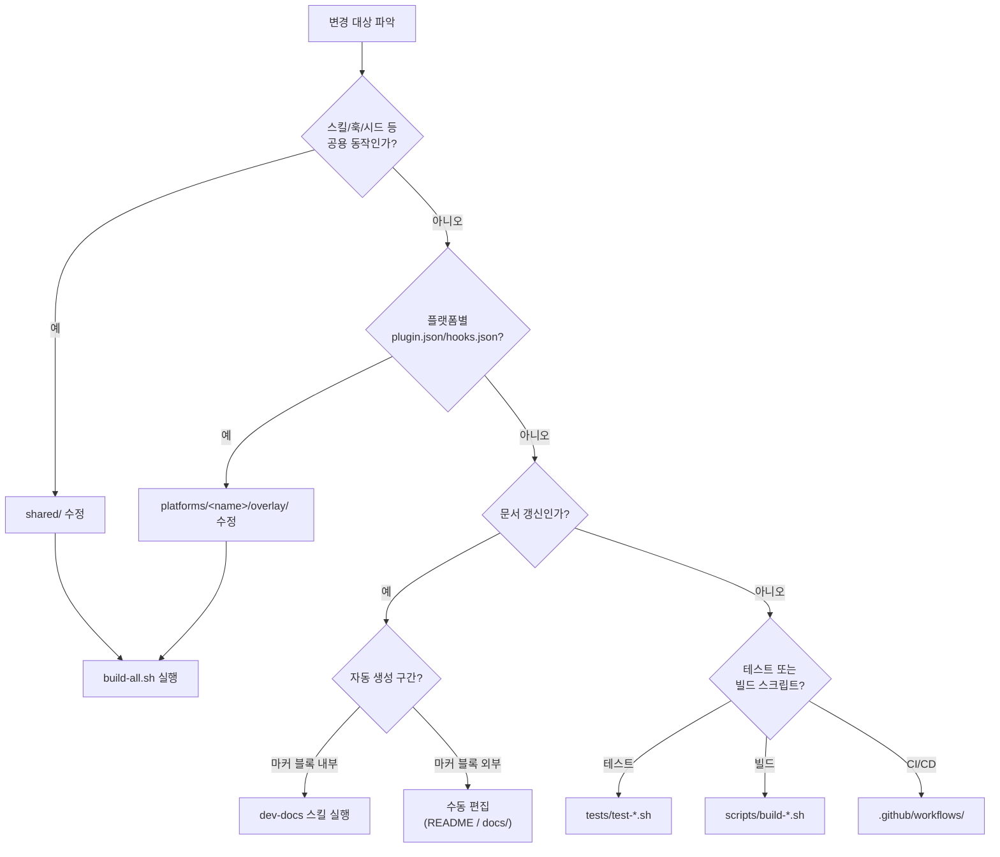

# Conventions

이 문서는 `ai-symbiote`를 수정할 때 지켜야 하는 저장소 규칙을 모아 둡니다.

## 어디를 수정할까?

<!-- AI-SYMBIOTE:START conventions:decision-tree -->

<!-- AI-SYMBIOTE:END conventions:decision-tree -->

## 편집 규칙

<!-- AI-SYMBIOTE:START conventions:editing-rules -->
- 공용 동작(스킬, 훅, 시드, 태스크마스터, 메신저 브릿지)은 반드시 `shared/`에서 수정한다.
- `plugins/ai-symbiote/`와 `dist/`는 빌드 산출물이다. 직접 수정하면 다음 빌드에서 사라진다.
- 플랫폼별 차이(plugin.json, hooks.json)는 `platforms/<name>/overlay/`에 둔다.
- 새 스킬은 `shared/skills/<name>/SKILL.md`에 추가하고 `bash scripts/build-all.sh`로 반영한다.
- 문서의 `<!-- AI-SYMBIOTE:START/END -->` 마커 블록 내부는 dev-docs 스킬이 관리한다. 수동 수정 시 다음 갱신에서 덮어써질 수 있다.
- 버전 변경 시 VERSION, 4개 plugin.json, marketplace.json, ARCHITECTURE.md, CHANGELOG.md를 **한 커밋에** 모두 갱신한다 (CLAUDE.md Release rules 참조).
<!-- AI-SYMBIOTE:END conventions:editing-rules -->

## 네이밍과 배치

<!-- AI-SYMBIOTE:START conventions:naming-layout -->
- 스킬: `shared/skills/<name>/SKILL.md` (YAML frontmatter 필수). 보조 스크립트는 `shared/skills/<name>/scripts/`에 둔다.
- 훅: `shared/hooks/scripts/<name>.sh`. 공용 함수는 `lib/common.sh`에 둔다.
- 하네스 시드: `shared/harness-seeds/<stack>.md`. 접두사 `[Seed #SN]` 형식을 따른다.
- 테스트: `tests/test-*.sh` 패턴. 순수 bash, `assert_contains()`/`assert_eq()` 함수 사용.
- 빌드 스크립트: `scripts/build-*.sh`. 진입점은 `build-all.sh`.
- 문서: `docs/` 아래에 두고 README.md는 허브 역할만 유지한다.
- SKILL.md는 **영어**로 작성한다 (토큰 효율성).
<!-- AI-SYMBIOTE:END conventions:naming-layout -->

## 생성물 경계

<!-- AI-SYMBIOTE:START conventions:generated-boundaries -->
| 구분 | 경로 | 생성 방식 | 수동 편집 |
|------|------|-----------|-----------|
| 원본 | `shared/` | 사람이 작성 | O |
| 원본 | `platforms/*/overlay/` | 사람이 작성 | O |
| 빌드 산출물 | `plugins/ai-symbiote/` | `build-claude.sh` rsync | X (다음 빌드에서 소실) |
| 빌드 산출물 | `dist/claude-symbiote/` | `build-claude.sh` rsync | X |
| 빌드 산출물 | `dist/codex-symbiote/` | `build-codex.sh` rsync | X |
| 자동 생성 구간 | `docs/*.md` 마커 블록 내부 | `dev-docs` 스킬 | X (다음 갱신에서 덮어쓰기) |
| 수동 구간 | `docs/*.md` 마커 블록 외부 | 사람이 작성 | O |
| 상태 파일 | `~/ai-symbiote/{slug}/` | 훅/스킬이 자동 관리 | 직접 편집 비권장 |
<!-- AI-SYMBIOTE:END conventions:generated-boundaries -->
