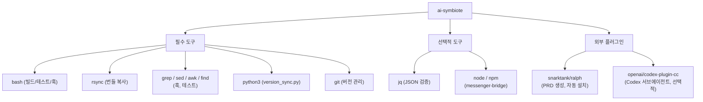
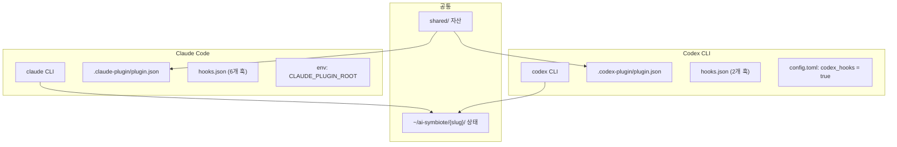
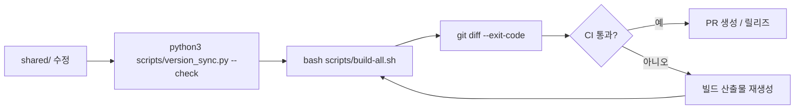

# Dependencies

이 문서는 `ai-symbiote`가 기대하는 외부 도구와 저장소 내부 의존성을 정리합니다.

## 의존성 맵

<!-- AI-SYMBIOTE:START dependencies:dependency-map -->

<!-- AI-SYMBIOTE:END dependencies:dependency-map -->

## 런타임 / 개발 도구

<!-- AI-SYMBIOTE:START dependencies:runtime-dev-tools -->
| 도구 | 용도 | 필수 |
|------|------|------|
| `bash` | 빌드 스크립트, 테스트, 훅 실행 | O |
| `rsync` | shared/ + overlay → 번들 복사 | O |
| `python3` | `version_sync.py` 버전 일관성 검증 | O |
| `git` | 버전 관리, CI diff 검증 | O |
| `grep`, `sed`, `awk`, `find` | 훅 스크립트, 테스트 내 텍스트 처리 | O |
| `jq` | JSON 파싱 (훅의 `json_field()` 등) | O |
| `node` / `npm` | messenger-bridge TypeScript 빌드/실행 | 메신저 사용 시만 |
| `curl` | update 스킬의 원격 저장소 확인 | 업데이트 시만 |
<!-- AI-SYMBIOTE:END dependencies:runtime-dev-tools -->

## 플랫폼별 의존성

<!-- AI-SYMBIOTE:START dependencies:platform-dependencies -->

| 항목 | Claude | Codex |
|------|--------|-------|
| 훅 수 | 6개 (SessionStart, PreToolUse, PostToolUse×4) | 2개 (SessionStart, PreToolUse) |
| PostToolUse 매처 | Read\|Skill, Write\|Edit | Bash만 지원 |
| 플러그인 경로 | `${CLAUDE_PLUGIN_ROOT}` | `${AI_SYMBIOTE_ROOT:-$HOME/plugins/ai-symbiote}` |
<!-- AI-SYMBIOTE:END dependencies:platform-dependencies -->

## 업데이트 경로

<!-- AI-SYMBIOTE:START dependencies:update-path -->

- 공용 변경: `bash scripts/build-all.sh` — Claude + Codex 번들 모두 갱신
- Claude만: `bash scripts/build-claude.sh`
- Codex만: `bash scripts/build-codex.sh`
- 사용자 업데이트: `/ai-symbiote:update` (Claude) 또는 `$ai-symbiote:update` (Codex)
<!-- AI-SYMBIOTE:END dependencies:update-path -->
