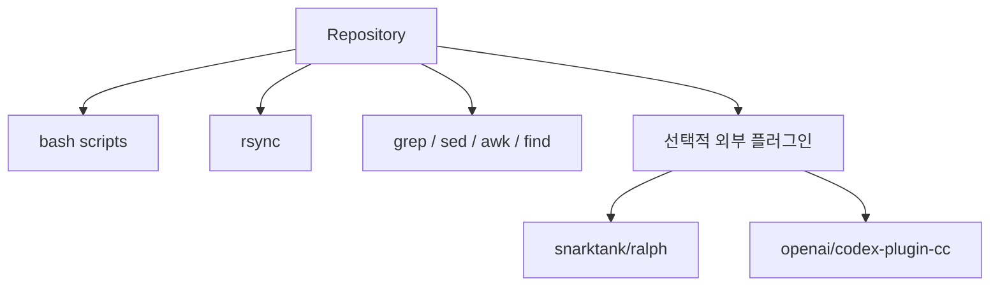
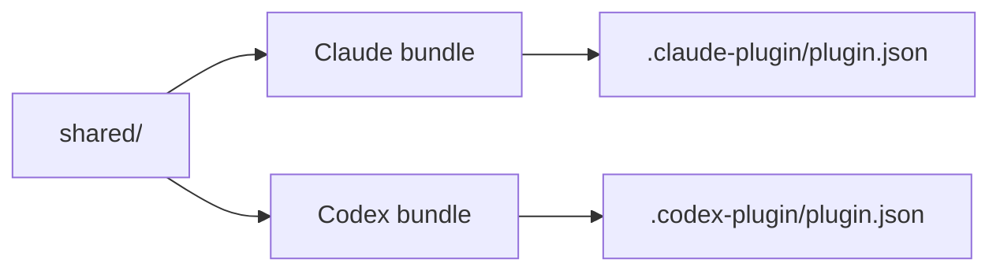

# Dependencies

이 문서는 `ai-symbiote`가 기대하는 외부 도구와 저장소 내부 의존성을 정리합니다.

## 의존성 맵

<!-- AI-SYMBIOTE:START dependencies:dependency-map -->

<!-- AI-SYMBIOTE:END dependencies:dependency-map -->

## 런타임 / 개발 도구

<!-- AI-SYMBIOTE:START dependencies:runtime-dev-tools -->
- `bash`: 빌드 및 테스트 스크립트 실행
- `rsync`: shared/와 overlay를 번들로 복사
- `grep`, `sed`, `awk`, `find`: 훅과 테스트 스크립트에서 사용
- `jq`: JSON 검증 테스트가 있을 때 사용
<!-- AI-SYMBIOTE:END dependencies:runtime-dev-tools -->

## 플랫폼별 의존성

<!-- AI-SYMBIOTE:START dependencies:platform-dependencies -->

<!-- AI-SYMBIOTE:END dependencies:platform-dependencies -->

## 업데이트 경로

<!-- AI-SYMBIOTE:START dependencies:update-path -->
- 공용 변경은 `bash scripts/build-all.sh`로 양쪽 번들을 함께 갱신한다.
- Claude 사용자는 `bash scripts/build-claude.sh` 경로를 사용할 수 있다.
- Codex 사용자는 `bash scripts/build-codex.sh` 또는 설치 스크립트 경로를 사용한다.
<!-- AI-SYMBIOTE:END dependencies:update-path -->
