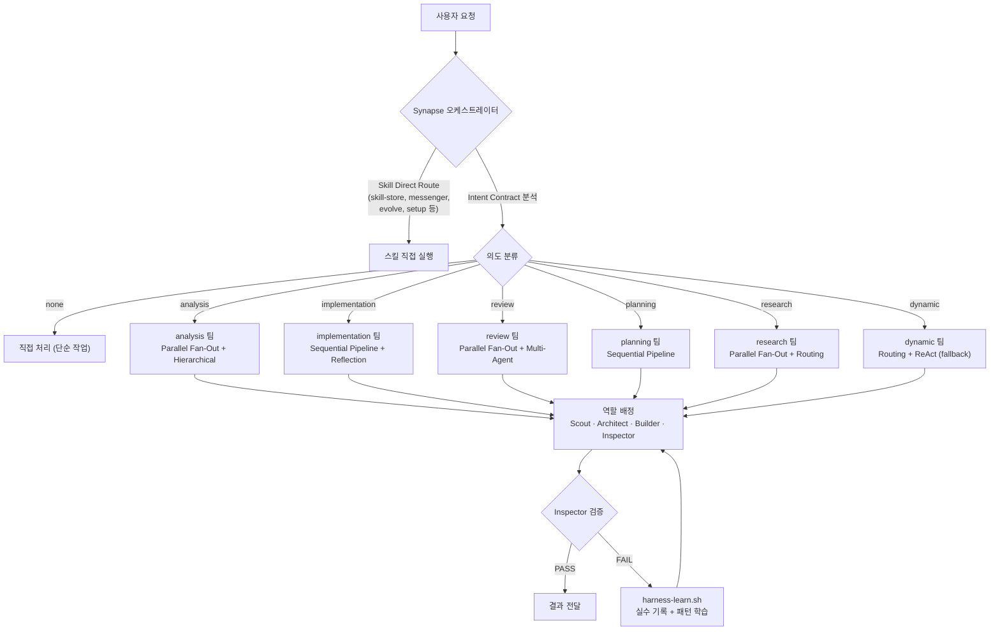
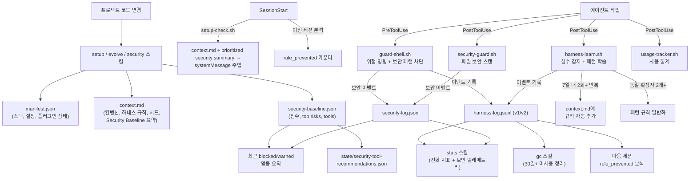
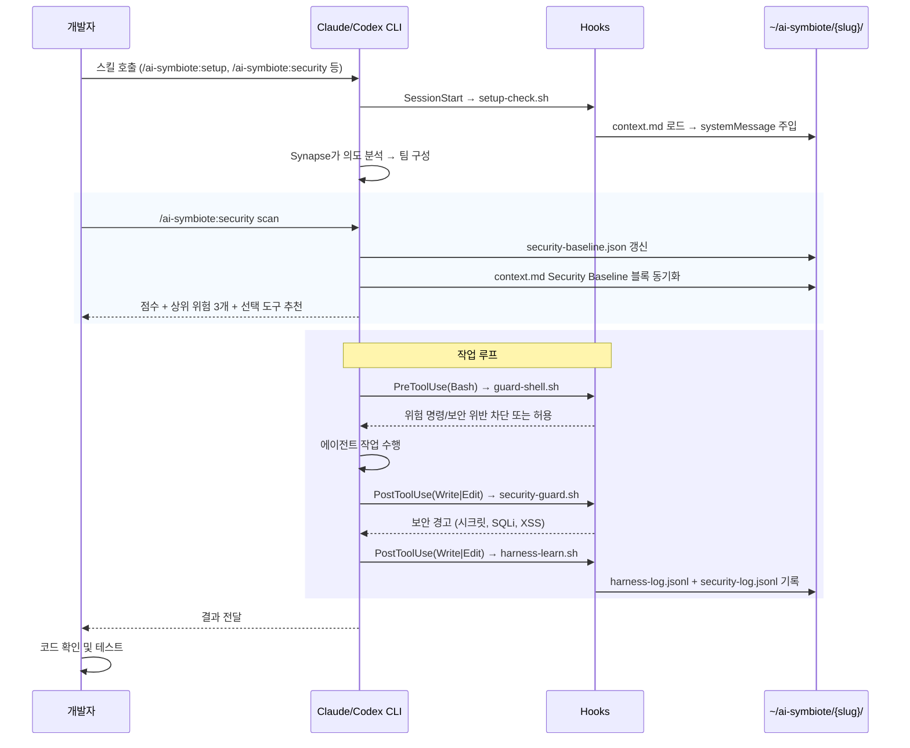
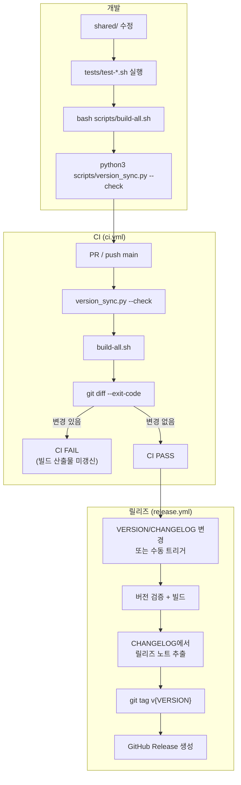

# Flows

이 문서는 프로젝트의 주요 흐름을 Mermaid로 한눈에 보여주기 위한 문서입니다.

## 시스템 상위 흐름

<!-- AI-SYMBIOTE:START flows:system-flow -->

<!-- AI-SYMBIOTE:END flows:system-flow -->

## 데이터 흐름

<!-- AI-SYMBIOTE:START flows:data-flow -->

<!-- AI-SYMBIOTE:END flows:data-flow -->

## 사용자 / 운영자 흐름

<!-- AI-SYMBIOTE:START flows:user-or-operator-flow -->

<!-- AI-SYMBIOTE:END flows:user-or-operator-flow -->

## 운영 흐름

<!-- AI-SYMBIOTE:START flows:operational-flow -->

<!-- AI-SYMBIOTE:END flows:operational-flow -->
