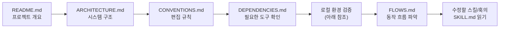
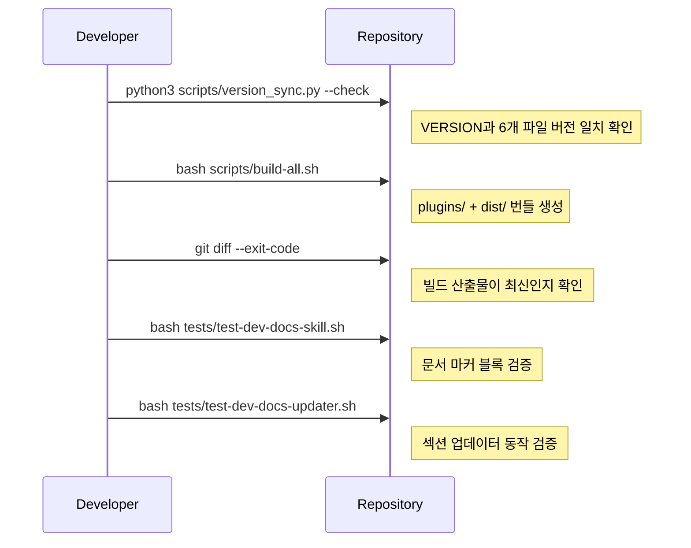

# Onboarding

이 문서는 처음 이 저장소를 보는 개발자가 가장 먼저 따라야 할 흐름을 정리합니다.

## 첫날 경로

<!-- AI-SYMBIOTE:START onboarding:first-day-path -->

<!-- AI-SYMBIOTE:END onboarding:first-day-path -->

## 읽기 순서

<!-- AI-SYMBIOTE:START onboarding:read-order -->
1. `README.md` — 프로젝트 허브, 설치 방법, 스킬 목록
2. `docs/ARCHITECTURE.md` — shared/ 구조, 빌드 흐름, 플랫폼 차이
3. `docs/CONVENTIONS.md` — 어디를 수정해야 하는지, 생성물 경계
4. `docs/DEPENDENCIES.md` — 필요한 외부 도구와 선택적 의존성
5. `docs/FLOWS.md` — Intent Contract 라우팅, 데이터/운영 흐름
6. `CLAUDE.md` — 릴리즈 규칙, 스킬 라우팅 규칙
7. 수정 대상의 `shared/skills/<name>/SKILL.md`
<!-- AI-SYMBIOTE:END onboarding:read-order -->

## 로컬 확인 절차

<!-- AI-SYMBIOTE:START onboarding:local-checks -->

<!-- AI-SYMBIOTE:END onboarding:local-checks -->

## 자주 하는 작업

<!-- AI-SYMBIOTE:START onboarding:common-tasks -->
| 작업 | 절차 |
|------|------|
| 새 스킬 추가 | `shared/skills/<name>/SKILL.md` 작성 → `bash scripts/build-all.sh` |
| 훅 수정 | `shared/hooks/scripts/` 수정 → 영향 범위 테스트 |
| 문서 갱신 (자동) | `/ai-symbiote:dev-docs` 또는 `dev-docs [doc-id]` 실행 |
| 문서 갱신 (수동) | 마커 블록 외부 영역 직접 편집 |
| 버전 범프 | `CLAUDE.md` Release rules에 나열된 7개 파일 일괄 갱신 → `build-all.sh` |
| 테스트 실행 | `bash tests/test-<name>.sh` (개별) |
| CI 로컬 재현 | `python3 scripts/version_sync.py --check && bash scripts/build-all.sh && git diff --exit-code` |
| 플러그인 설치 테스트 | `claude --plugin-dir ./plugins/ai-symbiote` |
<!-- AI-SYMBIOTE:END onboarding:common-tasks -->
