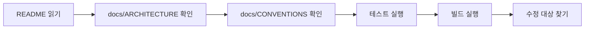
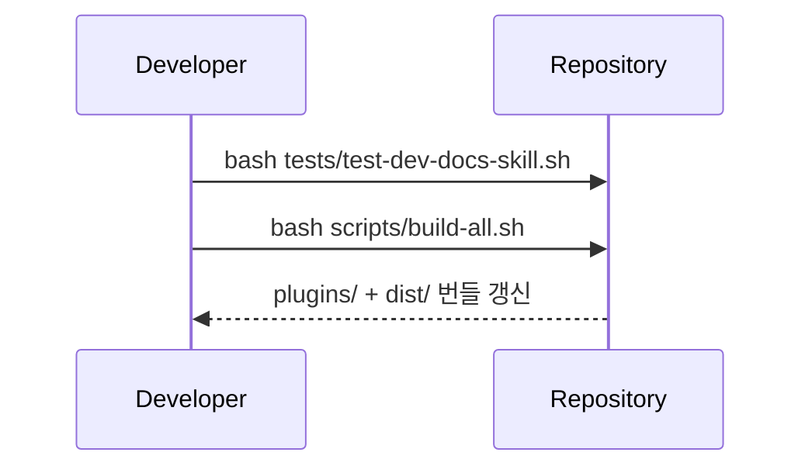

# Onboarding

이 문서는 처음 이 저장소를 보는 개발자가 가장 먼저 따라야 할 흐름을 정리합니다.

## 첫날 경로

<!-- AI-SYMBIOTE:START onboarding:first-day-path -->

<!-- AI-SYMBIOTE:END onboarding:first-day-path -->

## 읽기 순서

<!-- AI-SYMBIOTE:START onboarding:read-order -->
1. `README.md`
2. `docs/ARCHITECTURE.md`
3. `docs/CONVENTIONS.md`
4. `docs/DEPENDENCIES.md`
5. 필요한 기능의 `shared/skills/*/SKILL.md`
<!-- AI-SYMBIOTE:END onboarding:read-order -->

## 로컬 확인 절차

<!-- AI-SYMBIOTE:START onboarding:local-checks -->

<!-- AI-SYMBIOTE:END onboarding:local-checks -->

## 자주 하는 작업

<!-- AI-SYMBIOTE:START onboarding:common-tasks -->
- 새 스킬 추가: `shared/skills/<name>/SKILL.md` 작성 후 `bash scripts/build-all.sh`
- 문서 갱신: `README.md`, `docs/*.md` 수정 후 관련 테스트 실행
- 훅 수정: `shared/hooks/scripts/` 수정 후 영향 범위 테스트
<!-- AI-SYMBIOTE:END onboarding:common-tasks -->
