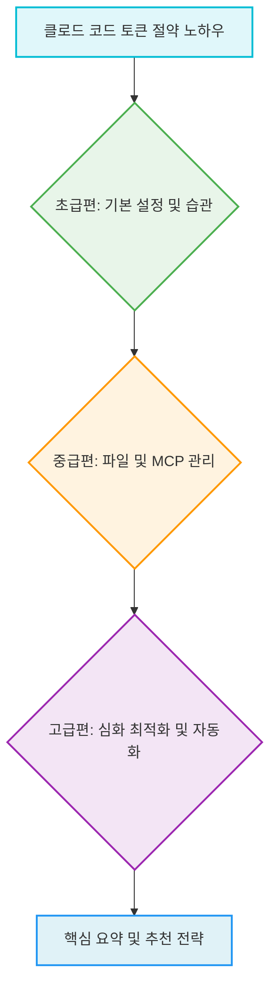

## 1. 개요

### 1.1 서론
클로드 코드(Claude Code)는 개발 작업을 돕는 강력한 AI 어시스턴트이지만, <mark>토큰 소모량이 많아 비용 부담이 커질 수 있다</mark>. 이 보고서는 클로드 코드의 토큰 사용량을 효율적으로 관리하고 절약하는 다양한 노하우를 초급, 중급, 고급 단계로 나누어 제시한다. 이러한 전략들을 통해 사용자는 불필요한 토큰 낭비를 줄이고, 클로드 코드를 더욱 경제적이고 효과적으로 활용할 수 있다.

### 1.2 전체 구조

## 2. 클로드 코드 토큰 절약 노하우: 초급편 
클로드 코드의 토큰 소모는 대화가 길어질수록 기하급수적으로 증가하므로, 기본적인 설정과 습관 개선을 통해 토큰 낭비를 줄이는 것이 중요하다.

### 2.1. 핵심 개념 이해: 클로드의 대화 처리 방식 
1. **전체 대화 제로딩 방식** 
  1. 클로드는 카카오톡처럼 맨 아래 메시지만 읽는 것이 아니라, 메시지를 보낼 때마다 맨 위에 있는 메시지부터 모든 대화 내용을 다시 읽는다.
  2. 이는 메시지당 500 토큰이라고 가정했을 때, 10번째 메시지에서 500 * 10이 되는 것이 아니라, 500 + 1000 + 1500 + ... 와 같이 이차적(quadratic, O(n²))으로 토큰 소모량이 늘어나는 방식이다.
  3. 예를 들어, 30번째 메시지를 읽게 되면 23만 2천 토큰을 읽게 되며, 이는 1000 토큰 메시지보다 31배 비싼 비용이다.
2. **토큰 소모량 증가의 심각성** 
  1. 대화가 길어질수록 토큰 소모량이 선형적으로 증가하는 것이 아니라, 이전 대화 내용까지 모두 포함하여 이차적(quadratic)으로 증가한다.
  2. 따라서 불필요한 대화 기록을 관리하지 않으면 예상보다 훨씬 빠르게 토큰이 소진될 수 있다.

### 2.2. 토큰 절약을 위한 필수 습관 
1. **새 작업 시작 전 반드시 클리어하기** 
  1. 작업이 끝나면 /clear 명령어를 사용하여 이전 대화 내용을 초기화해야 한다.
  2. 클리어를 제때 해주면 토큰 소모량이 늘어나려다가 초기화되고, 다시 늘어나려다가 초기화되는 방식으로 토큰을 적게 사용할 수 있다.
  3. 이는 토큰을 절약하는 가장 쉽고 빠른 방법이다.
2. **프롬프트 범위 제한하여 보내기** 
  1. 비효율적인 방식은 "이거 개선해 줘"와 같이 전체 파일을 태깅하여 명령하는 것이다. 이 경우 파일 전체가 컨텍스트에 들어가 비효율적이다.
  2. 효율적인 방식은 특정 파일의 특정 함수나 특정 줄을 정확히 집어서 명령하는 것이다.
  3. 예를 들어, README 파일 전체를 수정해 달라고 하는 대신, README 파일의 10번째 줄을 수정해 달라고 하면 10번째 줄만 읽어 토큰을 아낄 수 있다.
3. **간단한 명령은 묶어서 한 번에 보내기** 
  1. "어떤 걸 요약해 줘, 포인트 뽑아 줘, 제목 추천해 줘"와 같은 간단한 명령은 묶어서 한 번에 요청하는 것이 효율적이다.
  2. 예를 들어, "유약을 하고 핵심 포인트를 뽑아서 제목 추천해 줘"와 같이 한 번에 명령할 수 있다.
  3. 단, 복잡한 명령은 토큰이 더 들더라도 나눠서 하는 것이 정확도를 높일 수 있다.
4. **붙여넣기는 꼭 필요한 것만** 
  1. 파일을 태깅하거나 내용을 붙여넣기 할 때, 파일의 모든 텍스트가 컨텍스트에 들어가면 비효율적이다.
  2. 필요한 부분만 콕 집어서 붙여넣기 해야 토큰을 최소한으로 사용할 수 있다.
5. **작업 중 자리 뜨지 않기** 
  1. Shift + Tab을 두 번 눌러 플랜 모드에 진입한 후 자동으로 실행되도록 설정하고 자리를 비우면, 클로드가 잘못된 방향으로 계속 진행하며 루프에 빠질 수 있다.
  2. 따라서 작업 초반에는 루프에 빠지지 않는지 확인하는 습관을 들이는 것이 중요하다.

### 2.3. 모델 및 기능 설정 최적화 
1. **기본 모델을 소넷(Sonnet)으로 고정하기** 
  1. 클로드 코드를 처음 켰을 때 모델이 오퍼스(Opus)로 고정되어 있는 경우가 있다.
  2. /model 명령어를 통해 기본 모델을 소넷으로 설정하는 것이 토큰 절약에 필수적이다.
  3. 프로 요금제(20달러)를 사용하는 경우, 오퍼스를 사용하면 토큰이 매우 빨리 소진되므로 소넷을 기본으로 설정해야 한다. 
2. **작업에 맞는 모델 선택하기** 
  1. **하이쿠(Haiku)**: 준개발자나 간단한 작업, 단순 질문에 적합하며 가장 저렴하다. 
  2. **소넷(Sonnet)**: 일반적인 명령에 충분하며, 대부분의 작업에 효율적이다. 
  3. **오퍼스(Opus)**: 복잡한 아키텍처 설계나 깊은 디버깅과 같은 어려운 작업에 추천된다. 
  4. /model 명령어를 통해 작업에 맞게 모델을 바꿔가며 사용하는 것이 중요하다. 
3. **안 쓰는 기능은 꺼두기** 
  1. MCP(Model Context Protocol)와 같은 기능은 켜져 있기만 해도 매 응답마다 추가 토큰을 소모할 수 있다.
  2. 꼭 필요한 프로젝트에서 필요한 순간에만 기능을 켜서 사용하는 것이 토큰 낭비를 막을 수 있다.
4. **메모리 및 사용자 설정 저장해두기** 
  1. 세션 시작할 때마다 "나는 백엔드 개발자이고 이런 기술을 쓰고 있다"와 같은 역할을 매번 타이핑하면 토큰을 잡아먹는다.
  2. 세팅의 '메모리 & 유저 세팅'에서 역할과 스타일을 한 번만 저장해두면, 클로드가 모든 새 채팅에 자동으로 적용하여 불필요한 토큰 낭비를 막을 수 있다.

### 2.4. 전략적인 작업 시간 및 세션 관리 
1. **피크 타임을 피해서 작업하기** 
  1. 클로드 코드에는 같은 작업을 해도 토큰이 더 빨리 소진되는 피크 타임이 존재한다.
  2. 미국은 특정 시간대가 피크 타임이지만, 한국은 주로 밤 시간대가 피크 타임이다.
  3. 따라서 야근이나 밤에 사이드 프로젝트를 할 때는 이 시간대를 주의해야 한다.
2. **리셋 타이밍을 전략적으로 활용하기** 
  1. 클로드 코드는 일정 시간마다 세션이 리셋된다.
  2. 리셋 시간이 얼마 남지 않았는데 남아있는 토큰이 많다면 과감하게 사용하고, 할당량이 얼마 남지 않았는데 리셋까지 시간이 많이 남았다면 천천히 사용하는 것이 좋다.

### 2.5. 효율적인 작업 분할 및 계획 
1. **하루를 두세 개 세션으로 나눠 사용하기** 
  1. 클로드 코드는 하루에 여러 개의 세션을 사용할 수 있다.
  2. 한 세션에 모든 작업을 몰아서 하지 말고, 오전에 핵심 작업, 오후에 다른 작업, 저녁에 또 다른 작업과 같이 나눠서 사용하면 체감 한도가 훨씬 넉넉하게 느껴진다.
2. **한 세션에서는 한 작업만 하기** 
  1. 버그 세 개 고치기, 기능 두 개 추가하기와 같이 여러 작업을 한 세션에서 한 번에 처리하면 토큰 사용량이 기하급수적으로 올라간다.
  2. 따라서 한 세션에서는 하나의 논리적인 작업만 수행하고, 작업이 끝나면 /clear 명령어를 사용하여 초기화하는 것이 중요하다.
3. **세션 시작 전 작업 목록 미리 정리하기** 
  1. 클로드 코드를 켜자마자 명령을 내리기보다, 세션 시작 전에 오늘 해야 할 작업 목록을 적고 우선순위를 정하는 것이 좋다.
  2. 다섯 시간의 세션을 하나의 스프린트처럼 대하면 집중력을 높게 유지하고 토큰을 계획적으로 사용할 수 있다.

### 2.6. 토큰 사용량 모니터링 및 관리 
1. **엑스트라 유시지(Extra Usage) 기능 활용** 
  1. 중요한 작업 중에 세션이 초기화되어 작업이 중단될 수 있는 순간이 있다.
  2. 이때 '오버리지' 기능을 켜면 API 요금으로 과금되는 방식으로 작업을 계속 진행할 수 있다.
  3. 프로젝트 중단이 싫다면 이 안전장치를 켜두고, 비용 절감이 우선이라면 사용하지 않을 수 있다.
2. **리네임(Rename)과 리줌(Resume) 기능 사용하기** 
  1. /clear로 컨텍스트를 비우기 전에 /rename 명령어를 사용하여 세션 이름을 지정할 수 있다.
  2. `claude --resume` (또는 `claude -r`) CLI 플래그를 통해 이전에 저장해 둔 세션으로 돌아갈 수 있다.
  3. 작업 히스토리가 필요하거나 나중에 참고해야 할 때 유용하게 활용할 수 있다.
3. **컨텍스트, 코스트, 스탯(Context, Cost, Stats) 확인하기** 
  1. /context: 컴포넌트별 토큰 사용량을 확인하여 어디서 토큰이 많이 쓰이는지 파악할 수 있다.
  2. /cost: 현재 세션의 토큰 사용량과 예상 비용을 볼 수 있다.
  3. /stats: Pro/Max 구독자의 경우 사용량 통계를 확인할 수 있다.
  4. 이러한 명령어를 통해 토큰 낭비 여부를 체크하는 습관을 들이는 것이 좋다.
4. **성향 대시보드 옆에 열어두기** 
  1. 외부 플러그인을 활용하면 일별, 월별, 실시간 사용량을 쉽게 확인할 수 있다.
  2. 이를 통해 토큰 사용량을 지속적으로 모니터링하는 것을 추천한다.

| **구분** | **설명** |
| --- | --- |
| `/clear` | 현재 세션의 대화 내용을 초기화하여 토큰 소모 방지 |
| `/model` | 작업에 맞는 AI 모델(하이쿠, 소넷, 오퍼스) 선택 |
| `/rename` | 현재 세션에 이름을 지정하여 저장 |
| `claude --resume` | 저장된 세션으로 돌아가 작업 이력 확인 (CLI 플래그) |
| `/context` | 컴포넌트별 토큰 사용량 확인 |
| `/cost` | 현재 세션의 토큰 사용량 및 예상 비용 확인 |
| `/stats` | Pro/Max 구독자 사용량 통계 확인 |

## 3. 클로드 코드 토큰 절약 노하우: 중급편 
중급편에서는 클로드 코드의 파일 관리, MCP 최적화, 그리고 컨텍스트 압축(Compaction)을 통해 토큰을 절약하는 방법을 다룬다.

### 3.1. 파일 및 프로젝트 관리 최적화 
1. .claudeignore 파일 만들기 
  1. **목적**: 클로드가 탐색할 때 불필요한 파일(예: node_modules, .next 폴더)까지 전부 읽으려 하여 토큰이 과도하게 소모되는 것을 방지한다.
  2. **방법**: 프로젝트 루트에 .claudeignore 파일을 생성하고, 읽지 않을 파일이나 폴더를 git ignore처럼 명시한다. (참고: .claudeignore는 공식 빌트인 기능이 아닌 커뮤니티 훅 기반 구현이다. 보다 공식적인 방법은 `settings.json`의 permission rules를 활용하는 것이다.)
  3. **활용 팁**: 클로드 코드에게 .claudeignore에 넣을 파일이나 폴더를 추천해달라고 요청하면 프로젝트 기반으로 잘 추천해준다.
  4. **장점**: 프로젝트 초반에 한 번 만들어 놓으면 계속 사용할 수 있어 지속적인 토큰 절약 효과를 얻을 수 있다.
2. claude.md를 200줄 이하로 유지하기 
  1. **문제점**: claude.md 파일은 세션 시작 시 로드되어 시스템 프롬프트의 일부로 매 턴마다 전송되기 때문에, 파일이 길면 토큰 소모가 크다.
  2. **다이어트 팁**:
  1. 서술형 문장을 없애고, 헤딩, 리스트, 테이블로 구조화하여 명시한다.
  2. 규칙은 최소 단위로 축약하고, 코드 예시를 과도하게 포함하지 않도록 한다.
  3. 200줄이 넘어가면 다이어트할 타이밍으로 간주하고 정리한다.
3. **상세 지식은 스킬 파일로 분리하기** 
  1. **목적**: claude.md가 200줄을 넘어가면, 범용적이거나 핵심 규칙만 claude.md에 남기고 나머지 상세 내용은 스킬 파일로 분리한다.
  2. **원리**: claude.md는 항상 매 세션마다 로드되지만, 스킬 파일은 필요할 때만 로드된다.
  3. **예시**: API 작성 시 API 가이드 스킬, DB 작성 시 DB 가이드 스킬, 배포 관련 Deploy 가이드 등으로 분리할 수 있다.
  4. **장점**: 스킬 파일로 분리하면 매 세션마다 기본 토큰 소모량이 줄어든다.
4. claude.md에 다섯 가지 절약 규칙 추가하기 
  1. **목적**: 클로드가 스스로 토큰 낭비를 줄이도록 유도한다.
  2. **규칙**:
  1. 이미 읽은 파일은 다시 확인하지 않는다.
  2. 불필요한 도구 호출은 하지 않는다.
  3. 가능한 도구 호출은 동시에 실행한다.
  4. 50줄 이상의 불필요한 출력은 서브 에이전트에게 위임한다.
  5. 사용자에게 이미 설정한 내용은 다시 반복하지 않는다.
  3. **필수 규칙**: 위 다섯 가지가 많다면 1번과 5번은 반드시 적용하는 것을 추천한다. 이는 클로드가 자주 낭비하는 패턴이기 때문이다.
5. claude.md에 이미 결정된 내용 넣어두기 
  1. **내용**: 프로젝트 진행 시 이미 결정된 아키텍처, 코딩 규칙, 컨벤션, 빌드/테스트/배포 명령어 등 자주 바뀌지 않는 팀 단위 결정 사항을 claude.md에 적어둔다.
  2. **장점**: claude.md 파일이 탄탄할수록 매번 타이핑해야 하는 프롬프트가 효과적으로 줄어들어 토큰을 절약할 수 있다.
6. @로 파일 전체 참조 지양하기 
  1. **기준**:
  1. 500줄 이하 파일은 전체 참조해도 무방하다.
  2. 500줄이 넘어가면 필요한 구간만 지정하여 참조한다.
  3. 2,000줄이 넘는 파일은 그 파일 자체에 문제가 있다고 판단하고, 함수나 클래스 단위로 파일을 쪼갠 후 쪼개진 파일들을 참조하도록 한다.

### 3.2. 컨텍스트 압축(Compaction) 및 캐싱 관리 
1. **60% 지점에서 수동으로 컨텍스트 압축하기** 
  1. **문제점**: 클로드 코드는 컨텍스트가 거의 차면 자동으로 압축하지만, 이때는 이미 컨텍스트 품질이 상당히 저하된 상태이다. (정확한 자동 압축 임계값은 공식 문서에 명시되어 있지 않다.)
  2. **방법**: /context 명령어로 사용률을 확인한 후, 60% 정도가 되었을 때 수동으로 압축을 실행한다.
  3. **활용 팁**: 압축 시 보존할 내용을 프롬프트와 함께 넣어 실행한다. 예를 들어, /compact 현재 구현 중인 로그인 기능의 핵심 로직과 발생한 에러 내역은 반드시 보존해 줘와 같이 명령할 수 있다.
2. **자리 비우기 전에 압축하거나 클리어하기** 
  1. **문제점**: 클로드 코드는 프롬프트 내용을 임시 저장(프롬프트 캐싱)하는데, 이 캐시가 5분 뒤에 완료된다. 5분 이상 자리를 비웠다가 돌아오면 모든 내용이 재처리되어 토큰 사용량이 급증할 수 있다.
  2. **해결책**: 자리를 오래 비울 경우 /compact 또는 /clear 명령어를 실행하여 컨텍스트를 정리한다.
3. **쉘 명령어에서 긴 출력 주의하기** 
  1. **문제점**: 클로드 코드가 쉘 명령어를 실행하면 그 전체 출력이 컨텍스트 윈도우로 그대로 들어간다.
  2. **위험 패턴**:
  1. git log 실행 시 커밋 내용 전체가 컨텍스트로 들어간다.
  2. 전체 테스트를 실행해 줘 명령 시 수많은 로그가 컨텍스트로 들어간다.
  3. **해결책**:
  1. 특정 테스트만 실행하는 등 범위를 좁혀 명령한다.
  2. 훅(Hook)을 통해 명령어 출력을 head나 tail로 자동으로 상한선을 정하여 최적화할 수 있다.
4. **익스텐디드 씽킹(Extended Thinking) 기능 관리** 
  1. **문제점**: 이 기능은 눈에 보이지 않게 많은 토큰을 소모한다. 기본 예산이 요청당 수만 토큰에 달할 수 있다.
  2. **활용**: 복잡한 아키텍처 설계나 깊은 디버깅 시에만 켜두고, 단순 작업 시에는 꺼두는 것을 추천한다.
  3. **관리**: `MAX_THINKING_TOKENS` 환경 변수로 예산을 낮추거나, `/config`에서 씽킹을 비활성화하여 토큰 사용량을 관리할 수 있다.

### 3.3. MCP(Model Context Protocol) 관리 및 최적화 
1. **MCP 서버 최소화하기** 
  1. **문제점**: MCP 서버를 연결하면 매 메시지마다 해당 서버의 모든 도구 정의가 컨텍스트에 로드된다.
  2. **예시**: 다수의 MCP를 연결하면 매 메시지마다 15,000~20,000 토큰 이상의 오버헤드가 발생할 수 있다. (구체적 수치는 MCP 서버의 도구 수와 설명 길이에 따라 다르다.)
  3. **해결책**: /mcp 명령어로 불필요한 MCP가 연결되어 있지 않은지 확인하고 정리한다.
2. **MCP 툴 서치 옵션 설정하기** 
  1. **기능**: 수천 개의 도구 중에서 필요한 것만 실시간으로 검색하여 토큰을 47~85% 절감하고 도구 선택의 정확도를 높인다. (절감률은 설정 및 MCP 구성에 따라 다르다.)
  2. **설정**:
  1. auto (기본값): 컨텍스트의 10% 이상을 차지할 경우 툴 서치가 발동된다.
  2. true: 항상 툴 서치가 활성화된다. 여러 MCP를 사용하는 경우 true로 설정하면 토큰을 크게 아낄 수 있다.
3. **네 단계로 MCP 서버 줄이기** 
  1. **1단계: 리스트업(List up)**: settings.json에서 연결된 MCP 서버 목록을 확인한다.
  2. **2단계: 각 서버 도구 및 설명 체크**: 각 서버에 어떤 도구들이 있는지, 설명이 얼마나 장황한지 확인한다.
  3. **3단계: 토큰 비용 추정**: (도구 수 * 200) + (설명 글자 수 / 4) 공식을 사용하여 예상 토큰 비용을 추정한다.
  4. **4단계: 오버헤드가 큰 것부터 정리**: 추정된 비용을 바탕으로 오버헤드가 큰 MCP 서버부터 정리하여 효과적으로 줄인다.
4. **글로벌 레벨과 프로젝트 레벨 MCP 분리하기** 
  1. **문제점**: 모든 MCP를 글로벌 설정에 넣어두면 가벼운 프로젝트에서도 모든 MCP가 로드되어 토큰이 낭비된다.
  2. **해결책**:
  1. **글로벌 설정**: 파일 시스템 관련 MCP 하나만 넣어두는 것으로 충분하다.
  2. **프로젝트 레벨 설정**: 슈퍼베이스 MCP나 플레이라이트 MCP처럼 특정 프로젝트에서만 사용될 확률이 높은 MCP는 프로젝트 레벨로 분리한다.
  3. **예시**: 백엔드 프로젝트에서 플레이라이트 MCP를 연동하는 것은 불필요하다.

### 3.4. 분산 메모리 구조 및 작업 흐름 관리 
1. **분산 메모리 구조 만들기** 
  1. **개념**: claude.md를 데이터가 어디 있는지 알려주는 인덱스처럼 활용한다.
  2. **방법**: claude.md에 핵심 규칙을 넣고, 상세 내용은 docs 폴더 하위에 스킬 파일(예: API 가이드.md)로 나눠 저장한다. claude.md에서는 필요할 때 해당 스킬 파일을 읽도록 지시한다.
  3. **장점**:
  1. 기본 컨텍스트가 훨씬 가벼워진다.
  2. 기능별로 분리되어 스킬 파일 유지보수가 쉬워진다.
  3. 필요한 정보를 더 빠르게 찾을 수 있다 (예: API 관련 정보는 API 가이드 스킬만 읽으면 된다).
2. **대규모 작업 후 클리어하지 않고 이어가기** 
  1. **방법**: 컨텍스트가 너무 커지면 날리기 전에 한 번 저장하고 이어받기 한다.
  2. **절차**:
  1. 클로드 코드에게 "지금까지 진행한 내용을 완료된 것, 진행 중인 것, 다음 단계를 포함해서 progress.md로 정리해 줘"라고 요청한다.
  2. 진행 상황을 저장한 후 컨텍스트를 초기화한다.
  3. 이어서 작업할 때 progress.md 파일만 태그하여 알려주면, 컨텍스트를 날리지 않고 대규모 작업을 이어갈 수 있다.
3. **클로드 AI 웹에서 프로젝트 기능 활용하기** 
  1. **문제점**: 클로드 AI 웹에서 같은 PDF나 문서를 여러 채팅에 반복해서 업로드하면 매번 토큰으로 변환된다.
  2. **해결책**: '프로젝트' 기능을 활용하면 한 번 업로드한 파일을 캐시하여 추가 토큰 소모 없이 반복적으로 사용할 수 있다.

### 3.5. 작업 계획 및 모니터링 도구 활용 
1. **플랜 모드(Plan Mode) 먼저 활용하기** 
  1. **문제점**: 잘못된 방향으로 코드를 작성하고 버리는 상황은 토큰 낭비의 최대 원인이다. 코드를 작성할 때도, 지울 때도 토큰이 소모되어 두 배의 낭비가 발생한다.
  2. **방법**: Shift + Tab을 두 번 눌러 플랜 모드에 진입한다. 클로드가 어떤 파일을 수정할지, 어떤 순서로 할지, 리스크는 무엇인지 아웃라인을 작성해준다.
  3. **장점**: 계획을 확인하고 승인한 후에 실행으로 넘어가므로, 초반에 문제를 잡아 잘못된 방향으로 흘러가는 것을 막아 토큰 낭비를 크게 줄일 수 있다.
2. **상태 표시줄(Status Line) 설정하기** 
  1. **기능**: 터미널 하단에 현재 모델, 컨텍스트 사용률 등 실시간 현황을 표시한다.
  2. **장점**: 상태 표시줄을 설정해두면 컨텍스트 압축 타이밍을 잡기 훨씬 쉬워진다.
3. **ccusage 도구 활용하기** 
  1. **기능**: npm으로 설치할 수 있는 이 도구는 실시간으로 토큰 사용량을 편리하게 볼 수 있다.
  2. **활용**: 일 단위, 월 단위, 세션 단위로 토큰 사용량을 확인하고, 갑자기 토큰이 많이 나갔을 때 원인을 추적하는 데 활용할 수 있다.
4. **토큰 사용량 확인하는 세 가지 방법** 
  1. /context 명령어: 시스템 프롬프트, MCP 도구, 메모리 파일, 대화 메시지별 토큰 사용량을 확인하여 오버헤드를 찾아 최적화할 수 있다.
  2. **로그 파일 직접 확인**: JSON 형식의 로그 파일에서 cost 필드 안의 input_token 값과 output_token 값을 확인하여 사용량을 직접 확인할 수 있다.
  3. **웹 토큰 계산기**: Anthropic API의 `/v1/messages/count_tokens` 엔드포인트 또는 서드파티 토큰 계산 도구(예: claude-tokenizer.vercel.app)에 claude.md 내용을 붙여 넣어 실제 토큰 수를 확인해 볼 수 있다.

### 3.6. 툴 연동 및 서브 에이전트 현명하게 사용하기 
1. **툴은 필요한 것만 연동하기** 
  1. **문제점**: 서브 에이전트, MCP, 훅 등을 설치하다가 실수로 프로젝트 레벨이 아닌 전역으로 연동하면 모든 프로젝트에서 해당 툴을 로드하는 데 토큰이 소모된다.
  2. **해결책**: 현재 사용 중인 툴 목록을 확인하고, 지난 2주 동안 실제로 사용한 툴만 남기고 연동한다.
2. **서브 에이전트 현명하게 사용하기** 
  1. **문제점**: 서브 에이전트 워크플로우는 단일 에이전트 세션보다 토큰을 약 7배 더 많이 사용한다. 각 서브 에이전트가 깨어날 때마다 자신만의 전체 컨텍스트를 들고 다시 로드하기 때문이다.
  2. **해결책**:
  1. **단발성 작업에만 활용**: 탐색, 리서치 작업, 20줄 이상의 분석 등 단발성 작업에만 서브 에이전트를 활용한다.
  2. **하이쿠 모델 활용**: 하이쿠 모델은 소넷이나 오퍼스보다 훨씬 저렴하고 단순 작업을 잘 처리하므로, 서브 에이전트에게 하이쿠 모델로 돌릴 수 있는 작업을 맡기는 것을 추천한다.

## 4. 클로드 코드 토큰 절약 노하우: 고급편 
고급편에서는 클로드 코드의 토큰 사용량을 더욱 정교하게 최적화하고 자동화하는 심화 기술들을 다룬다.

### 4.1. 코드베이스 최적화 및 재사용 방지 
1. **코드베이스 사전 인덱싱 (QMD) 활용** 
  1. **문제점**: 클로드 코드가 "인증 관련 코드 어디 있어?"와 같은 질문을 받으면, glob 명령어로 전체 파일 목록을 읽고, grep 명령어로 키워드를 검색한 후, 찾은 파일을 통째로 다시 읽는 비효율적인 탐색 과정을 거친다. 이 중 glob과 grep 과정은 낭비이다.
  2. **해결책**: QMD(Queryable Markdown) 플러그인을 설치하여 프로젝트 파일을 미리 색인하고 검색 가능하게 만든다.
  3. **방법**: claude.md에 "파일을 읽기 전에 항상 QMD로 먼저 검색해라"는 한 줄을 추가한다.
  4. **장점**: 탐색 과정의 비효율적인 1, 2단계를 건너뛰고, 클로드가 검색 엔진처럼 바로 원하는 코드를 찾을 수 있게 되어 토큰 절감 효과가 90%에 달할 수 있다.
2. **파일 중복 재읽기 방지 훅 (ReadOnce Hook) 사용** 
  1. **문제점**: 클로드 코드는 세션 내에서 같은 파일을 반복해서 읽는다. 예를 들어 package.json 파일을 변경하고, 확인하고, 연관 파일을 작업할 때마다 계속 읽어 전체 토큰 비용이 발생한다.
  2. **해결책**: ReadOnce Hook을 설치하여 이미 읽은 파일을 추적하고 중복 재읽기를 차단한다. 이 훅은 오픈 소스이며 의존성이 없다.
  3. **디프(Diff) 모드**: 파일을 완전히 차단하는 대신, 마지막으로 읽은 후 변경된 줄만 반환하는 방식이다. 이는 파일 내용이 변경되었을 때 편집 내용을 확인하는 데 유용하다.
3. **훅(Hook)으로 로그 전처리하기** 
  1. **문제점**: 클로드가 테스트를 실행하거나 빌드를 돌리면 그 전체 출력이 컨텍스트 창으로 모두 들어온다. 수백 개의 테스트 결과 로그가 모두 들어오면 토큰 낭비가 심하다. 클로드에게는 통과된 테스트보다 실패한 로그만 필요하다.
  2. **해결책**: 훅을 이용하여 명령어 출력이 클로드에게 전달되기 전에 가로채서 전처리한다.
  3. **방법**: "Failed"나 "Error"가 들어간 줄만 클로드에게 전달되도록 필터링한다.
  4. **활용**: 빌드 로그에서도 "Warning"이나 "Error"만 포함된 줄만 추출하거나, 로그 출력 시 상단이나 하단만 잘라서 전달하도록 설정할 수 있다.

### 4.2. 환경 변수를 통한 비용 제어 및 MCP 최적화 
1. **환경 변수로 비용 직접 제어하기** 
  1. CLAUDE_CODE_DISABLE_NONESSENTIAL_TRAFFIC: 자동 업데이터, 피드백, 에러 리포팅, 텔레메트리 등 비필수 네트워크 트래픽을 비활성화하여 백그라운드 오버헤드를 줄인다.
  2. DISABLE_COST_WARNINGS: 비용 경고 메시지를 끈다. ccusage 라이브러리로 토큰 사용량을 추적할 수 있으므로 이 경고는 꺼두는 것을 추천한다.
  3. MAX_THINKING_TOKENS: 익스텐디드 씽킹의 토큰 예산을 직접 제한할 수 있다. (예: `MAX_THINKING_TOKENS=8000`)
  4. **프롬프트 캐싱**: 클로드 코드에게 보내는 프롬프트 중 반복되는 부분을 임시 저장하여 토큰 절감을 돕는다. claude.md와 같이 매 메시지마다 전달되는 내용이 수정되지 않았다면 캐싱되어 토큰을 절약할 수 있다. 프롬프트 캐싱은 기본적으로 활성화되어 있으므로 별도 설정 없이 사용할 수 있다.
2. **MCP 툴 설명 다이어트하기** 
  1. **대상**: MCP 설명을 직접 만들거나 오픈 소스 MCP를 포크해서 사용하는 개발자에게 해당한다.
  2. **문제점**: MCP의 도구 정의 설명이 길고 상세하면 많은 토큰을 잡아먹는다. 이 설명은 매 메시지마다 전달된다.
  3. **해결책**: 사람이 읽기 좋게 길게 작성된 설명을 의미만 잘 전달되도록 핵심만 남기고 축약한다.
3. **MCP 도구 필터링하기** 
  1. **문제점**: 특정 MCP 서버에서 실제로 사용하는 도구는 전체의 일부인데, 서버를 연결하면 전체 도구 정의가 모두 로드된다. 예를 들어, 30개의 Git 도구 중 8개만 사용해도 나머지 22개의 도구 정의가 매 메시지마다 컨텍스트로 들어온다.
  2. **해결책**: 일부 MCP 서버는 환경 변수나 설정 플래그로 노출할 도구를 제한하는 기능을 지원한다. 소스 코드나 문서를 확인하여 필터링 옵션을 활용한다.
  3. **오픈 소스 MCP**: 직접 포크하여 안 쓰는 도구를 제거할 수도 있다. 규모가 큰 MCP 서버는 대부분 이 기능을 지원한다.

### 4.3. 에이전트 및 터미널 전략 
1. **단일 클로드 코드 세션에 모든 도구 몰아넣지 않기** 
  1. **문제점**: 모든 도구를 하나의 세션에 몰아넣으면 불필요한 도구 정의가 컨텍스트에 들어와 토큰이 낭비되고 오작동 리스크가 증가한다.
  2. **해결책**: 역할별로 필요한 최소 도구 세트만 갖춘 에이전트를 분리하여 운영한다.
  3. **예시**:
  1. 코드를 리뷰하는 서브 에이전트에는 웹 도구가 거의 필요 없으므로 넣지 않는다.
  2. 고객 데이터를 처리하는 서브 에이전트에는 파일 시스템 도구가 필요 없으므로 넣지 않는다.
  4. **장점**: 각 에이전트의 컨텍스트에 불필요한 도구 정의가 들어오지 않아 토큰이 줄고, 오작동 리스크(예: 코드 리뷰 에이전트가 실수로 DB 테이블을 지우는 경우)도 줄어든다.
2. **멀티 터미널 전략** 
  1. **문제점**: 하나의 터미널 창에서 피처 개발, 리팩토링, 버그 픽스 등 모든 작업을 하면 서로 다른 작업들의 잔여 컨텍스트가 뒤섞여 충돌이 발생할 수 있다.
  2. **해결책**: 터미널 창을 여러 개 띄워서 작업을 분리한다.
  3. **장점**:
  1. 각 터미널 창에 컨텍스트가 따로 생성되므로 컨텍스트 충돌이 없다.
  2. 병렬적으로 작업을 진행하여 생산성을 높일 수 있다.

### 4.4. 토큰 최적화의 우선순위 
1. **최적화 전에 충분히 사용해보기** 
  1. **비유**: 운전 면허를 막 따서 제대로 운전하지 못하는 상황에서 기름값을 아끼겠다고 연비 운전을 하는 것은 의미가 없다.
  2. **핵심**: 클로드 코드를 내 몸의 일부처럼 자연스럽게 다룰 수 있을 만큼 많이 사용해본 후에 토큰 절약에 신경 쓰는 것이 의미가 있다.
2. **단계별 적용 추천 전략** 
  1. **초급편 필수**:
  1. /clear를 제때 해준다.
  2. 소넷 모델을 기본으로 사용한다.
  2. **중급편 필수**:
  1. .claudeignore 파일을 만든다.
  2. claude.md 파일을 다이어트한다 (200줄 이하).
  3. 안 쓰는 MCP 서버를 정리한다 (/mcp로 확인 후 2주간 미사용 시 끊기).
  3. **고급편**: 위 필수 사항들을 적용한 후에도 토큰이 부족하다고 느껴질 때 적용하는 것을 추천한다.
  4. **요금제 업그레이드 고려**: 프로 요금제 사용자가 맥스 요금제로 업그레이드를 고민한다면, 먼저 위 팁들을 적용해보고 그래도 부족할 때 업그레이드하는 것을 추천한다.

| **구분** | **초급편 (필수)** | **중급편 (필수)** | **고급편 (선택)** |
| --- | --- | --- | --- |
| **클리어** | `/clear` 제때 사용 | - | - |
| **모델 선택** | 소넷 모델 기본 사용 | - | - |
| **파일 관리** | - | `.claudeignore` 파일 생성 | QMD 사전 인덱싱, ReadOnce Hook |
| **`claude.md`** | - | `claude.md` 200줄 이하 다이어트 | - |
| **MCP 관리** | - | 안 쓰는 MCP 서버 정리 | MCP 툴 설명 다이어트, MCP 도구 필터링 |
| **컨텍스트** | - | 60% 지점 수동 압축, 자리 비울 때 압축/클리어 | 훅으로 로그 전처리 |
| **기타** | - | 익스텐디드 씽킹 관리, 쉘 출력 주의 | 환경 변수로 비용 제어, 멀티 터미널 전략 |

